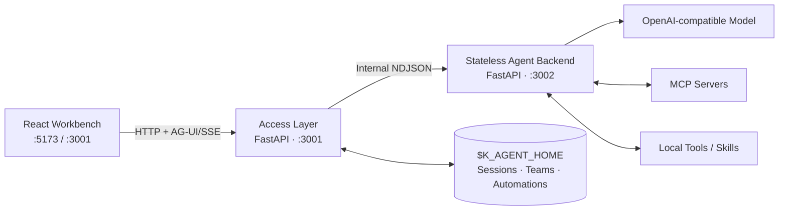

<div align="center">
  

  # K Agent

  **一个本地优先、可扩展、可观测的 AI Agent 工作台**

  从实时对话到定时执行，从单 Agent 到多 Agent 团队，统一管理模型、工具、MCP、Skills 与工作空间。

  [](LICENSE)
  [](requirements.txt)
  [](frontend/package.json)
  [](requirements.txt)
  [](docs/ag-ui-protocol.md)

  [快速开始](#-快速开始) · [功能概览](#-功能概览) · [系统架构](#-系统架构) · [项目文档](#-项目文档)
</div>

---

## 为什么选择 K Agent

K Agent 不只是一个聊天页面。它把 Agent 运行需要的会话状态、工具调用、工作空间、能力配置与自动化调度放进同一套本地工作台，同时保持推理服务无状态、接入边界清晰。

| 能力 | 说明 |
| --- | --- |
| 💬 **实时 Agent 对话** | 基于 AG-UI + SSE 展示文本、推理、工具调用、审批与运行状态 |
| 🧰 **工具 / MCP / Skills** | 统一发现、配置和选择本地工具、MCP Server 与可复用 Skill 包 |
| 🗂️ **持久化会话与工作空间** | 每个 Session 拥有独立历史、上下文、事件流和文件工作空间 |
| ⏱️ **定时任务** | 按一次、每天或每周自动运行；结果在自动化页面独立查看，不污染普通会话列表 |
| 👥 **Agent Team** | Supervisor 规划依赖任务，多个 Worker 并行协作并经过产物验收 |
| 🎙️ **浏览器语音** | 支持单次语音输入、连续语音对话、朗读、打断与取消回滚 |
| 🧠 **上下文管理** | 分层指令、长期记忆、上下文预算、历史压缩与旧工具结果裁剪 |
| 🔍 **可观测与可恢复** | 执行轨迹、结构化日志、Langfuse；普通工具错误返回给模型继续修正 |
| 🔒 **本地优先** | Access Layer 与 Agent Backend 默认仅监听 `127.0.0.1` |

## 功能概览

### Work：完整的 Agent 执行台

- Markdown、GFM 表格、数学公式和代码块渲染
- 推理过程、工具调用、人工审批与任务计划时间线
- 会话切换期间保留后台流式运行状态
- Session 级 MCP / Skill 选择与持久化
- 独立 Workspace 文件浏览与内容预览
- 多主题、字体调节和桌面宠物

### Automations：可持久化的定时任务

- 支持单次、每日、每周和 IANA 时区
- 使用最近到期时间动态休眠，不进行按秒轮询
- 每次执行创建独立 Session 与 Workspace
- 自动任务 Session 与普通聊天目录在持久化层隔离
- 页面内查看 Markdown 结果与折叠工具活动
- 支持立即运行、暂停、恢复、编辑和执行历史

### Agent Team：有计划的多 Agent 协作

- 组合 `k_agent`、`codex` 与 `claude_code` Worker
- Supervisor 生成带依赖关系的任务 DAG
- 独立并发池执行无依赖根任务
- Worker 提交后由 Supervisor 审核任务与 Artifact
- 团队 Mailbox、事件序列和产物目录持久化

## 系统架构



请求链路为：

```text
Frontend → Access Layer (:3001) → Stateless Agent Backend (:3002)
```

- **Access Layer** 是公开接入边界，负责会话、并发、配置目录、Team、定时任务和持久化。
- **Agent Backend** 不保存 Session 状态，只消费单次请求中携带的完整上下文与能力定义。
- 两个服务通过内部 NDJSON 流式 HTTP 通信，不是进程内函数调用。
- 默认仅允许本机访问。内部请求可能携带模型凭据，请勿直接暴露到公网或局域网。

更多设计细节见[接口与架构变更记录](docs/interface-change-record.md)。

## 快速开始

### 环境要求

- Python 3.11+
- Node.js 18+
- npm 9+
- 一个 OpenAI-compatible API Key

### 1. 克隆项目

```bash
git clone https://github.com/Sun-Kas/k_agent.git
cd k_agent
```

### 2. 安装依赖

```bash
python3 -m venv .venv
source .venv/bin/activate
pip install -r requirements.txt

cd frontend
npm install
cd ..
```

> Windows PowerShell 请使用 `.venv\Scripts\Activate.ps1` 激活虚拟环境。

### 3. 配置环境变量

```bash
cp .env.example .env
```

至少填写：

```env
OPENAI_API_KEY=your_openai_api_key
OPENAI_BASE_URL=https://api.openai.com/v1
OPENAI_MODEL=gpt-4.1-mini
```

也可以把状态保存在项目目录，便于开发时查看：

```env
K_AGENT_HOME=.k_agent
```

### 4. 启动开发环境

```bash
cd frontend
npm run dev
```

该命令会同时启动：

| 服务 | 地址 | 职责 |
| --- | --- | --- |
| Frontend | `http://localhost:5173` | React / Vite 工作台 |
| Access Layer | `http://127.0.0.1:3001` | 公开 API、状态与调度 |
| Agent Backend | `http://127.0.0.1:3002` | 无状态推理与工具执行 |

打开 [http://localhost:5173](http://localhost:5173) 即可使用。

## 本地部署

构建前端并以非 reload 模式启动两个本地服务：

```bash
cd frontend
npm run deploy:local
```

部署模式下 Access Layer 会在 `http://127.0.0.1:3001` 同源托管 `frontend/dist`，Agent Backend 继续运行在 `127.0.0.1:3002`。

需要容器化部署时，请参阅 [Docker 部署指南](docs/docker-deployment.md)。镜像不会包含 `.env`、API Key 或 `.k_agent` 数据；凭据在运行时注入，状态保存在独立 Docker Volume 中。

### Docker 运行流程

```bash
# 1. 准备运行时环境变量（不会进入镜像）
cp .env.example .env
# 编辑 .env，至少填写 OPENAI_API_KEY / OPENAI_BASE_URL / OPENAI_MODEL

# 2. 构建脱敏镜像
docker compose build

# 3. 后台启动
docker compose up -d

# 4. 验证服务与调度器
curl http://127.0.0.1:3001/api/health
curl http://127.0.0.1:3001/api/health/scheduled-tasks

# 5. 停止并删除容器，保留 named volume 中的数据
docker compose down
```

启动后打开 <http://127.0.0.1:3001>。不要使用 `docker compose down -v`，除非确定要永久删除容器内的 Sessions、Skills、Team 与定时任务数据。

## 运行时数据

持久化内容默认写入 `~/.k_agent`，可通过 `K_AGENT_HOME` 修改：

```text
$K_AGENT_HOME/
├── config/
│   ├── mcp.json
│   ├── models.json
│   ├── permissions.json
│   └── catalog/
├── content/
│   ├── memory/
│   └── skills/
└── state/
    ├── sessions/
    ├── teams/
    └── scheduled_tasks/
```

每个会话目录包含持久化 JSON 与独立 `workspace/`。Agent Team 和定时任务由 Access Layer 使用 SQLite 保存调度状态。

## 常用配置

| 配置项 | 用途 | 默认值 |
| --- | --- | --- |
| `OPENAI_API_KEY` | 模型 API Key | 必填 |
| `OPENAI_BASE_URL` | OpenAI-compatible API 地址 | `https://api.openai.com/v1` |
| `OPENAI_MODEL` | 默认模型 | `gpt-4.1-mini` |
| `K_AGENT_HOME` | 配置、内容与状态根目录 | `~/.k_agent` |
| `HOST` / `PORT` | Access Layer 地址 | `127.0.0.1:3001` |
| `AGENT_BACKEND_HOST` / `AGENT_BACKEND_PORT` | Agent Backend 地址 | `127.0.0.1:3002` |
| `MCP_CONNECT_TIMEOUT_SECONDS` | MCP 连接超时 | `60` |
| `MAX_MODEL_ITERATIONS` | 单轮最大模型迭代次数 | `6` |
| `LANGFUSE_ENABLED` | 是否启用 Langfuse | `true` |
| `TEAM_RUNTIME_ENABLED` | 是否启用 Agent Team 调度 | `true` |
| `SCHEDULED_TASK_RUNTIME_ENABLED` | 是否启用定时任务调度 | `true` |

完整模板见 [.env.example](.env.example)。

## 项目结构

```text
k_agent/
├── frontend/                 # React / Vite 工作台
├── access_layer/             # 公开 API、会话、Team、自动化与持久化
├── backend/                  # 无状态 Agent、模型、工具、MCP 与上下文管理
├── docs/                     # 协议与技术方案
├── requirements.txt
└── README.md
```

## 项目文档

| 文档 | 内容 |
| --- | --- |
| [AG-UI 协议约定](docs/ag-ui-protocol.md) | SSE 事件顺序、状态机与持久化规则 |
| [工具系统](docs/tools.md) | 本地工具、MCP 与错误返回契约 |
| [上下文管理](docs/context-management.md) | 指令、记忆、预算、裁剪与压缩 |
| [权限模式与 HITL 技术方案](docs/permission-and-hitl-technical-solution.md) | 默认/完全权限、单次越权审批、沙箱与生命周期 |
| [Agent Team 技术方案](docs/agent-team-technical-solution.md) | Supervisor、DAG、Mailbox 与 Artifact |
| [定时任务技术方案](docs/scheduled-task-technical-solution.md) | 调度、租约、Session 隔离与运行记录 |
| [接口变更记录](docs/interface-change-record.md) | Access Layer / Backend 服务边界 |

## 开发与验证

```bash
# Frontend 类型与边界检查
cd frontend
npm run check
npm run build:client

# Python 测试
cd ..
.venv/bin/python -m pytest backend/tests -q
```

## 安全说明

- Access Layer 与 Agent Backend 默认只监听 loopback 地址。
- Bash 工具可通过 `srt` OS 沙箱执行，并限制子进程环境变量。
- 日志只记录关联 ID、计数、工具名和耗时，不应记录 Prompt、工具参数、输出或凭据正文。
- 如果需要远程访问，请先增加身份认证、TLS、权限隔离和反向代理，不要直接修改监听地址后暴露服务。

## License

本项目基于 [MIT License](LICENSE) 开源。

---

<div align="center">
  如果这个项目对你有帮助，欢迎 Star ⭐、提交 Issue 或参与改进。
</div>
