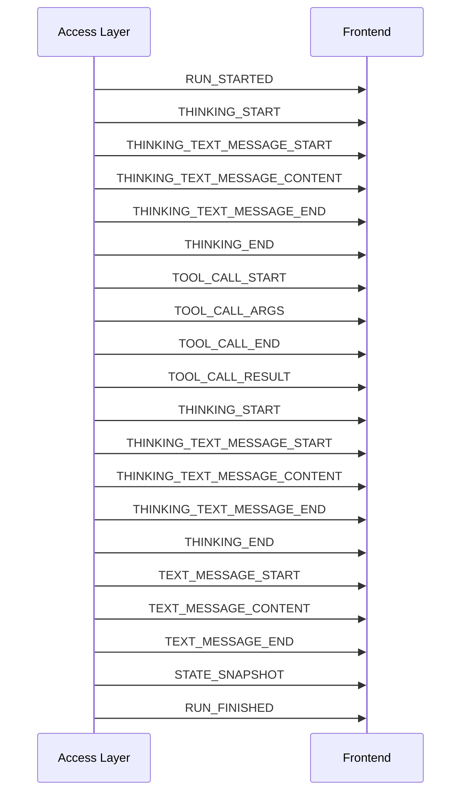

# K Agent AG-UI 协议约定

本文说明 K Agent 前后端当前采用的 AG-UI 流式协议、事件生命周期和前端状态机规则。实现基于 `ag-ui-protocol==0.1.19`，通过 SSE 从接入层发送到 React 前端。

## 1. 传输与入口

- HTTP 入口：`POST /api/agent`
- 请求体：AG-UI `RunAgentInput`
- 响应类型：`text/event-stream`
- SSE 帧分隔符：`\n\n`
- SSE 数据前缀：`data: `
- 服务端编码器：`ag_ui.encoder.EventEncoder`

请求链路：

```text
frontend/src/api/agui.ts
        ↓ RunAgentInput / SSE
access_layer/gateway.py
        ↓ 内部运行事件
access_layer/agui.py
        ↓ 标准 AG-UI 事件
frontend/src/App.tsx
```

`access_layer/agui.py` 是内部 Agent 事件到 AG-UI 事件的唯一协议适配层。前端不得读取内部 Agent 事件，也不得根据内容猜测生命周期。

## 2. 总体运行生命周期

每次运行以 `RUN_STARTED` 开始，并以 `RUN_FINISHED` 或 `RUN_ERROR` 结束。

正常完成时的尾部顺序为：

```text
STATE_SNAPSHOT
RUN_FINISHED
```

事件含义：

| 事件 | 作用 |
| --- | --- |
| `RUN_STARTED` | 建立本次 `threadId`、`runId` 的运行状态。 |
| `STATE_SNAPSHOT` | 提交最终消息、thinking、工具活动、任务和轨迹快照。 |
| `RUN_FINISHED` | 标记本次运行正常结束。 |
| `RUN_ERROR` | 标记运行失败，携带错误消息和错误码。 |

## 3. 正文消息协议

助手正文严格使用标准文本消息事件：

```text
TEXT_MESSAGE_START
TEXT_MESSAGE_CONTENT × N
TEXT_MESSAGE_END
```

| 事件 | 关键字段 | 前端行为 |
| --- | --- | --- |
| `TEXT_MESSAGE_START` | `messageId` | 创建或接管对应的 assistant 消息，记录活动消息 ID。 |
| `TEXT_MESSAGE_CONTENT` | `messageId`, `delta` | 只向对应消息追加增量正文。 |
| `TEXT_MESSAGE_END` | `messageId` | 结束该消息的正文流，清除活动消息 ID。 |

正文是否结束只由 `TEXT_MESSAGE_END` 判断。前端不能通过“停止收到 token”“出现工具事件”或“收到最终快照”推断正文结束。

## 4. Thinking 协议

一个 thinking 块使用外层 thinking 生命周期，块内文本使用 thinking text message 生命周期：

```text
THINKING_START
  THINKING_TEXT_MESSAGE_START
  THINKING_TEXT_MESSAGE_CONTENT × N
  THINKING_TEXT_MESSAGE_END
  ...可继续出现下一条 thinking text message
THINKING_END
```

| 事件 | 关键字段 | 前端行为 |
| --- | --- | --- |
| `THINKING_START` | `title?` | 开始一个新的 thinking 块。 |
| `THINKING_TEXT_MESSAGE_START` | `rawEvent?` | 在当前块中创建一条 thinking 文本步骤。 |
| `THINKING_TEXT_MESSAGE_CONTENT` | `delta`, `rawEvent?` | 只向当前活动 thinking 步骤追加文本。 |
| `THINKING_TEXT_MESSAGE_END` | `rawEvent?` | 封口当前 thinking 文本步骤。 |
| `THINKING_END` | — | 封口整个 thinking 块；此后不得再向该块写入。 |

### 4.1 分块规则

`THINKING_END` 是 thinking 块唯一的分隔标准：

- 收到 `THINKING_END` 后，当前块立即变为只读。
- 后续如果再次收到 `THINKING_START`，前端必须新建 thinking 块。
- `TEXT_MESSAGE_*`、`TOOL_CALL_*` 或 `CUSTOM` 事件不能直接关闭 thinking 块。
- 接入层必须先发送 `THINKING_END`，再发送后续正文或工具的 start 事件。
- 已关闭 thinking 的迟到更新只允许修正最终持久化快照，不得重新向前端续写。

### 4.2 `rawEvent` 元数据

AG-UI thinking text 事件本身承载文本生命周期；K Agent 使用标准事件允许的 `rawEvent` 字段携带展示元数据：

```json
{
  "id": "thinking-step-id",
  "phase": "reasoning",
  "title": "分析并决定下一步",
  "status": "active",
  "iteration": 0,
  "createdAt": "2026-07-28T12:00:00Z"
}
```

约束：

- 生命周期只由事件 `type` 决定，不能由 `rawEvent.status` 代替 start/end。
- thinking 正文只通过 `THINKING_TEXT_MESSAGE_CONTENT.delta` 传输。
- `rawEvent` 只用于步骤 ID、标题、阶段、状态和时间等 UI 元数据。
- 如果上游将占位文本整体替换为真实 thinking，接入层会结束旧的 thinking text message，再以新的 start/content/end 标准序列发送，不进行隐式覆盖。

## 5. 工具调用协议

工具调用使用：

```text
TOOL_CALL_START
TOOL_CALL_ARGS × N
TOOL_CALL_END
TOOL_CALL_RESULT
```

| 事件 | 关键字段 | 前端行为 |
| --- | --- | --- |
| `TOOL_CALL_START` | `toolCallId`, `toolCallName` | 创建独立工具块，状态为 `preparing`。 |
| `TOOL_CALL_ARGS` | `toolCallId`, `delta` | 追加工具参数，状态为 `running`。 |
| `TOOL_CALL_END` | `toolCallId` | 封口工具调用参数流，状态为 `waiting`。 |
| `TOOL_CALL_RESULT` | `toolCallId`, `messageId`, `content` | 写入工具结果，状态变为 `complete`。 |

`TOOL_CALL_END` 表示模型输出的工具调用及参数已经结束，不表示工具执行结果已经返回。工具块只有在收到 `TOOL_CALL_RESULT` 后才是执行完成状态。

Thinking 中不得保存或渲染 `phase="tool"` 的伪步骤。工具必须通过 `TOOL_CALL_*` 事件创建和更新。

## 6. 跨类型事件顺序

典型的“思考 → 工具 → 再思考 → 正文”顺序如下：



必须满足的顺序不变量：

1. Thinking 之后出现工具：`THINKING_END < TOOL_CALL_START`。
2. 工具执行结束后重新思考：`TOOL_CALL_RESULT < THINKING_START`。
3. Thinking 之后输出正文：`THINKING_END < TEXT_MESSAGE_START/CONTENT`。
4. 正常完成的流中，每个 start 必须由同类型的 end 封口；不能用其他类型事件代替。
5. 不同工具调用通过 `toolCallId` 隔离，不同正文消息通过 `messageId` 隔离。

如果运行异常或客户端主动中止，尚未结束的子流可能直接被 `RUN_ERROR` 或连接关闭打断；前端应将其标记为中断，不能伪造一个正常完成的 end。

## 7. 快照与历史持久化

流式事件用于实时 UI，最终 `STATE_SNAPSHOT` 用于会话持久化和重新加载。

快照包含：

| 字段 | 内容 |
| --- | --- |
| `sessionId` | 当前会话 ID。 |
| `messages` | 最终消息列表。 |
| `trace` | 执行轨迹。 |
| `tasks` | 当前任务列表。 |
| `thinking` | 本轮 thinking 步骤汇总。 |
| `thinkingGroups` | 已按 `THINKING_START/END` 划分的 thinking 块。 |

最后一条 assistant 消息的 `meta` 还会保存：

- `thinkingGroups`：thinking 块、步骤和顺序。
- `toolActivities`：工具 ID、名称、参数、结果、状态和顺序。

历史加载时必须保留事件形成的块边界，不得因为两个块之间没有正文而自动合并。

## 8. `CUSTOM` 事件边界

当前只允许以下非生命周期信息使用 `CUSTOM`：

| `name` | 用途 |
| --- | --- |
| `status` | 顶部运行状态提示。 |
| `trace` | 调试和执行轨迹。 |

正文、thinking 和工具活动不得使用 `CUSTOM`。`CUSTOM` 事件也不得创建、结束或合并这些 UI 块。

## 9. 前端状态机原则

前端实现位于 `frontend/src/App.tsx`，遵循以下原则：

1. start 创建，content/args 追加，end 封口，result 完成工具执行。
2. 事件只能更新自己的活动 ID；不能把新内容写入已结束的对象。
3. Thinking、工具和正文分别维护生命周期，互不充当对方的分隔符。
4. `STATE_SNAPSHOT` 用于最终校准和持久化，不替代实时 start/end。
5. 未知事件可以忽略，但不能据此猜测另一个事件流已经结束。

## 10. 代码与测试位置

- 协议适配与事件编码：`access_layer/agui.py`
- SSE 输出：`access_layer/gateway.py`
- 前端 SSE 解析：`frontend/src/api/agui.ts`
- 前端事件类型：`frontend/src/types.ts`
- 前端状态机：`frontend/src/App.tsx`
- 协议顺序测试：`backend/tests/test_agui_activity_timeline.py`

修改协议时至少验证：

```bash
cd frontend
npm run check
npm run build:client

cd ..
PYTHONPYCACHEPREFIX=/tmp/k_agent_pycache \
  .venv/bin/python -m unittest backend.tests.test_agui_activity_timeline
```
