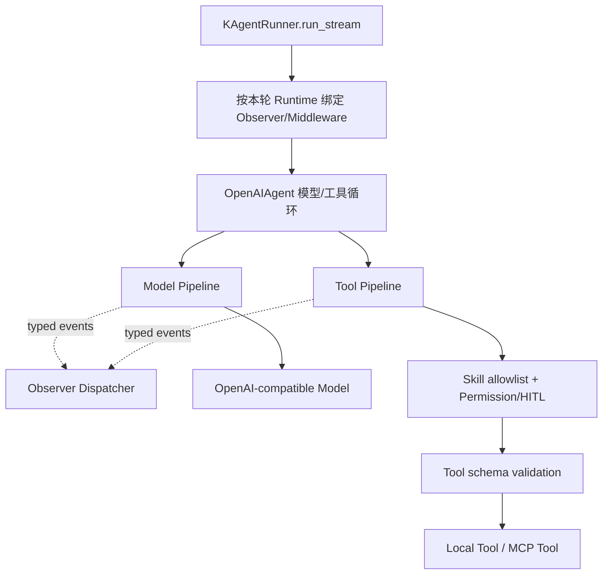

# Agent Hook 与 Middleware 技术方案

> 状态：已实现  
> 适用范围：Agent Backend 内的 K Agent 生命周期、模型调用、工具调用与可观测性。  
> 本文中的 Hook 指 Python 进程内扩展点，不指 Git Hook，也不指 Skill frontmatter 的
> `hooks` 字段。Skill `hooks` 继续只作为不可信声明式文本返回给模型，绝不执行。

## 1. 背景

迁移前 K Agent 使用 `CallbackManager` 分发生命周期回调。`OpenAIAgent.run_stream_react()`、
本地工具路径和 MCP 工具路径在各自业务位置显式调用：

```python
await callbacks.before_model(...)
# 调用并消费模型流
await callbacks.after_model(...)

await callbacks.before_tool(...)
# 执行工具
await callbacks.after_tool(...)
```

迁移前注册的 callback 包括：

- `TraceCallback`：生成最终结果中的内部 trace；
- `AgentBackendLoggingCallback`：写本地结构化运行日志；
- `LangfuseAgentCallback`：写 Agent、Generation 和 Tool observation。

这个实现简单且调用边界清楚，但随着权限、审批、重试、fallback、缓存、指标等横切能力
增加，会产生以下问题：

1. before/after/error 和计时逻辑分散，新增执行分支容易漏掉收尾。
2. Local Tool 与 MCP Tool 重复维护相同的观测逻辑。
3. `CallbackManager._emit()` 顺序 `await`，一般 callback 的异常可能中断 Agent；只有
   Langfuse 自身以及个别错误路径显式 fail-open。
4. callback 只返回 `None`，适合观测，却不适合表达重试、短路、请求改写或 fallback。
5. 如果直接把权限、重试也塞进 callback，观测失败与安全失败将无法采用不同策略。
6. 主流程依赖具体 hook 名称，扩展点越多，Agent 循环越难阅读和测试。

本方案借鉴现代 Agent Middleware 的分层思想，但不引入 LangChain/LangGraph 依赖，保持
当前 AG-UI 流式协议、双进程边界和无状态 Agent Runtime。

## 2. 目标与非目标

### 2.1 目标

1. 用 Python decorator 声明 Hook/Middleware，减少注册样板代码。
2. 使用显式列表决定某个 Agent 启用哪些扩展，不扫描包、不依赖导入副作用。
3. 将纯观测 `Observer` 与可影响执行的 `Middleware` 分开。
4. 将 before/after/error/elapsed 配对收口到统一执行管线。
5. 保持模型流的背压、到达顺序、取消传播和 AG-UI 事件顺序。
6. 保持权限审批在真实工具执行之前，任何参数改写都必须重新经过安全门。
7. 所有请求级状态只保存在 Runtime，不写入进程级 Agent、Pipeline 或 Middleware 单例。
8. 给每类扩展定义明确的异常、顺序、并发与敏感数据规则。
9. 支持按阶段迁移，并用测试证明外部行为没有变化。

### 2.2 非目标

- 不把 K Agent 改造成通用工作流图引擎。
- 不改变 Access Layer 与 Agent Backend 的 HTTP 边界。
- 不改变 AG-UI 事件协议、历史持久化方式或原始事件顺序。
- 不允许用户导入的 Skill 注册或执行 Python/Shell Hook。
- 不提供运行时远程加载任意 Middleware 的插件机制。
- 不为了 API 兼容长期保留两套 callback 执行路径；迁移完成后只保留新管线。

## 3. 核心决策

### 3.1 分成 Observer 与 Middleware

| 类型 | 用途 | 能否修改请求/结果 | 能否短路/重试 | 默认失败策略 |
| --- | --- | --- | --- | --- |
| Observer | 日志、Trace、Langfuse、指标 | 否 | 否 | fail-open |
| Middleware | 权限、重试、fallback、缓存、guardrail | 是 | 是 | fail-closed |

Observer 接收不可变事件快照。它不能返回业务值，也不能改变 Agent 状态。单个 Observer
失败只记录安全的错误元数据，不影响后续 Observer 或 Agent。

Middleware 接收类型化 request 和 `call_next`。它可以在调用前后执行逻辑、改写 request、
短路返回或多次调用 `call_next`。Middleware 的异常属于执行语义，默认向上传播。

### 3.2 Decorator 只声明，不自动注册

Python decorator 只在函数上附加不可变的 `HookSpec`，或把函数包装成一个 Middleware
对象。它不写进程全局 registry，也不扫描模块：

```python
@observe(AgentEventType.TOOL_COMPLETED, order=100)
async def record_tool_metric(event: ToolCompletedEvent) -> None:
    ...

@wrap_tool_call(order=200)
async def retry_transient_tool_error(
    request: ToolCallRequest,
    call_next: AsyncToolCallHandler,
) -> ToolCallResult:
    ...
```

启用范围保持显式：

```python
pipeline = AgentPipeline.compile(
    observers=[trace_observer, logging_observer, langfuse_observer],
    middleware=[permission_middleware, retry_middleware],
)
```

这样可以从 `KAgentRunner` 直接看出本轮启用了什么，测试也不会受模块导入顺序影响。

### 3.3 编译一次定义，请求级绑定 Runtime

进程级 Runner 可以缓存不可变的 Middleware 定义和已编译调用结构，但不得缓存请求数据。
每次 run 创建独立 `AgentPipelineRuntime`：

```python
@dataclass(slots=True)
class AgentPipelineRuntime:
    context: AgentRunContext
    observers: ObserverDispatcher
    middleware: CompiledMiddleware
    request_state: dict[str, Any]
```

其中 `request_state` 只属于当前 run，可保存本轮已批准目标、Middleware 计数和 observation
句柄。Langfuse callback 也是请求级对象，不进入进程级 Pipeline 定义。

### 3.4 不对业务包做隐式发现

禁止以下注册方式：

```python
# 禁止：import 时修改全局状态
GLOBAL_HOOKS.append(func)

# 禁止：启动时扫描 backend 下所有模块
discover_hooks("backend")
```

原因是它们会让执行顺序、测试隔离、Worker 启动时间和安全审计变得不可预测。

## 4. 总体架构



职责边界：

- `KAgentRunner`：选择进程级定义，绑定本轮 Logging/Langfuse/Trace Observer 和 Runtime。
- `OpenAIAgent`：保留模型↔工具的业务循环，只调用 `pipeline.run_model()`、
  `pipeline.run_tool()` 和少量领域事件发布接口。
- `AgentPipeline`：编译顺序、执行 Middleware、配对 Observer、处理计时和异常策略。
- Observer：只观察类型化事件，不参与权限和业务控制。
- Middleware：围绕模型或工具 handler 工作，不直接写 AG-UI，不持久化 Session。

## 5. 包与文件规划

建议增加：

```text
backend/agent/hooks/
├── __init__.py
├── types.py          # HookSpec、事件、Model/Tool request/result
├── decorators.py     # @observe、@before_*、@after_*、@wrap_* 声明
├── observers.py      # AgentObserver Protocol、ObserverDispatcher
├── middleware.py     # AgentMiddleware Protocol 与 handler 类型
├── pipeline.py       # 编译、顺序、执行、异常与计时
└── builtins.py       # 内建安全/恢复 Middleware 的组装入口
```

现有文件迁移：

| 当前文件 | 目标变化 |
| --- | --- |
| `backend/agent/callbacks.py` | 数据类型迁到 `hooks/types.py`；迁移完成后删除旧 Manager |
| `backend/observability/logging.py` | 改成 Observer，继续保持正文不落本地日志 |
| `backend/observability/langfuse.py` | 改成请求级 Observer，继续自行脱敏与关闭 observation |
| `backend/agent/react_agent.py` | 调用 Pipeline，不再散落成对 callback |
| `backend/runners/k_agent.py` | 显式绑定内建定义与请求级 Observer |
| `backend/main.py` | 继续创建请求级 Logging Observer，不承担 Middleware 编排 |

不修改 `access_layer/` 的协议；所有新增结构只存在于 Agent Backend 进程内。

## 6. 类型模型

### 6.1 Hook 元数据

```python
class HookKind(StrEnum):
    OBSERVER = "observer"
    BEFORE_AGENT = "before_agent"
    AFTER_AGENT = "after_agent"
    BEFORE_MODEL = "before_model"
    AFTER_MODEL = "after_model"
    WRAP_MODEL = "wrap_model"
    WRAP_TOOL = "wrap_tool"


class FailureMode(StrEnum):
    OPEN = "open"
    CLOSED = "closed"


@dataclass(frozen=True, slots=True)
class HookSpec:
    kind: HookKind
    name: str
    order: int
    failure_mode: FailureMode
```

约束：

- Observer 只能使用 `OPEN`。
- Middleware 默认使用 `CLOSED`；只有明确不影响正确性的统计型 middleware 才能声明
  `OPEN`，但优先把它改成 Observer。
- 名称在同一个编译单元内必须唯一。
- `order` 只负责确定性排序，不作为安全边界。内建安全门不参加普通 order 排序。

### 6.2 不可变请求和结果

```python
@dataclass(frozen=True, slots=True)
class ModelCallRequest:
    iteration: int
    model: str
    messages: tuple[Mapping[str, Any], ...]
    tools: tuple[Mapping[str, Any], ...]
    reasoning_effort: str | None

    def override(self, **changes: Any) -> "ModelCallRequest": ...


@dataclass(frozen=True, slots=True)
class ToolCallRequest:
    call_id: str
    iteration: int
    requested_name: str
    canonical_name: str
    arguments: Mapping[str, Any]
    source: Literal["local", "mcp"]
    server_id: str | None

    def override(self, **changes: Any) -> "ToolCallRequest": ...
```

所有 override 返回新对象，禁止原地修改跨 Middleware 共享的数据。真正调用 provider/MCP
前再转换为普通 `dict`。

结果至少区分：

```python
ModelCallResult
ToolCallResult
ToolCallFailure
```

可恢复工具错误仍由工具管线转成模型可见的结构化结果；`CancelledError` 等
`BaseException` 不得转换为普通工具结果。

### 6.3 Observer 事件

建议统一为不可变 dataclass：

```text
AgentStartedEvent
ContextBuiltEvent
ContextPrunedEvent
ModelStartedEvent
ModelCompletedEvent
ToolStartedEvent
ToolCompletedEvent
OperationFailedEvent
AgentCompletedEvent
```

事件携带 `run_id`、阶段、迭代号、来源、耗时和必要统计。是否携带正文由事件类型明确规定：

- 本地日志 Observer 不读取 prompt、参数值、输出正文或密钥；
- Langfuse Observer 可以接收业务正文，但必须经过现有脱敏器；
- Context 事件只携带预算和字符数，不携带压缩前消息正文；
- Observer 错误日志不得序列化完整事件对象。

### 6.4 关联 ID

统一采用以下关联关系：

| ID | 来源与生命周期 |
| --- | --- |
| `request_id` | HTTP 请求头，一次 Agent Backend 请求 |
| `thread_id` | Access Layer Session/Thread |
| `run_id` | Access Layer 下发并持久化的一次 run，作为跨服务主关联 ID |
| `call_id` | provider tool call ID；没有时由 Backend 为逻辑调用生成 |
| `operation_id` | 每次真实 model/tool attempt 生成，重试时必须变化 |
| `parent_operation_id` | 指向所属 Agent/model/tool operation，构造 trace 层级 |

`AgentRunContext.run_id` 应使用 Access Layer 下发的 `run_id`，不再默默生成第二个同名 ID。
如果确实需要 Backend 内部执行 ID，应命名为 `agent_execution_id`，避免日志中的 `runId` 与
`agentRunId` 语义混淆。

同一轮模型可能并行调用两次同名工具，Middleware 也可能重试同一个 `call_id`。因此
Langfuse/Trace 未结束项必须以 `operation_id` 配对，不能继续使用
`(run_id, iteration, source, name)` 作为唯一 key。`call_id` 关联逻辑工具调用，
`operation_id + attempt` 区分每次真实执行。

## 7. 声明式 API

### 7.1 Observer decorator

```python
@observe(AgentEventType.TOOL_COMPLETED, order=100)
async def log_tool_completed(event: ToolCompletedEvent) -> None:
    ...
```

复杂 Observer 可以继续使用类：

```python
class LangfuseObserver:
    async def handle(self, event: AgentEvent) -> None:
        ...
```

函数 decorator 和类最终都规范化为同一个 `AgentObserver` Protocol。Langfuse 需要保存本轮
未结束 observation，因此必须是请求级实例。

### 7.2 Node-style Middleware

```python
@before_model(order=100)
async def apply_dynamic_context(
    state: AgentState,
    runtime: AgentPipelineRuntime,
) -> AgentStateUpdate | None:
    ...
```

Node-style Hook 适合状态检查和更新，不包住真实 I/O：

- `before_agent`：初始化本轮扩展状态；
- `before_model`：上下文检查、动态模型/工具选择；
- `after_model`：输出 guardrail、模型调用计数；
- `after_agent`：确定性收尾。

before 按 `(order, registration_index)` 正序执行；after 倒序执行，形成对称栈。

### 7.3 Wrap-style Middleware

```python
@wrap_tool_call(order=100)
async def retry_tool(
    request: ToolCallRequest,
    call_next: AsyncToolCallHandler,
) -> ToolCallResult:
    for attempt in range(2):
        try:
            return await call_next(request)
        except TransientToolError:
            if attempt == 1:
                raise
    raise AssertionError("unreachable")
```

多个 wrapper 采用洋葱模型，列表中较前者位于外层：

```text
middleware_a(
  middleware_b(
    sealed_tool_executor()
  )
)
```

Wrapper 可以不调用、调用一次或多次 `call_next`。每次调用都必须是独立执行，不能复用已
消费的 stream、协程或结果对象。

## 8. Observer Dispatcher

Dispatcher 的行为固定为：

```python
async def emit(self, event: AgentEvent) -> None:
    for observer in self._matching_observers(event):
        try:
            await observer.handle(event)
        except Exception as exc:
            log_observer_failure(observer, event, exc)
```

规则：

1. Observer 顺序执行，保持 Langfuse start/end 和本地 trace 的确定性。
2. 单个 Observer 失败不会阻止后续 Observer。
3. 不用 `asyncio.gather()`；当前 Observer 数量少，顺序正确性比微小并行收益更重要。
4. Observer 不得执行长时间网络工作；SDK 应自行批处理，阻塞 SDK 调用放入线程。
5. 每个 Observer 可设置超时上限；超时也按 fail-open 处理。
6. `CancelledError` 必须继续传播，但 Pipeline 应在取消收尾路径尽力关闭未结束 observation。

## 9. Tool Pipeline

### 9.1 固定安全顺序

工具管线必须保持以下顺序：

```text
解析 Local/MCP/Skill alias
  → 用户 Middleware（可改写 request、重试或短路）
  → Skill allowlist
  → Permission / HITL
  → emit ToolStarted
  → 参数 schema 校验
  → 实际 Local/MCP 调用
  → emit ToolCompleted 或 OperationFailed
  → 可恢复错误转结构化 ToolCallFailure
```

安全门与参数校验组成 `sealed_tool_executor`，不能被普通 `order` 调整或从配置中移除。
Middleware 改写后的最终 request 必须进入安全门；任何 Middleware 都拿不到绕过安全门的
raw executor。

保持现有权限不变量：

1. `sandbox_permissions=require_escalated` 只是申请，不是授权。
2. Approval 必须发生在参数校验、`ToolStarted` 和真实执行之前。
3. `deny`、用户拒绝、审批取消和超时都不会执行工具。
4. `full_access` 仍只影响权限决策，不绕过工具参数校验、环境清理、超时和输出截断。
5. Middleware 改写工具名、参数、server ID 后必须重新进行 allowlist 与权限判断。

### 9.2 Local 与 MCP 统一终端

Local/MCP 只在 sealed executor 最后一层分流：

```python
async def execute_terminal(request: ToolCallRequest) -> str:
    if request.source == "local":
        return await local_tool.execute(dict(request.arguments))
    return await mcp_manager.call_tool(
        request.server_id,
        request.canonical_name,
        dict(request.arguments),
    )
```

计时、Observer、错误规范化只写一次，不再在两条分支重复。

### 9.3 重试边界

- 默认不重试具有副作用的工具。
- Retry Middleware 只处理明确标注为 transient 且幂等的调用。
- 每次 retry 都重新经过安全门与 Observer，便于审计每次真实尝试。
- `call_id` 在 retry 间保持不变；`operation_id` 与 `attempt` 每次递增，避免同名并行调用的
  observation 互相覆盖。
- 同一 run 已批准目标可以使用当前 `approved_targets` 语义避免重复审批，但不得扩大目标。
- Middleware 短路返回缓存结果时没有真实工具执行，因此不发 `ToolStarted`。

## 10. Model Pipeline 与流式约束

模型调用不能简单套用返回单个对象的普通 decorator，因为当前 provider 调用是流式的，
`after_model` 必须覆盖完整 stream 消费，而不是只覆盖 `chat.completions.create()`。

### 10.1 类型化模型流

模型终端输出内部类型，不直接输出 AG-UI：

```python
ModelReasoningDelta
ModelTextDelta
ModelToolCallDelta
ModelCallCompleted
```

签名：

```python
AsyncModelCallHandler = Callable[
    [ModelCallRequest],
    AsyncIterator[ModelStreamEvent],
]
```

`OpenAIAgent` 消费 Pipeline 输出并翻译成现有 thinking/message/tool 内部事件。最后一个
`ModelCallCompleted` 携带聚合后的文本、tool calls、response ID 和 elapsed；它不是外发
AG-UI 事件。

### 10.2 Stream Middleware 契约

```python
@wrap_model_call(order=100)
async def model_fallback(request, call_next):
    async for event in call_next(request):
        yield event
```

规则：

1. Middleware 必须保持事件顺序，不能在后台 task 中无序转发。
2. 不为 Middleware 引入无界队列；下游背压必须传回 provider stream。
3. 在第一个可见 delta 之前失败，可以安全切换 fallback model。
4. 已输出任何 reasoning/text/tool delta 后禁止自动重试整个模型调用，避免前端重复文本和
   重复工具调用。
5. 消费方取消时，取消必须穿透 Middleware 并关闭 provider stream。
6. `ModelStarted` 在真正打开某次 provider stream 前发送；`ModelCompleted` 仅在流完整结束
   并成功聚合后发送；失败发送 `OperationFailed(stage="model_call")`。
7. Stream transformer 与 Observer 分开：transformer 可以修改 delta，Observer 只能观看。

### 10.3 第一阶段不强行抽象 Stream Wrapper

为了降低迁移风险，第一阶段只把模型 before/after/error 配对收进
`pipeline.observe_model_call()`，仍由现有代码消费 provider stream。完成类型化模型适配器
后，再启用 `wrap_model_call`。不得为了统一 API 先引入 queue 转发或改变 AG-UI 时序。

## 11. Agent 生命周期

Agent Pipeline 提供一个明确的 run scope：

```python
async with pipeline.agent_run(context, initial_state) as run:
    async for event in agent_loop(run):
        yield event
    run.complete(final_result)
```

语义：

- enter：执行 `before_agent`，随后发 `AgentStartedEvent`；
- `complete()`：保存最终结果；
- normal exit：发 `AgentCompletedEvent`，倒序执行 `after_agent`；
- exception exit：发 `OperationFailedEvent(stage="agent_run")`，再传播原异常；
- cancellation：尽力关闭 Observer 资源，继续传播取消，不生成伪造的正常完成事件。

`ContextBuiltEvent`、`ContextPrunedEvent` 是明确的领域事件，仍在上下文真正构建/裁剪的位置
显式 `emit`。这类事件没有自然的 before/after 执行作用域，不需要强行做成 wrapper。

## 12. 执行顺序

假设配置：

```python
middleware=[auth, retry, logging_guard]
```

Node-style 顺序：

```text
auth.before_model
retry.before_model
logging_guard.before_model
model
logging_guard.after_model
retry.after_model
auth.after_model
```

Wrap-style 顺序：

```text
auth.wrap(
  retry.wrap(
    logging_guard.wrap(
      terminal
    )
  )
)
```

Observer 使用单独的 `order` 正序接收事件，不参与 Middleware 的洋葱逆序。

编译时输出仅含名称和顺序的安全调试信息，禁止输出配置正文或闭包内容。

## 13. 异常模型

| 场景 | 行为 |
| --- | --- |
| Observer 抛 `Exception` | 记录 observer 名/事件类型/异常类型，继续执行 |
| Observer 超时 | 记录超时，继续执行 |
| Middleware 抛 `Exception` | 默认终止当前 operation，交给上层错误语义 |
| 工具终端抛普通 `Exception` | 发失败事件，转成模型可见结构化工具错误 |
| 模型终端抛普通 `Exception` | 发失败事件，向上抛并转 AG-UI `RUN_ERROR` |
| Middleware/终端收到取消 | 清理后传播，不转普通错误 |
| `after_*` 抛异常 | 按该 Middleware failure mode；不能替换更早的原始异常 |
| Langfuse/Tracing 不可用 | fail-open，健康状态记录脱敏错误 |

如果 operation 已有原始异常，收尾阶段的新异常只能作为日志附加信息，不能覆盖原异常。

## 14. 并发与生命周期

1. `KAgentRunner`、`OpenAIAgent` 和已编译 Pipeline 可以是进程级单例，但只能保存不可变定义。
2. `AgentPipelineRuntime`、Observer 实例、Langfuse observation、批准集合、计数器和请求模型
   都是 run-scoped。
3. 不使用模块全局 current run；需要给深层工具传递环境时继续使用可恢复 token 的
   `ContextVar`，并在 `finally` 中 reset。
4. 同一个 Middleware 对象如果被进程级复用，必须无可变请求状态；需要状态时使用
   `runtime.request_state[spec.name]`。
5. 并行工具调用共享只读编译结构，但每个 tool attempt 使用独立 request、计时和事件。
6. Observer Dispatcher 不在多个 run 之间共享请求级 handler。

## 15. 安全与数据最小化

- Decorator/Middleware 只来自仓库内受信任 Python 代码。
- Access Layer 下发的 Skill 数据不能选择 Python Middleware，也不能传模块路径让 Backend
  动态 import。
- `HookSpec` 和健康接口只公开名称、类型、顺序、启用状态，不公开闭包、密钥和配置值。
- 本地 Logging Observer 延续当前策略：只记 ID、名称、数量、参数 key、字符数和耗时。
- Langfuse Observer 延续 API key/token/password/authorization/Data URL 等脱敏规则。
- Error event 的公开日志只记异常类；原始错误正文只进入明确允许且经过脱敏的后端。
- Middleware 不得直接访问 Session 存储；它只消费 Agent Backend 本轮 Runtime。

## 16. 配置与注册

第一版不新增用户可编辑的 `.env` Middleware 列表。内建顺序由代码显式定义：

```python
def build_k_agent_pipeline_definition() -> AgentPipelineDefinition:
    return AgentPipelineDefinition(
        middleware=(
            # 普通扩展位；sealed security gate 在 Pipeline 内部，不在此列表中。
            tool_recovery_middleware,
        ),
        observers=(),  # 请求级 Observer 在 bind_runtime() 时注入。
    )
```

本轮绑定：

```python
pipeline_runtime = definition.bind_runtime(
    context=context,
    observers=[
        TraceObserver(trace),
        ctx.logging_observer,
        *langfuse_observers,
    ],
)
```

以后如果需要开关，只允许对预注册名称做布尔启停；不允许通过环境变量提供任意 import
字符串。

## 17. 与现有 Runner 的关系

- 第一阶段仅迁移 `k_agent`，因为当前生命周期 callback 只在 K Agent 模型/工具循环中使用。
- `codex`、`claude_code` 可以共享 Agent 级 Observer 类型，但不能假装拥有内部模型/工具事件；
  只有其 SDK/CLI 能可靠暴露相应边界时才接入。
- Runner Registry 继续保存进程级无状态 Runner 单例。
- `RunnerContext.logging_observer` 保存本轮日志 Observer；对象只在 Backend 进程内创建，
  不跨 HTTP 传输。

## 18. 迁移计划

### 阶段 0：锁定行为

补齐当前行为测试：

- Agent 正常结束、模型失败、工具成功、工具可恢复失败；
- Local/MCP 的 before/after/error 顺序；
- 权限批准、拒绝、取消、超时均不提前执行工具；
- Langfuse 失败不影响 Agent；
- 流取消关闭 MCP 和未结束 observation；
- 并行工具调用不串 run/iteration/source。

### 阶段 1：Observer 分层

1. 新增 `hooks/types.py`、`decorators.py`、`observers.py`。
2. 将 Trace、Logging、Langfuse 改成请求级 Observer。
3. Dispatcher 统一 fail-open、超时和安全错误日志。
4. 通过 adapter 暂时接住现有调用点，但同一个事件只能走一条路径，禁止双写。

验收：本地日志字段、Langfuse 层级和 final trace 与迁移前一致。

### 阶段 2：Tool Pipeline

1. 抽出类型化 `ToolCallRequest/Result`。
2. 合并 Local/MCP 的观测、计时和错误处理。
3. 将权限、Skill allowlist、审批和校验固化为 sealed executor。
4. 添加 `@wrap_tool_call` 及编译器。
5. 删除 `_execute_tool()` 中散落的 callback 调用。

验收：权限/HITL 全量测试通过；普通工具失败仍返回模型，不产生 `RUN_ERROR`。

### 阶段 3：Agent 与 Model Scope

1. 引入 `agent_run()` 与 `observe_model_call()` scope。
2. 收口 Agent/model 的 start/end/error 和计时。
3. 删除 `run_stream()` 中成对 callback 调用。
4. 保持当前 provider stream 消费和 AG-UI 翻译不变。

验收：隐藏标签页、取消、idle timeout、reasoning/text/tool 顺序测试通过。

### 阶段 4：类型化 Model Stream Middleware

1. 将 OpenAI-compatible chunk 适配为 `ModelStreamEvent`。
2. 增加 `@wrap_model_call` 的异步迭代器组合。
3. 明确首个可见 delta 之后禁止整轮 retry。
4. 按需迁移 fallback、guardrail 等真正需要控制模型调用的能力。

验收：无 queue、无乱序、无重复 delta；取消能关闭 provider stream。

### 阶段 5：清理

- 删除旧 `AgentCallback`/`CallbackManager` 和 adapter。
- 更新测试、类型导入、架构文档与 README。
- 不保留旧 callback 注册 API 的长期兼容路径。

## 19. 测试方案

### 19.1 单元测试

```text
test_hook_decorators.py
  - spec 元数据、默认 failure mode、重复名称

test_observer_dispatcher.py
  - 顺序、过滤、fail-open、超时、取消
  - 同轮并行同名工具按 operation_id 正确配对

test_middleware_compiler.py
  - before 正序、after 倒序、wrapper 洋葱顺序
  - short-circuit、request override、多次 call_next

test_tool_pipeline.py
  - Local/MCP 统一事件
  - 改写参数后重新权限校验
  - 拒绝/取消时 terminal 未执行
  - transient retry 与非幂等不重试

test_model_pipeline.py
  - delta 原始顺序与背压
  - 首 delta 前 fallback
  - 首 delta 后禁止整轮 retry
  - timeout/cancel 关闭 stream
```

### 19.2 集成测试

- `/internal/agent/run` 正常、模型错误、工具错误的 AG-UI 序列不变。
- Trace、Logging、Langfuse 同一 run 的 ID 和层级一致。
- 并行同名工具与 retry attempt 在 Langfuse 中分别完成，不覆盖未结束 observation。
- 并发 Session、并行工具和 Team run 不共享请求状态。
- Access Layer 的 run rollback、取消和持久化不受影响。
- Skill `hooks` 字段仍只渲染文本，没有 Python/Shell 执行路径。

### 19.3 必须保持的序列断言

```text
ModelStarted
  → reasoning/text/tool-call delta（原始到达顺序）
  → ModelCompleted | OperationFailed

Permission approved
  → ToolStarted
  → ToolCompleted | OperationFailed
```

用户拒绝、审批超时或权限 deny 时，不得出现 `ToolStarted`。

## 20. 可观测性与健康状态

建议在 Agent Backend 内部健康响应增加不含敏感数据的调试摘要：

```json
{
  "agentPipeline": {
    "compiled": true,
    "middleware": ["tool-recovery"],
    "observerFactories": ["logging", "langfuse", "trace"]
  }
}
```

如果健康接口目前只用于连接状态，也可以暂不公开，仅在启动日志记录一次。禁止列出
Middleware 配置值、prompt、工具参数或密钥。

建议增加内部指标：

- `agent_observer_failure_total{observer,event}`
- `agent_middleware_failure_total{middleware,operation}`
- `agent_model_call_duration_ms`
- `agent_tool_call_duration_ms{source,tool}`

高基数 ID 不放指标 label，只进入结构化日志/trace。

## 21. 验收标准

方案实现完成必须同时满足：

1. `react_agent.py` 不再直接依赖具体 Logging/Langfuse/Trace 类型。
2. Local 与 MCP 工具只有一份 start/end/error/elapsed 执行逻辑。
3. Observer 失败不能中断 Agent；Middleware 失败按明确策略处理。
4. 权限审批顺序与现有安全文档完全一致。
5. 模型和 AG-UI 流不通过无界 queue，中途取消不泄漏任务或连接。
6. before/after 顺序、wrapper 嵌套顺序和重复名称在编译期可测试、可诊断。
7. 请求级状态不进入进程级 Runner/Agent/Pipeline 单例。
8. Skill `hooks` 不获得任何可执行能力。
9. focused backend tests、完整 backend tests 和前端 stream/类型检查通过。
10. 旧 `CallbackManager` 删除，不存在双重事件上报。

## 22. 最终建议

采用“Decorator 声明 + 显式列表注册 + 编译 Pipeline”的方式，但不要把 decorator 当成
执行机制本身。执行层应坚持两条独立通道：

```text
Observer：不可变事件、只观察、顺序执行、fail-open
Middleware：request + call_next、可控制执行、洋葱组合、默认 fail-closed
```

先迁移 Observer 和 Tool Pipeline，再处理模型流。这样能优先消除当前重复 hook 和异常
策略不一致的问题，同时把风险最高的流式重构放到已有行为被测试锁定之后。
