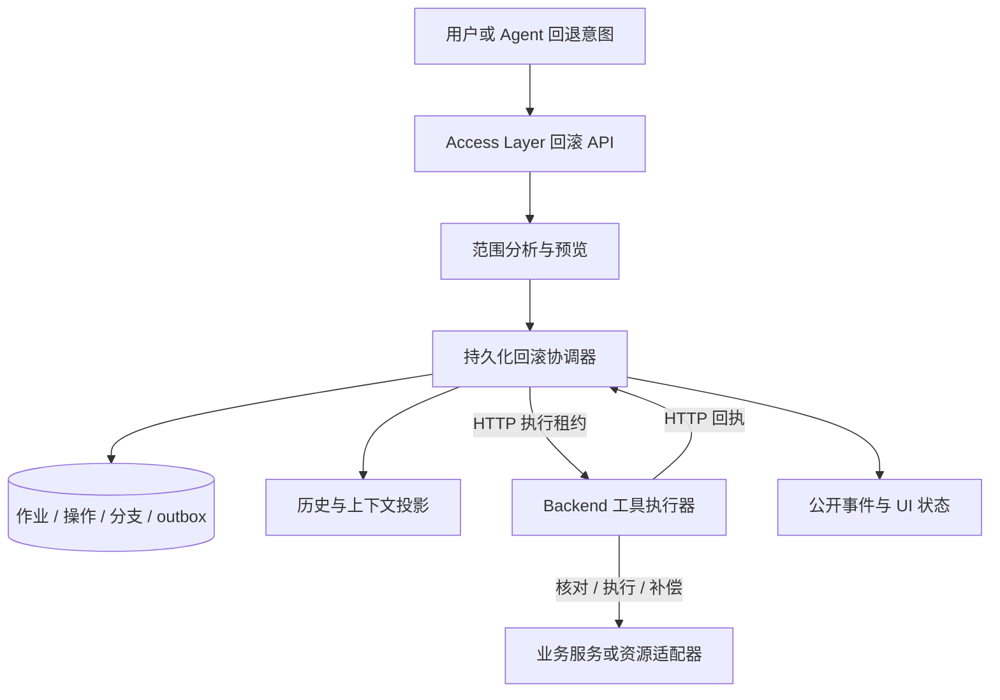
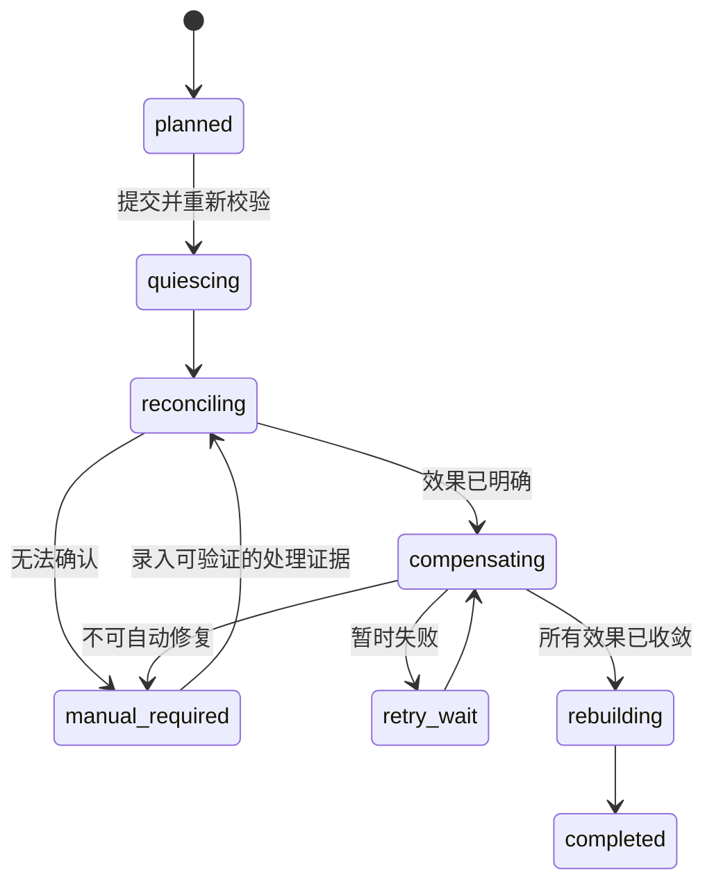

# Agent 逻辑回滚：调研与完整技术方案

- 编写日期：2026-09-07
- 文档状态：设计提案，供架构评审；不代表已实现能力。
- 适用对象：具备工具调用、持久化会话、并行任务与外部业务操作的 Agent 系统。
- 项目落点：K Agent。本文只进行了有限的目录与代码边界核对，没有完成全仓库实现审计。
- 调研方法：以框架官方文档、厂商架构文档和官方源码为依据；框架事实与本文建议分别标明。网页会持续更新，正式选型时应锁定 SDK 版本重新验证。

## 1. 决策摘要

建议将逻辑回滚定义为：**停止受影响的执行，核实已经发生的操作，按业务规则撤销可撤销影响，再从可信边界构造新的执行分支。**

它需要四组能力共同工作：

1. **检查点与分支**：恢复可序列化的执行状态、选择新的决策路径。
2. **持久化操作记录**：知道每个工具操作是否发出、是否完成、结果是否明确。
3. **业务补偿与资源恢复**：撤销本次操作造成的影响，或恢复受管理的文件与产物。
4. **上下文与历史投影**：保留真实历史，让新分支使用有效结论及当前外部事实。

框架通常提供其中一部分。LangGraph 的时间旅行解决从检查点重新执行；Temporal 提供持久化工作流和 Saga 组织方式；Claude Code 的检查点覆盖其跟踪的会话与文件。不能把这些能力直接等同于跨业务系统的完整回滚。[S1][S4][S6]

K Agent 的建议职责分配：Access Layer 持有回滚作业、会话分支、持久化与并发控制；Backend 执行模型和工具，通过 HTTP 接收执行授权并报告结果；业务服务定义合法迁移、幂等与补偿。Agent 可以提出回退意图，运行时负责判断能否执行以及是否完成。

## 2. 术语、目标与非目标

### 2.1 必须区分的操作

| 操作 | 目的 | 是否重新调用模型 | 是否撤销外部影响 |
| --- | --- | --- | --- |
| resume | 从中断处继续既有执行 | 取决于恢复点 | 默认不撤销 |
| retry | 再次尝试同一个逻辑操作 | 仅当被重试的是模型调用 | 不撤销；必须防止重复副作用 |
| replay-for-recovery | 用已记录结果重建执行状态 | 已完成调用一般复用记录 | 不撤销 |
| fork / time travel | 从历史状态创建新的决策路径 | 边界之后可能重新调用 | 不自动撤销 |
| restore | 恢复受管理的文件或资源快照 | 不需要 | 仅覆盖声明的资源 |
| compensate | 执行抵消既有业务影响的操作 | 不应依赖模型临时生成实现 | 按业务能力撤销或抵消 |
| replan | 基于当前事实重新规划 | 通常需要 | 本身不撤销 |

不同框架的 replay 语义不同：LangGraph 时间旅行会重新执行检查点之后的节点；Temporal 恢复重放依赖事件历史重建工作流。本文使用完整术语，避免把“读取历史结果”和“重新执行外部请求”混用。[S1][S5]

### 2.2 目标

- 支持回到某个可信决策点重新规划。
- 支持失败或取消后撤销已执行的可补偿业务操作。
- 支持进程崩溃后继续核对或补偿，避免依赖内存中的撤销栈。
- 支持并行任务的依赖分析，避免遗漏受影响的后续产物。
- 保留完整历史、操作证据及补偿进度。
- 对不能保证完成的回滚显式报告部分完成、结果未知或人工处理。

### 2.3 非目标

- 恢复 LLM 内部未公开的推理状态，或保证重跑生成相同答案。
- 让任意 Shell、浏览器操作、MCP 工具自动获得 undo 能力。
- 把整个业务数据库恢复到旧快照，覆盖其他用户的合法更新。
- 保证跨任意第三方服务的全局 ACID 或无条件 exactly-once。
- 删除失败执行的真实记录，使审计历史看起来像操作从未发生。

## 3. 调研结果与选型判断

### 3.1 LangGraph：检查点、状态更新与执行分支

LangGraph 在执行步骤边界持久化状态，并支持历史状态查询与时间旅行。从指定检查点恢复时，此前结果保留，后续节点重新运行；修改状态会创建新的检查点。状态更新受 reducer 规则影响，不能假设消息列表等字段总是直接覆盖。[S1][S2]

对 Agent 的启示：将“方案选择”“工具调用”“验证结果”等拆成可恢复节点；外部影响不能由状态快照代替。检查点粒度受节点及子图边界约束，需要在建图时设计。[S1]

恢复时应隔离副作用，并设计幂等性；持久化任务结果有助于避免重复工作，但不能单独解决外部服务已成功、本地尚未记录的窗口。[S3]

**适用判断**：适合图式 Agent 的执行状态管理和分支探索；完整业务回滚仍需操作记录与补偿层。

### 3.2 Temporal：持久化执行与 Saga

Temporal 的工作流通过事件历史恢复状态，工作流代码必须满足确定性要求；外部操作应放到 Activity 等执行边界。已记录结果用于恢复，Activity 自身的重试与幂等需要另外设计。[S5]

Temporal 官方 Saga 示例强调：先执行操作、成功后才注册补偿，会遗漏“实际产生影响但调用超时”的情况。应在操作前登记能处理“影响可能尚未发生”的补偿动作。[S4]

**适用判断**：适合长时间运行、跨服务、需要持久化定时器与可靠补偿的流程。引入后应明确一个执行协调者；避免 Access Layer 和 Temporal 各自维护一套互相竞争的作业状态机。

### 3.3 Claude Code：会话与受跟踪文件的恢复

官方文档提供代码恢复、对话恢复以及二者同时恢复。检查点并不覆盖所有环境变化：通过 Bash 修改的文件不在其文件编辑跟踪范围内；也不能据此推断外部请求被撤销。[S6]

**适用判断**：可借鉴“恢复范围显式展示”的交互方式。文件级回退需要明确覆盖哪些工具、路径及修改来源。

### 3.4 Azure：补偿事务的业务约束

补偿是业务相关的操作，可能失败，也可能只能抵消影响而不能恢复原状；并发更新、操作顺序和不可逆步骤都需要纳入设计。补偿步骤应支持幂等与恢复，且应尽量把不可逆操作放在关键验证之后。[S7]

**适用判断**：作为业务补偿协议的设计依据。不能从工具名或自然语言描述推导出可靠的逆操作。

### 3.5 选型建议

| 场景 | 建议基础能力 | 需要额外提供 |
| --- | --- | --- |
| 只读问答与方案探索 | 检查点、分支、上下文投影 | 结论依赖与失效规则 |
| 编码与文件生成 | 以上能力 + 文件快照或独立工作目录 | 并发修改检测、资源覆盖声明 |
| 订单、库存等业务 Agent | 持久化协调器 + 操作记录 + Saga | 业务服务补偿、幂等、查询结果 |
| 跨天流程、大量定时重试 | 评估 Temporal 等工作流引擎 | 运维、确定性约束、版本兼容 |
| 任意 Shell / 浏览器自动化 | 隔离执行 + 能力保守声明 | 不能承诺通用自动撤销 |

本方案首先定义协议与边界，再选择执行引擎。是否引入 Temporal 应通过恢复演练、并发负载和运维成本评估决定，不以“Agent 需要回滚”为唯一理由。

## 4. 核心不变量

以下为本方案要求，应转化为运行时校验和验收条件。

1. **真实历史不可被回滚覆盖**：原操作、补偿和新分支均保留独立记录。
2. **同一逻辑操作身份稳定**：重试沿用 operation_id 和幂等键；新业务意图使用新身份。
3. **未知不等于失败**：超时、进程退出、连接断开不能直接证明外部操作未生效。
4. **先记录意图，再允许副作用执行**：记录操作、输入摘要、补偿策略及作用资源。
5. **分支与外部事实分离**：对话退回旧分支，不意味着外部系统退回旧状态。
6. **补偿具有自己的执行记录**：包含状态、尝试次数、外部回执与失败原因。
7. **回滚完成需要证据**：有未知结果、未完成补偿或未收敛的在途操作时不得标记 completed。
8. **旧执行不能推进新分支**：通过 generation / fencing token 拒绝过期结果更新当前投影。
9. **不依赖会话内存锁实现跨进程安全**：采用持久化 CAS、租约及唯一约束。
10. **Agent 不能绕过业务迁移规则**：可用动作展示只是辅助，最终由业务服务校验。

## 5. 总体架构与项目接入边界



### 5.1 当前有限核对的事实

本次直接阅读了以下文件，路径均相对于仓库根目录：

- `CLAUDE.md`：规定 Access Layer 与 Backend 独立运行，禁止互相导入；Access Layer 持有公开 API、会话、持久化和请求并发，Backend 负责无状态模型及工具执行。
- `access_layer/sessions/history.py`：定义追加式历史记录及投影，已有 `history_mutation` 和 `remove_run` 等处理；其公开及持久化事件采用白名单。
- `access_layer/sessions/store.py`：已存在审批检查点、resume intent 和相关状态处理入口。本次只做局部定位，未审计其全部恢复保证。

因此，不能仅追加回滚事件名称就假定前端能收到并持久化，也不能把现有 `remove_run` 当作业务撤销。本文后续表结构、API、字段和新模块名称均为拟议设计。

### 5.2 建议组件

| 组件 | 所有权 | 职责 |
| --- | --- | --- |
| Rollback Coordinator | Access Layer | 状态机、租约、调度、收敛判断 |
| Operation Ledger | Access Layer 持久化层 | 操作意图、尝试、结果、补偿关系 |
| Branch / Checkpoint Store | Access Layer | 分支谱系、检查点、投影边界 |
| Effect Adapter | Backend 工具执行边界 | 将工具映射为 execute / reconcile / compensate |
| Business Guard | 业务服务 | 迁移、资源版本、幂等与补偿合法性 |
| History Projector | Access Layer | 完整历史到当前分支模型输入和 UI 视图的转换 |

建议新增目录为 `access_layer/rollback/`；Backend 侧适配器位置应在正式实现前依据现有 Tool Runtime 调用链确定，不能仅凭本文新增一个平行工具入口。

### 5.3 无状态 Backend 如何参与持久化执行

Backend 不直接读写 Access Layer 数据库。副作用调用前，向内部 HTTP 控制面提交 operation intent；只有取得已持久化的执行许可后才调用外部系统，随后回报结果。许可至少绑定 operation_id、输入摘要、租户、分支 generation 和有效期。

回执失败时不能盲目重复业务操作。Access Layer 会将超时租约对应的操作转入核对流程。若 Backend 已发出外部请求，许可过期也无法撤回请求，仍须通过外部幂等及核对收敛。

## 6. 工具效果协议

### 6.1 效果分类

| effect_kind | 例子 | 回滚策略 |
| --- | --- | --- |
| read_only | 查询文档、读取库存 | 无业务补偿；重跑时检查数据新鲜度 |
| local_reversible | 受管理工作目录的文件编辑 | 快照或条件逆向修改 |
| remote_compensable | 占用库存、创建可取消订单 | 注册业务补偿 |
| irreversible | 无撤回能力的外部发布 | 阻止承诺完整回滚，进入修复方案 |
| unknown | 未适配的任意工具 | 不自动判断可撤销 |

只读的定义指业务副作用；调用仍可能产生费用、访问日志等，不能承诺“完全没有影响”。

### 6.2 建议契约

```text
EffectDefinition
  effect_kind
  definition_version
  execute(input, operation_id, idempotency_key)
  reconcile(operation_id, external_ref) -> known_success | known_absent | pending | unknown
  compensate(original_operation, compensation_id)
  validate_compensation(current_resource_state)
  capture_before / restore_if_version_matches      # 仅适用本地资源
  resource_keys / conflict_scope
  supports_external_idempotency
  supports_external_fencing
  compensation_deadline
```

- 补偿函数由工具或业务开发者提供，采用版本化注册；不让模型在故障发生后临时生成并执行撤销代码。
- execute 前登记补偿策略；执行成功后补齐资源 ID、占用凭证等 receipt。
- 如果资源 ID 仅在响应中返回，适配器必须提供按客户端 operation_id 查询的方式；否则响应丢失时可能永久无法自动核对，应声明这一限制。
- 工具元数据应沿用现有 Catalog 的权威来源；授权后的运行时解析可信适配器，不能由模型参数覆盖 effect_kind 或补偿实现。
- 含多个副作用的工具应拆成子操作，或由该工具内部提供自己的持久化补偿协议。一个粗粒度 success/failed 返回值不足以描述部分完成。

## 7. 数据模型与一致性

### 7.1 逻辑实体

| 实体 | 关键字段 | 关键约束 |
| --- | --- | --- |
| branch | id, session_id, parent_id, base_checkpoint_id, generation, status | 新分支保留父分支；活跃指针用版本更新 |
| checkpoint | id, branch_id, history_cursor, state_ref, schema_version, digest | 完整写入后才能标记可恢复 |
| operation | id, tenant_id, branch_id, step_id, input_hash, effect_kind, status, external_ref, adapter_version | 幂等作用域唯一；同键不同输入拒绝 |
| operation_attempt | id, operation_id, lease_owner, fence, start/end, outcome | 每次尝试独立记录，operation 身份不变 |
| dependency | producer_id, consumer_id, input_version | 用于失效闭包；不能只依靠时间顺序 |
| rollback_job | id, target, scope, plan_hash, state, expected_version, owner, lease_until | 同一冲突范围不能并发提交回滚 |
| compensation | id, job_id, original_operation_id, status, receipt | 同一原操作的补偿语义需要去重 |
| outbox | event_id, aggregate_id, version, payload, published_at | 业务状态与待发布事件同事务 |

幂等唯一键建议按 `(tenant_id, operation_kind, idempotency_key)` 定义，并校验 input_hash。tool_call_id 只标识一次模型工具调用，不适合作为跨恢复过程的唯一业务幂等身份。

### 7.2 操作状态

```text
prepared → executing → succeeded
                     → failed_confirmed
                     → unknown → reconciling → succeeded / failed_confirmed / manual_required
```

`failed_confirmed` 表示已经确认没有需要处理的残留效果；如果工具内部部分成功，应记录子操作或进入未知/核对状态，不能仅按异常类型下结论。

补偿单独记录 `pending / running / succeeded / unknown / retry_wait / manual_required`，不抹掉原操作的 succeeded 事实。

### 7.3 存储与原子性

建议回滚控制数据使用支持事务、唯一约束和 CAS 的存储。单机可以评估 SQLite；多实例部署优先评估共享事务数据库。具体选择需依据部署拓扑确定。

当前会话历史是独立追加日志，不能假设“数据库提交 + JSONL 追加”具备跨介质事务。建议在操作状态事务内写 outbox，再由发布器将事件投递到历史与实时通道，使用稳定 event_id 去重；重启后重试未发布记录。检查点只有在其引用的历史游标可读且摘要校验通过后才允许成为恢复点。

UI 历史继续持有对话事实；operation ledger 持有副作用结果和核对事实。两者通过事件 ID 关联，UI 投影延迟不改变业务操作的真实状态。

本地日志只能保证意图不丢失，不能单方面保证第三方服务只执行一次。外部幂等、可查询请求身份或原子业务接口是收敛的重要条件。

## 8. 回滚范围、并发与算法

### 8.1 支持的范围

- `context_only`：创建历史分支，不承诺撤销外部影响；必须向新上下文注入仍存在的外部事实。
- `effects_and_context`：补偿范围内的外部影响，确认收敛后创建新分支。
- `artifacts_only`：恢复声明覆盖的产物，保留对话事实。

MVP 建议支持“同一分支从某检查点之后的整个后缀”。局部回滚需要完整依赖证据，放到后续阶段。

### 8.2 受影响集合

从目标后的步骤或指定错误节点出发，沿依赖边计算后继闭包。对于共享资源冲突、缺失依赖信息或动态 Shell 操作，采用保守范围扩大，或者拒绝局部自动回滚。不能只选时间戳晚于错误节点的全部任务，也不能只选调用栈上的子任务。

对于并行 DAG，补偿顺序由资源和业务依赖决定。默认采用逆拓扑顺序；只有确认无冲突且业务允许的补偿才并行。读取被撤销产物生成的摘要、长期记忆候选及下游文件也需纳入失效范围。

### 8.3 作业状态机



### 8.4 执行顺序

1. **预览**：验证目标检查点、列出受影响操作、不可逆项、未知项和预计补偿。
2. **提交**：校验 plan_hash、资源与分支版本；计划过期则重新预览，不能按旧计划执行。
3. **停止推进**：冻结受影响范围的新调度，递增 generation，向在途执行发送取消请求。
4. **收敛在途操作**：等待可确认的完成或取消；过期结果仍写入原操作账本，但不得推进新分支。
5. **核对未知结果**：查询外部状态，处理正在完成的请求；没有确认前不得假设资源不存在。
6. **执行补偿**：按依赖调度补偿，每一步持久化进度并校验资源状态。
7. **恢复本地产物**：检查目标路径和版本，防止覆盖用户或其他任务的新修改。
8. **重建分支**：从目标检查点投影有效上下文，附加已发生的补偿与当前外部事实。
9. **原子切换活跃指针**：只有满足完成条件才切换；生成完成事件并解除允许范围内的调度冻结。

### 8.5 取消与晚到结果

取消信号不等于外部请求被撤销。旧 worker 的 fencing token 能阻止其修改本地新分支，却不能阻止不支持 fencing 的第三方服务晚到提交。

因此，若外部服务无法证明请求终止，应保持 reconciling 或 manual_required，不能先补偿成功再假定不会出现晚到写入。恢复策略需要明确服务端终态查询、取消确认、操作有效期或“迟到成功后再次补偿”的业务协议。

## 9. 完整示例：错误方案导致订单流程回退

### 9.1 原流程

```text
P0：确认需求
P1：选择商品方案 A
O1：创建订单，客户端操作标识 op-order-17
O2：占用库存，获得 reservation-22
O3：后续校验发现方案 A 不符合约束
```

用户要求回到 P1 前选择方案 B。

### 9.2 正常补偿路径

- 以 P0 为分支基点，列出 O1/O2 及其派生产物。
- 冻结原分支的新业务操作，核对 O1/O2 状态。
- 用 reservation-22 释放本次占用，使用独立 compensation_id 去重。
- 按订单状态机取消原订单，保留订单和取消记录。
- 验证本次库存占用已释放、订单达到允许的取消终态。
- 创建新分支，向模型提供“原方案失效；旧订单已取消；库存占用已释放”，重新选择 B。

### 9.3 响应丢失路径

若 O1 请求超时，按 op-order-17 查询业务服务：

| 查询结果 | 后续动作 |
| --- | --- |
| 订单存在且可取消 | 补齐 external_ref，执行取消 |
| 请求仍处理中 | 保持核对，不创建重复订单 |
| 权威确认未执行且不会再执行 | 标记无效果，无需取消 |
| 不支持查询或结果不明确 | manual_required，阻止完整回滚完成声明 |

### 9.4 并发变更路径

如果订单被其他流程推进到不可取消状态，不能用旧订单快照覆盖。返回业务冲突，按当前合法动作进入退货、修复或人工处理。新方案是否能继续，必须由明确的部分恢复策略决定。

## 10. 检查点、上下文、历史与长期记忆

### 10.1 检查点内容

建议保存：执行步骤位置、结构化计划、变量、产物版本引用、分支 ID、历史游标、状态摘要、工具定义版本，以及必要的恢复兼容信息。

不能保存后就直接信任：权限和业务资源状态在恢复时需重新校验。检查点不携带可无限期重用的授权；旧分支 HITL 决议应绑定请求摘要和 generation，不能用于批准新参数。

### 10.2 模型输入重建

模型输入应由确定性投影生成：

```text
目标检查点之前的有效上下文
+ 用户纠正信息
+ 保留的外部事实与补偿结果
+ 新分支当前任务
```

失效结论不能继续作为有效事实注入；但“已经发出的通知无法撤回”等现实影响必须保留。保留工具调用和结果的协议配对，不生成孤立 tool result。上下文压缩摘要必须绑定分支及覆盖范围摘要；覆盖失效内容的旧摘要需重建。

### 10.3 历史与产物

原分支事件保持原始顺序，回滚追加新的状态记录。新分支使用新的 run_id、tool_call_id；不能把旧流式文本或 reasoning 累积结果当成新的增量事件再次播放。

长期记忆和知识库条目应具有来源及版本。只撤销本次分支贡献的条目或版本；缺少来源、已经合并共享内容的记录不能整体删除，应通过修订或人工核对处理。

### 10.4 AG-UI 接入

保留标准 `RUN_*`、`TEXT_MESSAGE_*`、`REASONING_*`、`TOOL_CALL_*` 生命周期。回滚产品进度可评估使用 `ACTIVITY_SNAPSHOT`；额外控制事件如使用 `CUSTOM`，必须明确为项目扩展并完成生产端、白名单、持久化和前端消费者的联合修改。[S8]

本次核对发现当前历史层并不接受任意 CUSTOM。本文不假设存在标准 `ROLLBACK_COMPLETED` 事件，也不建议复用泛化的 status/trace 名称掩盖真实协议。业务账本事件与 UI 展示事件应分别定义。

## 11. API 与错误契约（拟议）

### 11.1 公开接口

| 接口 | 语义 |
| --- | --- |
| `POST /api/sessions/{id}/rollback-plans` | 只读分析并持久化预览计划，不执行副作用 |
| `POST /api/sessions/{id}/rollbacks` | 提交计划，创建异步回滚作业 |
| `GET /api/sessions/{id}/rollbacks/{jobId}` | 查询状态、证据、待处理项 |
| `POST /api/sessions/{id}/rollbacks/{jobId}/resume` | 从当前持久化状态继续核对或补偿 |

提交请求示例：

```json
{
  "planId": "rp_17",
  "planHash": "sha256:...",
  "expectedBranchVersion": 12,
  "idempotencyKey": "user-request-28"
}
```

提交响应返回 `202`、jobId 和查询地址；重复的同内容提交返回同一作业。恢复接口只能推进已有作业，不能重新生成一套补偿身份。

### 11.2 错误与状态

| code | 含义 | 默认处理 |
| --- | --- | --- |
| `ROLLBACK_PLAN_STALE` | 分支或资源已变化 | 重新生成预览 |
| `UNKNOWN_OUTCOME` | 外部结果不确定 | 核对，禁止盲目重试 |
| `IRREVERSIBLE_EFFECT` | 含无法撤销影响 | 显示可执行范围与修复选项 |
| `RESOURCE_VERSION_CONFLICT` | 并发更新冲突 | 重新读取并应用业务规则 |
| `INVALID_TRANSITION` | 当前业务状态禁止该操作 | 展示当前状态与允许动作 |
| `CHECKPOINT_INCOMPATIBLE` | 恢复结构不兼容 | 迁移或选择兼容恢复点 |
| `IDEMPOTENCY_CONFLICT` | 同键不同输入 | 拒绝执行 |
| `COMPENSATION_REQUIRES_MANUAL` | 无法自动补偿 | 保留冻结范围与处理证据 |

错误应包含 jobId、operationId、currentState、allowedActions、retryable 等适用字段，不把业务拒绝统一包装成可重试的服务器错误。

### 11.3 授权

预览和提交均验证会话、租户及资源访问权；提交时重新验证授权。补偿不天然拥有更高权限，应受显式服务能力约束。已有用户明确授权的范围可直接执行，不为所有回滚统一增加人工审批；不可逆影响、授权不足或业务要求审批时才进入相应流程。

## 12. 文件与环境恢复

- 在操作前记录文件是否存在、内容摘要、受管理版本和路径边界；恢复前核对当前版本仍是本次修改的后继。
- 对并发修改返回冲突，不直接覆盖。删除、创建、重命名应分别记录，不能只保存文本 diff。
- 大文件可用内容寻址对象存储；快照必须先落盘再发布检查点引用。
- 检查符号链接、路径穿越及工作目录边界，避免恢复写到授权目录之外。
- 独立 Git worktree 能隔离代码修改，但不自动隔离网络请求、数据库、环境依赖或全部未跟踪文件。
- 任意 Shell 工具若没有完整效果适配器，按 unknown 处理；容器快照的覆盖范围要包括持久卷声明，不能宣称恢复了宿主机和外部服务。

## 13. 故障矩阵与恢复规则

| 故障点 | 必须保留的事实 | 恢复方式 |
| --- | --- | --- |
| 意图落盘前崩溃 | 无执行许可 | 不应发生外部调用 |
| 意图落盘后、调用前崩溃 | prepared 记录 | 按执行协议确认后安全尝试 |
| 外部成功、回执丢失 | executing / unknown | 按稳定业务身份查询 |
| 补偿成功、确认丢失 | compensation unknown | 同补偿身份核对或幂等重试 |
| 工作进程重复领取 | 租约与 fence | 仅一个有效持有者推进状态 |
| 外部晚到成功 | 原操作记录仍可更新 | 核对并按协议补偿；不污染新分支 |
| 状态提交、事件未发布 | outbox 待发布 | 重启后补发并去重 |
| 文件快照缺失或损坏 | 校验失败 | 拒绝该恢复点 |
| 补偿策略升级 | adapter_version | 保留旧版本执行能力或显式迁移 |
| 用户反复点击回滚 | 幂等提交记录 | 返回同一作业 |
| 两个会话操作同一资源 | 业务资源版本或锁 | 资源级冲突检测；会话锁不足 |
| 部分补偿完成后永久失败 | 完成步骤与剩余步骤 | manual_required，保留部分完成事实 |

回滚进行中“取消回滚”不能简单恢复正向执行，因为部分补偿已经改变业务状态。MVP 不提供这一能力；需要时设计为新的恢复计划。

## 14. 验证与验收

### 14.1 必需测试

1. 状态机非法迁移：所有终态、未知态和重试态均有明确限制。
2. 幂等：并发提交、同键不同参数、重复回执、重复补偿。
3. 故障注入：在意图提交、外部生效、回执提交、事件发布及分支切换前后强制终止进程。
4. 未知结果：外部成功但客户端超时、外部仍在处理、无查询能力三类分别验证。
5. 并发：旧 worker 回执、跨会话共享资源、回滚与新请求竞争。
6. DAG：受影响闭包、独立分支保留、补偿依赖顺序。
7. 历史：完整记录不丢失，当前投影无失效结论，工具消息配对正确。
8. HITL：旧审批不能用于新分支、新参数或新权限状态。
9. 文件：用户并发修改、创建/删除/重命名、符号链接和快照损坏。
10. 升级恢复：旧 schema 与旧适配器版本恢复行为明确。

### 14.2 验收条件

- 已适配的幂等业务服务在重复请求演练中不产生重复业务效果。
- 所有 unknown 操作都进入核对或人工处理，没有静默当作失败或成功。
- 每个 completed 回滚作业都可证明范围内效果已按声明处理、在途操作已收敛、新分支可恢复。
- 在所有关键故障注入点重启后，作业能继续或明确进入人工处理。
- 历史、账本和外部结果可按 operation_id 关联核对。
- 无受管理范围外文件覆盖，无其他会话修改丢失。

### 14.3 可观测性

监控回滚完成率、人工处理率、unknown 数量及最长停留时间、补偿重试次数、计划过期次数、资源冲突率、outbox 延迟、恢复耗时。告警阈值由服务目标确定，不在缺少负载数据时编造具体毫秒或成功率承诺。

## 15. 分阶段实施与迁移

| 阶段 | 交付 | 准入条件 |
| --- | --- | --- |
| P0：边界审计 | 定位真实工具入口、会话并发、历史投影、业务服务能力；形成契约评审 | 明确全部写操作绕过路径 |
| P1：操作记录 | operation/attempt、稳定幂等身份、unknown 核对；先覆盖一个业务工具 | 崩溃与响应丢失测试通过 |
| P2：受限回滚 | 单分支后缀回滚、串行补偿、持久化作业与预览 | 全链路补偿与恢复测试通过 |
| P3：上下文与 UI | 新分支、摘要失效、审批隔离、回滚进度与历史展示 | 前后端投影一致 |
| P4：扩展能力 | DAG 局部回滚、资源快照、更多工具适配 | 依赖与资源冲突证据完整 |
| P5：规模化 | 工作流引擎评估、跨实例运行、保留策略与恢复演练 | 负载和运维数据支持选型 |

已有历史缺少 operation identity 和补偿凭证时，标记为 legacy_untracked；可以提供上下文分支，但不推断历史外部操作可自动补偿。不能通过事后解析聊天文本伪造可靠操作记录。

采用能力开关按工具启用。关闭功能时停止接收新回滚作业，但继续处理已有核对和补偿；不能通过关闭 worker 丢弃尚未完成的业务恢复。数据迁移优先采用兼容新增字段，验证后再切换读取路径。

## 16. 评审结论与待确认事项

建议接受的核心设计：

- 检查点负责执行状态，操作账本负责副作用事实，补偿负责业务恢复，分支投影负责模型上下文。
- 回滚是持久化工作流，包含核对、重试、并发控制和明确的完成条件。
- 默认先实现保守的后缀回滚；依赖证据完善后再支持局部回滚。
- 不可逆工具和未知效果工具必须明确暴露能力限制。
- 保持 Access Layer / Backend 的 HTTP 边界，避免新增第二套绕过授权的工具执行路径。

正式实施前需确认：生产部署是单实例还是多实例；控制数据采用何种事务存储；首个业务工具是否支持幂等和按客户端操作 ID 查询；文件恢复覆盖范围；检查点与补偿凭证保留期限；历史分支展示方式；长期运行场景是否值得引入 Temporal。

本次交付仅包含文档，不修改运行时代码，不声明已经具备完整回滚能力。

## 17. 调研来源与项目关联资料

以下来源均为官方资料；访问日期为 2026-09-07。正文 `[Sx]` 对应本表。本文接口、状态机、数据模型和分阶段方案是综合设计建议，不是这些框架的现成统一 API。

| 编号 | 来源 | 支持的事实与用途 |
| --- | --- | --- |
| S1 | [LangGraph — Use time-travel](https://docs.langchain.com/oss/python/langgraph/use-time-travel) | 检查点恢复、分支、后续节点重新执行 |
| S2 | [LangGraph — Persistence](https://docs.langchain.com/oss/python/langgraph/persistence) | 步骤边界、持久化状态、恢复与状态更新 |
| S3 | [LangGraph — Functional API](https://docs.langchain.com/oss/python/langgraph/functional-api) | 副作用隔离、任务结果持久化与幂等要求 |
| S4 | [Temporal — Saga compensating actions design pattern](https://temporal.io/blog/compensating-actions-part-of-a-complete-breakfast-with-sagas) | 补偿业务语义、调用前登记补偿、超时后的影响 |
| S5 | [Temporal 官方源码 — Workflow definition](https://github.com/temporalio/documentation/blob/main/docs/encyclopedia/workflow/workflow-definition.mdx) | 工作流确定性与事件历史恢复；main 为可变引用 |
| S6 | [Claude Code — Checkpointing](https://code.claude.com/docs/en/checkpointing) | 会话与代码恢复、文件跟踪范围和限制 |
| S7 | [Azure Architecture Center — Compensating Transaction pattern](https://learn.microsoft.com/en-us/azure/architecture/patterns/compensating-transaction) | 补偿失败、并发、非原状恢复、不可逆步骤 |
| S8 | [AG-UI — Events](https://docs.ag-ui.com/concepts/events) | 标准运行、消息、工具、推理及扩展事件边界 |

项目关联资料（这些是关联文档入口，不作为已实现能力的证明）：

- [工具运行时统一执行边界方案](../architecture/tool-runtime-refactor-technical-solution.md)
- [持久化 HITL 检查点方案](../architecture/durable-hitl-checkpoint-technical-solution.md)
- [上下文压缩与完整历史方案](../architecture/context-compaction-conversation-storage-refactor-plan.md)
- [AG-UI 协议约定](../architecture/ag-ui-protocol.md)
