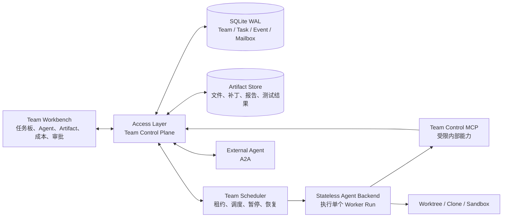

# k_agent Agent Team Runtime 技术方案

> 定位：一个本地优先、模型无关、MCP/Skill 原生、协作过程可监督的 Agent Team Runtime 与工作台。

## 1. 执行摘要

k_agent 的 Agent Team 不应实现成多个 Agent 共享一段群聊上下文，而应新增一个由 Access Layer 持有的、事件驱动且可恢复的 Team Control Plane。Agent Backend 继续只负责执行单次 Agent Run。

核心原则：

> Team 是持久化业务实体，Agent Run 是可失败、可重试、可替换的一次执行尝试。

系统需要同时满足以下目标：

- 协作过程真正可见、可暂停、可恢复。
- 每个 Agent 拥有独立的模型、MCP、Skill、工具权限和文件系统边界。
- 普通工具错误返回给对应 Agent 自我修复，不让整个 Team 终止。
- Agent 通过 Artifact 引用传递成果，避免主管 Agent 反复转述造成信息损失。
- 从第一天记录成本、延迟、重复工作率、任务覆盖率和最终质量。
- 同时支持自动组队和用户手动指定团队，并展示每个 Agent 的创建原因。
- 编码 Agent 使用独立 worktree/clone 和 OS sandbox，避免共享可变工作区。
- 外部 Agent 通过 A2A 接入，但不暴露内部 MCP 密钥、完整上下文和本地文件路径。

## 2. 总体架构



### 2.1 服务职责

#### Access Layer

Access Layer 是 Team Control Plane 的唯一所有者，负责：

- Team、Agent、Task、Run、Mailbox、Artifact 和 Approval 的持久化。
- 自动组队、手动组队和 Agent 配置解析。
- 任务调度、依赖判断、租约、重试、暂停、恢复和取消。
- MCP/Skill 目录校验及每个 Agent 的运行时能力快照。
- Team Event Log 和面向前端的实时事件流。
- Workspace/worktree 生命周期和合并审批。
- A2A 外部 Agent 注册、认证和任务映射。

#### Agent Backend

Agent Backend 保持无状态，只负责：

- 消费一次 Run 的完整、自包含请求。
- 构建提示词、模型上下文和工具运行环境。
- 执行单个 Supervisor 或 Worker Run。
- 输出标准 AG-UI 事件和结构化工具结果。
- 不读取 Team 数据库，不拥有任务板和 Mailbox，不决定最终调度状态。

#### Frontend

Frontend 增加独立 Team Workbench，负责：

- 展示团队状态、任务依赖、Agent 状态和事件时间线。
- 展示 Agent 创建原因、能力边界和成本。
- 提供暂停、恢复、停止、重分配、消息、审批和 Artifact 查看能力。
- 通过 Team Event `seq` 进行断线续传和状态恢复。

### 2.2 与现有架构的衔接

现有代码边界应继续保持：

- `access_layer/gateway.py` 负责公开 AG-UI 入口、会话和运行时能力解析。
- `access_layer/concurrency.py` 的同会话锁只用于公开用户请求串行化。
- `access_layer/agent_backend_client.py` 继续作为 Access Layer 调用 Agent Backend 的内部流式客户端。
- `backend/main.py` 的 `/internal/agent/run` 继续执行单次无状态 Run。
- `backend/runners/base.py` 的 `RunnerContext` 扩展 Team 作用域，但不加入持久化逻辑。
- `backend/agui.py` 继续处理单 Agent 的标准 AG-UI 事件转换。

Supervisor 不应通过公开 `/api/agent` 递归启动子 Agent。当前同会话锁覆盖完整流式请求，递归调用可能导致阻塞。Team Scheduler 应绕过公开会话入口，直接调用内部 Agent Backend Client，并使用独立 Team 并发池。

## 3. 建议代码结构

```text
access_layer/
  teams/
    models.py            # Team、Agent、Task、Run 等领域模型
    store.py             # SQLite 事务与查询
    events.py            # Append-only Team Event Log
    scheduler.py         # 租约、调度、重试、资源限制
    orchestrator.py      # Supervisor 生命周期与事件唤醒
    mailbox.py           # Agent mailbox
    artifacts.py         # Artifact 元数据、版本、权限和血缘
    profiles.py          # Agent 配置快照与能力边界
    approvals.py         # 可恢复审批
    workspaces.py        # worktree/clone/sandbox 生命周期
    merge.py             # 冲突检测、集成分支和质量门禁
    metrics.py           # 成本、延迟、覆盖率和重复率
    control_mcp.py       # Team 内部工具服务
    a2a/
      registry.py
      client.py
      server.py
      security.py

frontend/src/team/
  api.ts
  types.ts
  reducer.ts
  TeamWorkbench.tsx
  TaskBoard.tsx
  AgentRoster.tsx
  TeamTimeline.tsx
  ArtifactPanel.tsx
  ReviewPanel.tsx
  MergePanel.tsx
  MetricsPanel.tsx
```

Agent Backend 的主要改动位置：

- `backend/main.py`：扩展内部 Run 输入，加入 `teamId/taskId/agentId/attemptId`。
- `backend/runners/base.py`：扩展 `RunnerContext` 的运行作用域。
- `backend/runners/codex.py`、`backend/runners/claude_code.py`：接收独立 workspace，而不是只根据 `thread_id` 共享 session workspace。
- `backend/api/schemas.py`：增加 Team Run 相关的内部请求模型，但 Team 领域模型仍放在 Access Layer。

## 4. 持久化设计

### 4.1 存储选择

不建议直接采用 JSON 文件加文件锁实现共享任务板。单机演示可以工作，但任务认领、租约续期、崩溃恢复和未来多进程调度需要事务。

建议：

- 现有会话继续使用 JSON 存储，降低迁移风险。
- Team 元数据使用 SQLite WAL。
- Artifact 大文件存放在文件系统，SQLite 保存索引、哈希和血缘。
- 默认数据库路径：`$K_AGENT_HOME/state/team_runtime.db`。
- 默认 Artifact 路径：`$K_AGENT_HOME/state/teams/{teamId}/artifacts/`。
- 默认 Workspace 路径：`$K_AGENT_HOME/state/teams/{teamId}/workspaces/`。

### 4.2 核心数据表

| 实体 | 关键字段 |
|---|---|
| `teams` | `goal`、`mode`、`status`、`budget`、`policy`、`revision` |
| `team_agents` | `role`、`runnerKind`、`modelId`、`profileSnapshot`、`creationReason`、`status` |
| `team_tasks` | `spec`、`status`、`priority`、`owner`、`leaseUntil`、`attempt`、`qualityGate` |
| `task_dependencies` | `taskId`、`dependsOnTaskId` |
| `agent_runs` | `agentId`、`taskId`、`attempt`、`providerSessionId`、`usage`、`error` |
| `mailbox_messages` | `sender`、`recipient`、`type`、`correlationId`、`dedupeKey`、`ack` |
| `artifacts` | `kind`、`path`、`sha256`、`version`、`producer`、`status`、`schema` |
| `artifact_links` | `artifactId`、`consumerTaskId`、`relation` |
| `team_events` | `teamId`、`seq`、`type`、`actor`、`entity`、`payload` |
| `team_approvals` | `action`、`scope`、`status`、`expiresAt`、`resolution` |
| `workspace_leases` | `workspaceId`、`agentId`、`baseCommit`、`branch`、`status` |

### 4.3 状态模型

Team 状态：

```text
draft → running → paused → running → completed
                  └───────────────→ cancelled
        └─────────────────────────→ failed
```

Task 状态：

```text
pending → ready → claimed → running → review → completed
                    │          │          └→ revision_required → ready
                    │          └→ failed → ready/reassigned
                    └→ lease_expired → ready
```

Agent 状态：

```text
spawning → idle → busy → waiting → idle
                    ├→ paused
                    ├→ failed
                    └→ stopped
```

Run 状态：

```text
queued → running → waiting_approval → succeeded
                 ├→ failed
                 ├→ cancelled
                 └→ lost
```

### 4.4 原子任务认领

Agent 自主认领必须通过 SQLite 事务实现：

1. 执行 `BEGIN IMMEDIATE`。
2. 检查任务依赖是否全部完成。
3. 检查任务是否为 `ready`，且租约不存在或已经过期。
4. 检查 Agent 能力、权限、并发和预算是否满足要求。
5. 以 `revision` 作为乐观锁，原子更新 owner、status、lease 和 revision。
6. 写入 `task.claimed` Team Event。
7. 提交事务。

多个 Agent 同时认领同一任务时，只允许一个成功。其他 Agent 得到结构化结果：

```json
{
  "ok": false,
  "error": {
    "code": "TASK_ALREADY_CLAIMED",
    "message": "任务已被其他 Agent 认领",
    "retryable": true
  }
}
```

## 5. Team Scheduler

### 5.1 独立调度池

Team 内部 Agent 调度不能直接复用公开 Agent 请求并发限制。建议增加独立配置：

```env
TEAM_RUNTIME_ENABLED=false
TEAM_MAX_ACTIVE_AGENTS=4
TEAM_MAX_ACTIVE_TASKS=4
TEAM_MAX_ACTIVE_TASKS_PER_AGENT=1
TEAM_TASK_LEASE_SECONDS=120
TEAM_HEARTBEAT_SECONDS=20
TEAM_MAX_ATTEMPTS=3
TEAM_PAUSE_GRACE_SECONDS=15
TEAM_MAX_DELEGATION_DEPTH=1
TEAM_ARTIFACT_MAX_BYTES=52428800
TEAM_AUTO_MERGE=false
A2A_ENABLED=false
```

`TEAM_MAX_DELEGATION_DEPTH=1` 表示第一阶段只支持 Supervisor 创建 Worker，不允许 Worker 继续递归组建子团队。

### 5.2 调度循环

Scheduler 的主要循环：

1. 扫描状态为 `running` 的 Team。
2. 将依赖已满足的 `pending` Task 转为 `ready`。
3. 处理过期 Agent heartbeat 和 Task lease。
4. 为可运行 Task 查找满足能力和预算条件的 Agent。
5. 原子认领任务并创建 Run Attempt。
6. 调用 Agent Backend 执行 Worker Run。
7. 持久化事件、指标、Artifact 和最终状态。
8. 根据结果进入 review、retry、reassign 或 completed。
9. 在关键事件后唤醒 Supervisor。

### 5.3 崩溃恢复

- Scheduler 定期续租运行中的任务。
- Access Layer 启动时扫描过期租约。
- 如果 CLI Runner 存在可恢复 session，优先 resume。
- 无法 resume 时创建新的 `attempt`，保留旧 Run 和错误记录。
- 工具副作用、Mailbox 投递和 Artifact 发布必须携带幂等键。
- 一个 Worker 崩溃只影响对应 Task Attempt，不改变整个 Team 状态。
- Team 只在目标不可达、预算耗尽、系统性错误或用户取消时终止。

### 5.4 暂停语义

提供两种暂停：

- **软暂停**：停止派发新任务，当前 Worker 在模型或工具边界完成后暂停。
- **硬暂停**：取消正在执行的 Backend/CLI Run，保存 checkpoint，将 Task 转入可恢复状态。

恢复时根据数据库和 Event Log 重建 Scheduler 状态，不能依赖原进程内存。

## 6. Supervisor 运行模式

Supervisor 不应作为一个永久占用 HTTP 连接的长时间 Run。采用事件唤醒模型：

1. 用户提交目标。
2. Supervisor 生成结构化 Team Proposal。
3. 用户批准，或 Team Policy 自动批准。
4. Scheduler 创建 Agent 和 Task，并开始调度。
5. Task 完成、失败、Artifact 发布、审查或质疑事件唤醒 Supervisor。
6. Supervisor 更新计划、创建修订任务或调整 Agent。
7. 所有必要 Artifact 通过质量门禁后，Supervisor 合成最终结果。

Supervisor 通过受限的 Team Control MCP 操作 Team，而不是直接访问数据库。

建议工具：

```text
team_task_list
team_task_create
team_task_claim
team_task_update
team_agent_propose
team_mail_send
team_mail_receive
artifact_publish
artifact_get
artifact_list
team_request_review
team_request_approval
```

Team Control MCP 的约束：

- 由 Access Layer 托管，不出现在普通用户 MCP 目录中。
- 每次 Run 签发短期 capability token。
- Token 限定 `teamId/agentId/runId/允许操作/过期时间`。
- Agent Backend 只拿到连接定义和临时凭据，不持有 Team 数据。
- Team MCP 工具不获取公开 session lock，只执行短 SQLite 事务。
- Token、内部 endpoint 和认证头不得进入模型提示词、Artifact 或遥测正文。

## 7. Agent Profile 与权限边界

每个 Agent 创建时生成不可变的 `AgentProfileSnapshot`：

```json
{
  "runnerKind": "k_agent|codex|claude_code|a2a",
  "modelId": "...",
  "reasoningEffort": "...",
  "rolePrompt": "...",
  "mcpServerIds": [],
  "skillIds": [],
  "toolAllow": [],
  "toolDeny": [],
  "filesystem": {
    "readRoots": [],
    "writeRoots": []
  },
  "network": {
    "allowedOrigins": []
  },
  "limits": {
    "maxTokens": 100000,
    "maxToolCalls": 100,
    "timeoutSeconds": 1800
  },
  "approvalPolicy": "...",
  "workspaceMode": "none|workspace|worktree|clone"
}
```

Access Layer 在每次 dispatch 时：

- 校验 MCP/Skill 仍然启用。
- 解析成完整、自包含的运行定义。
- 将最终运行快照写入 `agent_runs`。
- 不允许模型仅提交一个 MCP/Skill ID 就绕过目录和权限验证。
- 对模型、工具、文件系统和网络分别做最小权限控制。

### 7.1 Agent 创建原因

自动创建 Agent 时持久化 `AgentSpawnDecision`：

- 创建原因。
- 来源：用户、Supervisor 或系统策略。
- 当前能力缺口。
- 期望输出 Artifact。
- 预计成本和并行收益。
- 使用的模型、MCP、Skill 和权限范围。
- 创建由谁批准。

前端直接展示这些信息，而不是只显示一个角色名称。

## 8. Mailbox

Mailbox 使用持久化、至少一次投递语义：

- 每条消息包含 `messageId`、`correlationId` 和 `dedupeKey`。
- 消息状态为 `sent → delivered → acked`。
- 支持 Agent、Supervisor、系统和受控广播收件箱。
- 接收方使用 `dedupeKey` 消除重复投递。
- 消息正文优先传递 Artifact 引用，不复制完整成果。
- Mailbox 只传递任务信息、证据、结论和请求，不传递隐藏思维链。

建议消息类型：

```text
task_offer
task_claim_result
artifact_ready
review_request
review_result
challenge
clarification_request
blocked_notice
status_update
shutdown_request
```

## 9. 交叉审查与 Agent 质疑

质疑和交叉审查应是有界工作流，而不是无限群聊：

1. Producer 发布候选 Artifact。
2. Scheduler 根据 `reviewPolicy` 创建 Review Task。
3. Review Task 必须分配给不同 Agent；高风险任务可要求不同模型。
4. Reviewer 获得原始任务规格、验收标准、Artifact 和必要资料。
5. Reviewer 返回结构化结论：`accept/revise/reject`。
6. 问题记录严重度、证据、Artifact 定位和建议修复方式。
7. Producer 可以提交一次修订和一次 challenge。
8. 默认最多允许 1～2 轮，超过上限交由 Supervisor 或用户裁决。

Review Artifact 示例：

```json
{
  "verdict": "revise",
  "score": 0.72,
  "issues": [
    {
      "severity": "high",
      "artifactRef": "artifact://team/artifact@1",
      "location": "section:4.2",
      "evidence": "缺少并发认领失败路径",
      "suggestion": "增加 revision CAS 和冲突返回协议"
    }
  ]
}
```

## 10. Artifact 协作

Artifact 是 Agent 之间交换成果的主要载体：

```text
artifact://{teamId}/{artifactId}@{version}
```

建议类型：

```text
report
structured_data
source_patch
test_result
review
conflict
checkpoint
citation_set
final_answer
```

Artifact 规则：

- 内容不可原地修改，只能创建新版本。
- 发布过程使用临时文件、SHA-256 和原子 rename。
- 元数据记录 producer、task、run、输入 Artifact、MIME、大小和生成时间。
- 模型默认只收到 manifest、摘要和引用，需要时再按范围读取正文。
- 大文本预览必须截断，避免每个 Agent 重复吞入完整上下文。
- 状态支持 `candidate/accepted/rejected/superseded`。
- 最终结果必须能够追溯到任务、Agent、工具调用和原始资料。
- Artifact 下载和读取需要校验 team、agent、role 和 capability token。

## 11. 编码任务隔离

当前 CLI Runner 如果只根据 `thread_id` 获取 session workspace，多个 Team Worker 将共享同一工作目录。Agent Team 阶段必须改为显式传入独立 workspace。

### 11.1 Workspace 模式

- `workspace`：普通文件型任务，不涉及 Git 合并。
- `worktree`：可信本地仓库，速度快，文件树隔离。
- `clone`：高风险或不可信 Agent，拥有独立 `.git` 元数据，隔离更强。

Git worktree 只是工作文件并发隔离，不是安全沙箱，因为它仍共享主仓库 Git 元数据。真正的安全边界仍由 OS sandbox 或 container 提供。

### 11.2 编码流程

1. 固定 Team 的 `baseCommit`。
2. 每个编码 Agent 获得独立 worktree/clone 和分支。
3. Sandbox 只允许写自己的工作目录和临时目录。
4. Agent 产出 Patch Artifact、测试结果、base/head commit。
5. Integration Agent 在独立集成工作区处理合并。
6. 检查变更路径、hunk 重叠和 base 是否过期。
7. 无冲突变更执行三方合并并运行质量门禁。
8. 冲突生成 Conflict Artifact 和 Resolution Task。
9. 通过审批后才允许应用到用户工作分支。

任何 Worker 都不能直接合并到用户当前分支。

### 11.3 冲突检测

冲突检测分三层：

- 文件层：两个 Artifact 是否修改相同路径。
- Hunk 层：修改行范围是否重叠，是否存在 stale base。
- 语义层：即使 Git 可自动合并，是否修改同一接口、schema、配置或生命周期契约。

语义冲突可通过代码索引、测试失败、API schema diff 和 Reviewer Agent 发现。发现冲突时不应覆盖任一成果，而应生成结构化 Conflict Artifact。

## 12. Team Workbench

建议保留现有聊天页面，同时增加独立工作台：

- 左侧：共享任务板、优先级、依赖关系和认领状态。
- 中间：主管对话、最终综合和 Team 时间线。
- 右侧：Agent 列表、状态、模型、MCP、Skill、权限、创建原因和成本。
- 下方或抽屉：Artifact、Diff、测试、审查和冲突。

关键操作：

- 暂停、恢复或取消 Team。
- 暂停、停止或替换单个 Agent。
- 手动组队和任务重分配。
- 给指定 Agent 发送消息。
- 批准 Team Plan、危险工具和最终合并。
- 查看每个 Agent 的创建原因和能力快照。
- 查看每次失败、重试、恢复和自我修复过程。

Frontend 应增加独立 `frontend/src/team/` 状态域，不继续把所有 Team 状态堆入现有 `App.tsx`。Team reducer 以 Event Log 为权威，通过 `lastEventSeq` 断线恢复。

## 13. Team 事件协议

单 Agent 内部继续使用标准 AG-UI。Team 级事件使用：

```text
CUSTOM name="team.event"
```

事件 envelope：

```json
{
  "schemaVersion": 1,
  "teamId": "...",
  "seq": 1042,
  "eventId": "...",
  "type": "task.claimed",
  "actor": {"type": "agent", "id": "..."},
  "entity": {"type": "task", "id": "..."},
  "payload": {},
  "occurredAt": "..."
}
```

事件类型：

```text
team.created
team.paused
team.resumed
team.completed
agent.created
agent.status_changed
task.created
task.claimed
task.blocked
task.completed
run.started
run.failed
run.retried
mail.sent
mail.acked
artifact.published
artifact.accepted
review.completed
merge.conflict_detected
approval.requested
approval.resolved
metric.updated
```

所有事件按 Team `seq` 持久化。前端重连时请求 `afterSeq=N`，保证不重排、不重复、不丢失。单 Agent 原始 AG-UI 事件仍按到达顺序保存，不能从聚合状态反向伪造推理或工具事件。

## 14. API 设计

### 14.1 Team API

```text
POST   /api/teams
GET    /api/teams/{teamId}
GET    /api/teams/{teamId}/events?afterSeq={seq}
GET    /api/teams/{teamId}/stream?afterSeq={seq}
POST   /api/teams/{teamId}/commands/pause
POST   /api/teams/{teamId}/commands/resume
POST   /api/teams/{teamId}/commands/cancel
POST   /api/teams/{teamId}/commands/message
```

### 14.2 Task API

```text
GET    /api/teams/{teamId}/tasks
POST   /api/teams/{teamId}/tasks
POST   /api/teams/{teamId}/tasks/{taskId}/claim
POST   /api/teams/{teamId}/tasks/{taskId}/reassign
POST   /api/teams/{teamId}/tasks/{taskId}/cancel
POST   /api/teams/{teamId}/tasks/{taskId}/review
```

### 14.3 Artifact 和审批 API

```text
GET    /api/teams/{teamId}/artifacts
GET    /api/teams/{teamId}/artifacts/{artifactId}
GET    /api/teams/{teamId}/artifacts/{artifactId}/content
POST   /api/teams/{teamId}/approvals/{approvalId}/resolve
```

长时间 Team 不应依赖最初创建请求一直保持连接。创建 API 返回 `teamId`，后续通过 Team Event Stream 观察状态。

## 15. 工具失败隔离

普通工具失败必须继续返回给当前 Agent：

- 本地工具失败。
- MCP `isError`。
- 参数解析错误。
- Team Task 已被认领。
- Artifact 版本冲突。
- 权限不足或审批待处理。

统一结构：

```json
{
  "ok": false,
  "error": {
    "code": "STABLE_ERROR_CODE",
    "message": "可供模型理解的错误原因",
    "retryable": true,
    "details": {}
  }
}
```

对应 Agent 可以修正参数、换工具、请求权限或报告阻塞。只有模型流中断、协议损坏、预算耗尽和用户取消才结束当前 Run。

Run 失败后：

- Task 根据策略重试或重新分配。
- Supervisor 收到结构化失败事件。
- 其他 Agent 和 Task 继续运行。
- 不把单个 Worker 的失败升级成 Team 级终止。

## 16. A2A 外部 Agent 接入

A2A 作为外部传输适配器，不作为内部 Team 存储协议，也不替代 MCP。

映射关系：

```text
Internal AgentProfile ↔ A2A Agent Card
Internal Task         ↔ A2A Task
Internal Artifact     ↔ A2A Artifact
Team Event            ↔ A2A status/stream event
```

安全要求：

- 默认 `A2A_ENABLED=false`。
- Agent Card 域名必须在 allowlist 中。
- 使用 OAuth2、mTLS 或明确的 API credential。
- 防止 SSRF、重定向和私网地址绕过。
- 限制响应体、Artifact 大小、超时和并发。
- 不向外部 Agent 暴露内部 MCP 密钥、完整对话或本地文件路径。
- Artifact 使用临时签名下载地址或显式上传。
- 当前服务默认只绑定 loopback；外部 A2A 必须由用户显式配置监听、反向代理和认证。

A2A 协议参考：<https://a2a-protocol.org/latest/>

## 17. 指标与可观测性

每个指标都保存原始值和计算版本，避免未来定义变化后无法回算。

### 17.1 核心指标

- **成本**：Team、Task、Agent、模型和工具维度的 token 与价格快照。
- **延迟**：排队、执行、审批等待、关键路径和总墙钟时间。
- **重复工作率**：重复 Task Attempt、重复工具签名、相同 Artifact 哈希和被判无效的成本比例。
- **任务覆盖率**：已通过质量门禁的必需任务权重 / 总必需任务权重。
- **最终质量**：自动门禁、交叉审查和人类验收分别记录，不强行压成一个分数。
- **协作开销**：Mailbox 消息量、Supervisor 唤醒次数和 Artifact 读取量。
- **恢复能力**：重试次数、租约过期数、恢复成功率和人工介入次数。

### 17.2 Langfuse Trace 层级

```text
Team root
  ├─ Supervisor turn
  ├─ Task
  │   ├─ Worker run
  │   ├─ Model generation
  │   ├─ Tool calls
  │   └─ Artifact publish
  ├─ Review
  └─ Merge / Final synthesis
```

建议关联字段：

```text
team_id
task_id
agent_id
attempt_id
artifact_id
runner_kind
model_id
workspace_id
```

遥测必须 fail-open，并继续对 API key、token、authorization、密码、Data URL 和敏感文件内容进行脱敏。

## 18. 实施路线

### 18.1 3.0：Team Runtime 基础

范围：

- SQLite Team Store。
- Team、Agent、Task、Run 领域模型。
- Team Event Log。
- Team API。
- 前端只读任务板和事件时间线。

验收：Access Layer 重启后，Team、Task、Agent 和事件序列完整恢复。

### 18.2 3.1：Supervisor—Worker 稳定版

范围：

- 结构化 Team Proposal。
- 自动和手动组队。
- 独立 Team 调度池。
- Task lease、heartbeat、retry 和 reassign。
- Team 暂停、恢复和取消。

验收：三个 Agent 并行时杀掉其中一个，其他 Agent 继续，失败任务自动恢复或重新分配。

### 18.3 3.2：Mailbox、Artifact、交叉审查

范围：

- 持久化 Mailbox。
- Artifact URI、版本和血缘。
- Review Task。
- 有界 challenge 流程。

验收：Supervisor 最终输出只依赖已接受 Artifact；Agent 重启后可以继续消费未确认消息。

### 18.4 3.3：编码隔离与合并

范围：

- Worktree/clone 生命周期。
- 每 Agent 独立 sandbox。
- Patch Artifact 和 Test Result Artifact。
- Integration Agent。
- Conflict Artifact 和 Resolution Task。

验收：两个 Agent 修改同一行时不得污染用户工作区，必须产生可见冲突任务。

### 18.5 3.4：完整工作台与指标

范围：

- 团队拓扑和实时状态。
- Agent 创建原因和能力快照。
- 成本、关键路径、覆盖率和重复率。
- 审批、恢复和人工接管。

验收：刷新页面或断网重连后，团队状态和事件顺序完全一致。

### 18.6 3.5：A2A

范围：

- Agent Card 注册。
- 外部任务和状态流。
- Artifact 映射。
- 认证、SSRF 防护和网络策略。

验收：远程 Agent 超时、重复事件或恶意 Artifact 均不能终止或越权影响本地 Team。

## 19. 必须覆盖的测试

### 19.1 并发和恢复

- 十个 Agent 同时认领一个 Task，只有一个成功。
- Access Layer 在三个 Worker 运行中重启，状态可恢复。
- Task lease 过期后只产生一个新 attempt。
- 重复 heartbeat、完成事件和 Mailbox ack 不会重复推进状态。
- 用户暂停 Team 后不再派发新任务。

### 19.2 错误隔离

- 普通工具失败返回 `ok:false`，Agent 可以自行修复。
- 一个 Worker 模型流崩溃不会终止 Team。
- MCP 超时只影响当前工具调用或当前 Run。
- Supervisor 失败可重试，已完成 Artifact 不丢失。

### 19.3 权限和安全

- Agent 不能使用未分配 MCP/Skill。
- capability token 不能跨 Team、Agent 或 Run 使用。
- Artifact 路径穿越、符号链接和超限文件被拒绝。
- 外部 A2A Agent 不能访问内部地址和本地凭据。
- Team 内部 MCP 的认证信息不会进入 prompt、Artifact 和 telemetry。

### 19.4 编码隔离

- Worker 只能写自己的 workspace。
- 两个 worktree 的未提交修改互不影响。
- stale base 和重叠 hunk 生成 Conflict Artifact。
- 未经审批不修改用户当前分支。
- 合并后的质量门禁失败时不能标记任务完成。

### 19.5 前端事件恢复

- Team Event 按 `seq` 重放且不重复。
- 切换 session 或 Team 不丢失运行状态。
- 页面隐藏和恢复时继续消费事件。
- 重连时从 `lastEventSeq` 恢复，不使用聚合状态伪造事件。

## 20. 明确的非目标

第一版应禁止或暂缓：

- Agent 无限递归创建 Team。
- 无限制的 Agent 群聊。
- 所有 Agent 共享可变记忆和工作目录。
- Worker 自动合并到用户分支。
- Supervisor 绕过权限直接操作数据库。
- 为追求自主性而隐藏调度、成本或失败。
- 把内部 MCP 认证信息暴露给提示词或 Artifact。
- 直接复制其他产品基于 JSON 文件锁的持久化实现。

## 21. 最终定位

k_agent 的差异化不应是“同时跑多个模型”，而应是：

> 每个 Agent 都是有明确任务、能力快照、执行空间和审计轨迹的 Worker；所有协作通过可恢复任务、Mailbox 和 Artifact 发生，并始终受用户监督。

这使 k_agent 更适合被定位为一个本地优先、模型无关、MCP/Skill 原生、协作过程可监督的 Agent Team Runtime 与工作台，而不是另一个群聊式多 Agent 框架。

## 22. 现有代码参考位置

- `README.md`：当前 Access Layer 与 Agent Backend 服务边界。
- `access_layer/gateway.py`：公开 Agent 请求、会话串行化和 Agent Backend 转发。
- `access_layer/concurrency.py`：当前全局并发和同 session 锁。
- `access_layer/agent_backend_client.py`：内部 NDJSON 流式调用。
- `access_layer/sessions/store.py`：当前会话和原始 AG-UI Event 持久化。
- `backend/main.py`：无状态 Agent Backend 入口和运行上下文创建。
- `backend/runners/base.py`：RunnerContext 和 Runner Protocol。
- `backend/runners/codex.py`：Codex CLI workspace 和 MCP/Skill 注入。
- `backend/runners/claude_code.py`：Claude Code workspace 和 MCP/Skill 注入。
- `backend/approvals.py`：当前进程内审批 broker。
- `backend/config/config.py`：服务并发、存储和 sandbox 配置。
- `backend/permissions/rules.py`：当前工具权限规则。
- `backend/storage/file.py`：当前文件原子写入实现。
- `frontend/src/types.ts`：当前 AG-UI Event 类型。
- `frontend/src/App.tsx`：当前按 session 管理活动 Run 和事件处理。

