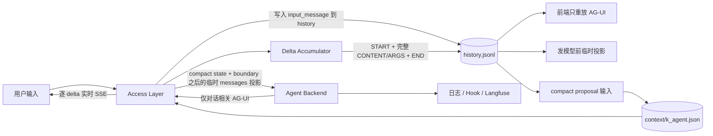

# K Agent 上下文压缩、完整对话存储与 AG-UI 重构计划

> 状态：已实施  
> 日期：2026-09-04  
> 关联文档：[AG-UI 协议约定](ag-ui-protocol.md)、[上下文压缩最终技术方案](context-compaction-technical-solution.md)  
> 实施范围：Backend / Access Layer / Frontend / CLI / 会话迁移器已按本文的 1–8 条边界切换。

## 0. 计划范围

两个任务一次做完，不拆开：

1. **结合上下文压缩，重做对话存储**（借鉴 Claude Code：UI 完整 transcript ≠ Provider 活动上下文）。
   完整对话历史尽量保留对话相关 AG-UI 事件；token `delta` 只在内存累计，结构边界写成一条完整内容再落盘。
   压缩只改发给模型的活动上下文，不裁 UI 历史。
2. **删掉与对话无关的运行观测事件**：Backend 不再发送 `status` / `trace`。前端顶栏状态和右侧运行轨迹
   **只能**从实时 AG-UI 流或同一份完整对话历史投影，不得另开 `trace[]` / `thinking[]` / `tasks[]` 或 CUSTOM 观测事件。

你刚看到的 `session.json` 里 `trace/tasks/thinking` 全是空数组、页面却有思考和轨迹，就是因为前端在有
`events` 时**根本不读这三个字段**，而是重放 `events`（含 `CUSTOM(trace)` 和 `REASONING_*`）。本计划把这条
假数据源拆掉：观测事件不再产生，顶层空数组删除，轨迹只从白名单 AG-UI 投影。

本文中的“delta 累计后保存”是指：实时 token 在内存中累计，在结构边界生成
一条**完整内容的 AG-UI 事件**再写入 `history.jsonl`。这与 `context/k_agent.json` 里的 compact
摘要不是同一份数据。

## 1. 最终边界

Agent Backend 不再产生 `status`、`trace` 内部事件，`backend/agui.py` 也不再把它们转换成
`CUSTOM(status)`、`CUSTOM(trace)`。

公开 AG-UI 流只保留会改变下列任一事实的事件：

1. 用户看到了什么对话内容；
2. Agent 进行了什么 reasoning、工具调用或人工交互；
3. 一次 run 从何时开始、以什么结果结束；
4. 会话恢复或历史回放时必须重建什么状态。

由此得到单一数据流：

```text
实时 Backend AG-UI 流 ───────┐
                             ├─ 同一个事件投影器 ─→ 对话正文 / reasoning / 工具 / 审批 / 简化状态
持久化完整对话事件历史 ──────┘

Backend 日志 / Hook / Langfuse ────────────────→ 调试与性能观测，不进入对话历史
```

前端“运行轨迹”不得再依赖独立的 `trace[]`、`thinking[]`、`tasks[]` 或 `CUSTOM(trace)`；只能从当前
实时 AG-UI 流或同一份持久化对话事件历史投影得到。

### 1.1 三类数据必须分开

| 数据层 | 是什么 | 是否可删除或重建 | 消费方 |
| --- | --- | --- | --- |
| 完整对话历史 | 用户输入与对话相关 AG-UI 事件的有序事实流 | 除用户明确删除会话外不可因 compact 删除 | 历史 UI、审计；发模型前临时投影 |
| Provider 活动上下文 | compact summary、boundary 后的消息、当前工作集 | 可从完整历史重新生成 | Agent Backend 模型调用 |
| 运行观测 | 耗时、Hook、重试、缓存、内部服务状态 | 按日志保留策略清理 | 日志、Langfuse、开发排障 |

这里的“完整”不是保存所有内部事件，而是完整保存**所有会改变对话语义和时间线**的事件。`status/trace`
不属于完整对话历史；它们只是重复展示或内部诊断。

### 1.2 一次 run 的统一数据流



只有 `H` 是 UI 历史事实源。发给模型的 messages 数组、顶栏状态、右侧轨迹、compact state 都是派生视图，
不能反过来覆盖完整历史。前端**不**消费 messages 投影。

## 1.5 实施结果

| 项 | 现状 |
| --- | --- |
| Delta 累计落盘 | **已落地**。Access Layer 不把每个 token 写入 `events`；`TEXT_MESSAGE_END` 等边界写一条完整 `delta`。旧会话已按此迁移过一轮。 |
| `session.json` 仍塞整份 `events[]` | **已拆分**：只留元数据，对话事实追加到 `history.jsonl`。 |
| 顶层 `trace` / `tasks` / `thinking` | **已删除**：Session API 和新写入路径都不再包含。 |
| Backend `status` / `trace` | **已删除**：所有 Runner 不再产生，AG-UI 不再映射，Access Layer 白名单再做一次拦截。 |
| 前端顶栏 status、右侧「执行轨迹」 | **已切换**：实时和历史均由同一类标准事件按到达顺序投影。 |
| 持久化 compact 边界 | **已落地基础协议**：`context/k_agent.json` 保存 `history.seq + messageId + prefixDigest + summary`，失效时回退到完整历史。 |

该改造保留了已有 delta 累计语义，并将 compact 挂到可校验的 history seq。

## 2. 当前问题

当前链路重复表达了同一运行状态：

```text
backend/agent/react_agent.py
  ├─ _run_status() ─→ 内部 status ─→ CUSTOM(status) ─→ frontend setStatus()
  ├─ _run_trace()  ─→ 内部 trace  ─→ CUSTOM(trace)  ─→ frontend trace[]
  └─ reasoning / tool / text / run events ──────────→ 对话时间线
```

这带来四个问题：

- `status` 只是“正在思考”“正在调用工具”之类的展示文案，与标准事件表达的生命周期重复；
- `trace` 混入 `agent:start`、耗时和 Hook 等调试信息，不属于对话事实；
- 实时页面、历史回放和右侧轨迹分别消费不同状态源，容易出现互相矛盾；
- `session.json` 被 `status/trace` 高频写入并持续膨胀，且顶层 `trace/tasks/thinking` 与 `events`
  又形成重复或空字段。

Claude Code 的 transcript 也采用相同原则：可恢复的 user/assistant/system/attachment 消息进入持久链，
progress 是 UI 临时状态，不参与 transcript 和父子链。K Agent 不复制它的具体文件格式，但采用这条
持久化边界。

## 3. 允许发送的 AG-UI 事件

### 3.1 对话事件白名单

| 类别 | 事件 | 实时发送 | 持久化 | 用途 |
| --- | --- | --- | --- | --- |
| 用户输入 | `input_message` envelope（非 Backend 事件） | 前端本地即可显示；服务端随 history 回放 | 是 | 「你」的气泡和附件。当前实现写在 `messages[]`，events 里往往没有；事件-only UI **必须**把用户回合写入 history，否则刷新后左侧对话只剩助手侧 |
| Run | `RUN_STARTED` | 是 | 是 | 建立一次可恢复运行 |
| Run | `RUN_FINISHED` | 是 | 是 | 记录完成、停止或等待人工处理 |
| Run | `RUN_ERROR` | 是 | 是 | 记录对用户可见的运行失败 |
| 正文 | `TEXT_MESSAGE_START/CONTENT/END` | 是 | 是 | 助手正文 |
| Reasoning | `REASONING_*` | 是 | 是 | 可展示的 reasoning。新 run 不再发旧 `THINKING_*`；迁移时把旧 THINKING 规范成 REASONING |
| 工具 | `TOOL_CALL_START/ARGS/END/RESULT` | 是 | 是 | 工具名称、参数和最终结果 |
| 人工交互 | `ACTIVITY_SNAPSHOT` | 是 | 是 | 审批、问答卡片的公开内容（无 checkpoint） |
| HITL 协议 | `STATE_SNAPSHOT` / `MESSAGES_SNAPSHOT` | 可以 | **否** | 仅实时协议；checkpoint 已在 `approvals/`。不入 history，避免把可执行状态和巨大 messages 快照写进对话日志 |

白名单以外的事件默认不能进入公开 SSE 或会话历史。新增事件必须先回答：“删掉它后，是否无法重建
对话、工具、人工交互或 run 结果？”答案为否时，它应进入日志或前端本地状态，而不是 AG-UI。

### 3.2 `CUSTOM` 的处理

| 当前事件 | 计划 |
| --- | --- |
| `CUSTOM(status)` | 删除；前端从标准事件推导运行状态。 |
| `CUSTOM(trace)` | 删除；详细信息写 Backend/Access Layer 日志、Hook 和 Langfuse。 |
| `CUSTOM(cli_session)` | 从公开 AG-UI 移走，改为 Backend → Access Layer 的私有控制元数据；不发给浏览器。 |
| `CUSTOM(tool_output_delta)` | 暂时只用于实时工具卡片，不持久化；最终 `TOOL_CALL_RESULT` 是历史事实。后续若 AG-UI 提供标准工具输出流事件，再替换该扩展。 |
| 旧 `CUSTOM(approval_*)` | 只做旧历史兼容；新运行统一使用 `ACTIVITY_SNAPSHOT`。 |

因此，删除 `status/trace` 不等于删除工具和 reasoning 轨迹。它们已经由标准 AG-UI 事件完整表达。

## 4. 前端状态如何产生

前端不再接受服务端自然语言状态文案，而是维护一个纯事件状态机：

| 最近事件 | 页面状态 | 展示文案示例 |
| --- | --- | --- |
| 无活动 run | `idle` | 等待新任务 |
| `RUN_STARTED` | `running` | 正在处理 |
| `REASONING_START` / `REASONING_MESSAGE_*` | `running` | 正在思考 |
| `TOOL_CALL_START/ARGS` | `running` | 正在准备 `{toolCallName}` |
| `TOOL_CALL_END` 且尚无 result | `running` | 正在执行 `{toolCallName}` |
| 待处理的 `ACTIVITY_SNAPSHOT` | `waiting` | 等待你的确认 |
| `TEXT_MESSAGE_START/CONTENT` | `running` | 正在回复 |
| `RUN_FINISHED` | `complete` 或 `waiting` | 已完成 / 等待你的确认 |
| `RUN_ERROR` | `error` | 运行失败 |

状态文案是前端投影，不是会话事实。刷新后对持久化事件重新运行同一状态机，应得到与实时结束时相同
的结果。

附件过大、浏览器不支持语音、会话加载失败等客户端提示继续保留，但改用独立 `notice/toast` 状态，
不能再复用 Agent run 状态字段。

## 5. 运行轨迹与按钮简化

### 5.1 运行轨迹

右侧轨迹改成一个按到达顺序排列的统一时间线：

```text
reasoning → tool call → tool result → reasoning → assistant text
```

每一项都从 AG-UI 事件投影；不再分别维护“思考过程 / 任务计划 / 工具活动 / 执行轨迹”四套数组。
正文仍以左侧 transcript 为主，右侧可只显示简短的“已生成回复”节点，避免重复正文。

以下内容不再展示为对话轨迹：

- `agent:start/end`、请求消息数；
- Hook 名称与内部阶段；
- `memory:eager_loaded` 等内部装载信息；
- Backend、MCP、工具耗时；
- 重试次数、缓存命中、内部 HTTP 状态。

这些内容需要排障时从结构化日志或 Langfuse 查看。

### 5.2 状态控件

前端只保留：

- 一个由标准事件推导的状态标识；
- 运行中的“停止”操作；
- 审批或问答卡片自身的操作按钮；
- 工作区入口。

删除“轨迹事件数”等由 `trace[]` 产生的指标。“工具调用数”“reasoning 块数”如继续展示，也必须从
统一事件投影器计算，不能另建持久状态。

## 6. 会话历史存储规则

本次改造同时收紧持久化边界，但不把上下文压缩摘要混进对话历史。

### 6.1 事实源与派生状态

```text
完整对话事件历史      唯一 UI 事实源；气泡、思考、工具、审批都从 AG-UI 事件投影，不再用 messages 链渲染
Backend 用 messages    仅在发模型前由 Access Layer 从 history 临时投影，不落盘、不作为前端展示源
context/k_agent.json  上下文压缩后的活动视图，是派生索引，不是历史替代品
日志 / Langfuse        调试、耗时和内部执行阶段
```

上下文压缩只能改变下一次发给 Provider 的活动 messages，不能删除或覆盖完整对话事件历史。compact
boundary 应引用稳定的历史位置和消息 ID，不能引用 `status/trace`。

### 6.2 完整历史记录模型

`history.jsonl` 不直接混放无法区分来源的对象，每条记录使用统一 envelope：

```json
{
  "schemaVersion": 1,
  "seq": 42,
  "sessionId": "session-id",
  "runId": "run-id",
  "kind": "agui_event_batch",
  "recordedAt": "2026-09-03T12:00:00Z",
  "events": [
    {"type": "TEXT_MESSAGE_START", "messageId": "message-id"},
    {"type": "TEXT_MESSAGE_CONTENT", "messageId": "message-id", "delta": "累计后的完整正文"},
    {"type": "TEXT_MESSAGE_END", "messageId": "message-id"}
  ]
}
```

除 AG-UI 事件外，只允许少量会话事实 envelope：

- `input_message`：Access Layer 接受的用户消息和附件；
- `history_mutation`：编辑、取消或删除消息产生的 tombstone/替换记录；
- `agui_event` / `agui_event_batch`：Backend 输出的对话相关标准事件。

`status`、`trace`、日志和 compact summary 均不能作为 history record。

### 6.3 Delta 落盘

实时 SSE 继续逐块发送 `TEXT_MESSAGE_CONTENT`、`REASONING_MESSAGE_CONTENT` 和
`TOOL_CALL_ARGS`。持久化时不保存每个 token，而是在对应结构边界累计后只保存一条同类型事件：

```text
实时：START → CONTENT("你") → CONTENT("好") → END
历史：START → CONTENT("你好")                  → END
```

累计后的事件仍保留原 `type`、`messageId/toolCallId`、`rawEvent` 等字段，`delta` 中保存该块的完整内容。
历史回放从空投影开始，因此处理这条完整 `delta` 一次即可得到和实时流相同的最终结果。

持久化过滤规则：

1. 丢弃 `CUSTOM(status)`、`CUSTOM(trace)` 和 `CUSTOM(tool_output_delta)`；
2. 对上述三类标准 delta 按 ID 和生命周期边界累计；
3. 其余白名单事件按真实到达顺序保存，不按类型重新分组；
4. 异常、停止时先封存已经收到的部分内容，再保存 run 终态；
5. 不再保存顶层 `trace`、`tasks`、`thinking` 字段。

### 6.4 目标目录

最终从单个不断膨胀的 `<session-id>.json` 拆成：

```text
$K_AGENT_HOME/state/sessions/<session-id>/
├── session.json             # 会话元数据（见下），不含 events / compact 摘要
├── history.jsonl            # 追加式完整对话事件历史（UI 与审计的唯一事实源）
├── context/
│   └── k_agent.json         # compact boundary、summary、活动尾部状态
├── approvals/               # 未决/已决人工确认卡（checkpoint 在此，不进 history 可执行字段）
├── resume-intents/          # 见下；不是对话历史
└── workspace/
```

**不单独落盘 `messages.json`，前端也不用 messages 链画对话。** 中间聊天区、思考、工具卡与右侧轨迹一律重放 `history.jsonl`（或实时 SSE）里的 AG-UI 事件。Access Layer 只在调用 Agent Backend 时，从同一份 history 临时投影出 Provider 需要的 user/assistant/tool 数组；这是内部请求体，不是会话文件，也不是页面数据源。

`session.json` 只保留非对话事实，例如：

| 字段 | 是什么 | 要不要 |
| --- | --- | --- |
| `title` / `updatedAt` | 侧栏展示 | 要 |
| `capabilities.mcpServerIds` / `skillIds` / `permissionMode` | 这个会话勾选了哪些 MCP、Skill、权限 | 要。不是聊天事件，下一轮 run 必须带上，history 里通常没有 |
| `source` / `sourceRef` | 会话来源：普通聊天 / 定时任务 / fork 自哪个会话 | 要。用来决定是否进左侧目录、分支从哪来 |
| `cliSessions` | Codex/Claude 原生 session id | 若仍支持那些 Runner 则要；与 k_agent 主对话事件无关 |
| `openInterruptIds` | 未决审批 ID 索引 | 要；正文仍在 `approvals/` |

`resume-intents/` 不是聊天记录。用户点「允许/拒绝」之后，Access Layer 在真正再次调用 Backend 之前，先把这次决定写成一个认领文件（intent）：包含本次 resume 的 runId、覆盖了哪些 Interrupt、payload 哈希。进程若在工具执行中途崩溃，重启后看到同一份 intent 就视为「这个决定已经认领」，避免同一张审批被执行两次。它是 HITL 的 CAS/幂等账本，会话 API 不把它当 transcript 返回。

`history.jsonl` 每条记录具有单调递增 `seq`、`runId` 和事件 payload。一个已结束的文本、reasoning 或
工具参数流可作为原子 batch 追加，确保 START、累计内容和 END 不被进程崩溃拆成伪完整记录。

文件存储实现需要新增 append/read-range 能力；未来换成数据库时，同一协议映射为按
`(session_id, seq)` 排序的事件表。`session.json` 不再内嵌整个 `events[]`。

### 6.5 上下文压缩如何消费完整历史

每次 Reason 前由 Access Layer 构造活动上下文：

```text
system/request context
+ 已提交 compact summary（若存在）
+ boundary 之后由完整历史投影得到的 messages
+ 当前工作集
```

compact state 的 boundary 调整为：

```json
{
  "id": "compact-id",
  "coveredThroughSeq": 420,
  "coveredThroughMessageId": "message-id",
  "coveredPrefixDigest": "sha256:...",
  "sourceRunId": "run-id"
}
```

- `coveredThroughSeq` 是完整历史中的稳定顺序锚点；
- `coveredThroughMessageId` 防止 boundary 落在半条消息或 tool call/result 中间；
- `coveredPrefixDigest` 校验 boundary 之前的有效对话投影是否被编辑、取消或删除；
- compact 成功只前移 boundary、更新 summary，不改写 `history.jsonl`；
- state 丢失或校验失败时，从完整历史重建 messages，再重新 compact。

因此，前端永远不展示 summary 代替旧对话；summary 只服务 Provider 的有限上下文窗口。

## 7. 联合实施顺序

本计划确认后严格按下面顺序实施，避免先删字段导致历史或 UI 无法恢复。

### 阶段 A：冻结协议与建立统一投影器

- 定义 durable history envelope、事件白名单、delta 累计和 `seq` 规则；
- 把实时/历史公共状态机提取成纯 projector，先用现有事件输入验证结果；
- 为 `messages`、timeline 和 run status 三种投影建立相同 fixture；
- 明确 compact boundary 只能落在完整语义组之后，不能拆 tool call/result。

### 阶段 B：Backend 和 Access Layer 删除无效事件

| 文件 | 修改 |
| --- | --- |
| `backend/agent/react_agent.py` | 删除 `_run_status()`、`_run_trace()` 及所有 yield 调用；内部诊断改为 logger/Hook。 |
| `backend/runners/claude_code.py`、`codex.py`、`codex_app_server.py`、`cli_process.py` | 同样删除内部 `status`/`trace` yield；公开流只留对话相关 AG-UI。只改 k_agent 不够。 |
| `backend/agui.py` | 删除 `status`、`trace` 到 `CustomEvent` 的映射；`cli_session` 改走私有控制记录。 |
| Backend 测试 | 断言公开事件流不存在 `CUSTOM(status|trace)`，且标准事件顺序不变。 |

Access Layer 同时增加公开事件白名单，即使 Backend 误发 `status/trace` 也不得转发或持久化，防止边界
以后再次漂移。

### 阶段 C：拆分完整历史与会话投影

| 文件 | 修改 |
| --- | --- |
| `access_layer/gateway.py` | 区分私有控制记录与公开 AG-UI；只有白名单事件可以进入 SSE。 |
| `access_layer/sessions/durable_events.py` | 增加持久化过滤器；删除 status/trace/tool stdout，保留并累计标准 delta。 |
| `access_layer/sessions/store.py` | 移除 `trace/tasks/thinking`；将 `events` 从主 JSON 拆到 append-only history store。 |
| `access_layer/storage/interface.py` | 增加受控的追加与范围读取接口。 |
| `access_layer/sessions/migrate_history.py` | **必做辅助函数**：把现有 `sessions/<id>/<id>.json` 转成新目录形态。见第 8.1 节。不可只改写入路径、不改旧文件。 |

该阶段完成第 8 节旧会话迁移，但不立即删除只读备份。先证明新 history 可以重建与旧 `messages` 等价
的 Provider 对话，并完整恢复 reasoning、工具和正文顺序。

### 阶段 D：前端切到单一事件源并简化控件

| 文件 | 修改 |
| --- | --- |
| `frontend/src/types.ts` | 从 `SessionState` 删除 `trace/tasks/thinking`；对话区只消费历史 AG-UI 事件与开放审批。 |
| `frontend/src/components/transcript-timeline.ts` | 扩展为实时和历史共用的纯事件 projector。 |
| `frontend/src/App.tsx` | 删除 `CUSTOM(status|trace)`、`messages` 驱动的气泡拼装；打开会话只重放 history 事件（含 `input_message`）。 |
| `frontend/src/components/ConversationTranscript.tsx` | 不再 `groupDisplayMessages(session.messages)`；与主聊天共用事件 projector。 |
| CLI projector | 与 Web 相同：用户回合来自 history 的 `input_message`，不再从 `session.messages` 插回时间线。 |

### 阶段 E：上下文压缩切到新历史边界

- compact boundary 增加历史 `seq` 锚点，并继续保存 `coveredThroughMessageId` 与前缀摘要；
- Provider 活动上下文由 `messages` 投影加 compact state 构造；
- UI 始终读取完整 history，不读取 compact summary；
- 删除 compact state 后可以从完整历史重新投影和重新压缩。

### 阶段 F：清理旧字段和兼容读取

- 删除新写路径中的 `trace/tasks/thinking/events` 顶层字段；
- 删除前端 `CUSTOM(status|trace)`、独立 `trace[]` 和重复轨迹面板；
- 删除旧 `_merge_summary` 等临时压缩写路径；
- 旧格式只保留一个有期限的读取迁移器，不再双写。

## 8. 旧会话迁移

迁移必须保住真正的对话轨迹：

1. 读取旧 `<session-id>.json` 的 `events`，保持原顺序；
2. 过滤 `CUSTOM(status)`、`CUSTOM(trace)`、`CUSTOM(tool_output_delta)`；
3. 合并旧的逐 token CONTENT/ARGS；
4. 规范化仍在使用的旧 reasoning 和 approval 事件；将 `THINKING_*` 映射为 `REASONING_*`；
5. 把旧 `messages` 里的 user 回合（含附件）写成 `input_message` 并插入对应 `RUN_STARTED` 之前，否则事件-only UI 会丢「你」的气泡；
6. 丢弃旧 `STATE_SNAPSHOT` / `MESSAGES_SNAPSHOT`（恢复仍靠 `approvals/`）；
7. 对比：history 投影的助手正文/工具参数与旧 `messages` 语义一致；
8. 对比通过后原子写入 `session.json` + `history.jsonl`，旧单文件在验证期内只读备份；
9. 顶层 `trace/tasks/thinking` 不迁移。

迁移不能通过“只保留 messages”来缩小文件，因为那会丢失 reasoning、工具事件边界和真实先后顺序。

### 8.1 必做：旧记录转换辅助函数

实施阶段 C 必须同时落地可单测、可重复执行的转换函数，不能指望「下次对话时自然写成新格式」。现网 `$K_AGENT_HOME/state/sessions` 和仓库内 `.k_agent/state/sessions` 都要能被它改掉。

建议模块：`access_layer/sessions/migrate_history.py`（名称实施时可微调，职责不能缺）。

```text
migrate_session_record(payload: dict) -> MigratedSession
migrate_session_dir(session_dir: Path, *, backup: bool) -> None
migrate_all_sessions(sessions_root: Path) -> MigrationReport
```

`migrate_session_record` 是纯函数：吃旧单文件 JSON（含 `messages` / `events` / 空的 `trace|tasks|thinking`），吐出：

- `session.json` 元数据（title、capabilities、source、cliSessions、openInterruptIds；不含 events）；
- `history.jsonl` 行列表（第 8 节 1–7 步已经做完：滤 status/trace、累计 delta、THINKING→REASONING、插入 `input_message`、丢掉 snapshot）。

约束：

- **幂等**：已是新形态（存在 `history.jsonl` 且 `session.json` 无 `events`）则跳过；
- **可单测**：用当前真实会话切片做 fixture，断言用户气泡、工具块、累计正文都在 history 里，且无 `CUSTOM(status|trace)`；
- **加载时自动跑**：`SessionStore._ensure_loaded` 发现旧 `<id>.json` 就调用目录转换，再读新文件；
- **可手动批跑**：Access Layer 启动或一次性脚本调用 `migrate_all_sessions`，覆盖用户本机 home 与开发用 `.k_agent`；
- 旧文件先改名为 `<id>.json.bak`（或 `legacy/`），验证期过后再删；转换失败则保留原文件并打错误日志，不中断整个会话索引。

阶段 C 的验收：对至少一份现有长会话（例如含 MCP 工具的麦当劳对话）跑辅助函数后，前端只重放 history 仍能看到「你」的气泡、思考、工具和助手正文。

## 9. 验收标准

### 协议

- 任意新 run 的公开 SSE 中不存在 `CUSTOM(status)`、`CUSTOM(trace)`；
- 标准 run、reasoning、text、tool、activity 生命周期完整且顺序不变；
- Backend 私有控制数据不会泄漏到浏览器。

### 历史

- 提供 `migrate_session_record` / `migrate_all_sessions`，现有磁盘会话都能变成 `session.json` + `history.jsonl`，且幂等；
- 历史记录中不存在 status、trace、tool stdout 增量；
- “reasoning → 工具 → reasoning → 正文”的原始顺序可以完整恢复；
- 刷新、重启和定时任务回放得到相同时间线；
- 上下文 compact 前后，UI 完整历史条数和内容不减少。

### 上下文压缩

- compact boundary 只能引用已持久化的 `history.seq` 和完整消息 ID；
- 压缩、重启和自动 continuation 不改变完整历史；
- boundary 前历史被编辑或取消后，digest 校验失败并废弃旧 compact state；
- 删除 `context/k_agent.json` 后可以仅凭完整历史重建 Provider messages；
- Provider 输入不会再次包含 boundary 前原始消息，但历史 UI 仍可读取这些事件。

### 前端

- 会话详情 API 返回 history 事件、元数据、开放审批；不再依赖 `messages/trace/tasks/thinking` 给前端画界面；
- 定时任务详情、CLI `timelineFromSession` 与 Web 使用同一套事件投影；
- fork 复制 `history.jsonl` 与 `session.json` 元数据，按规则决定是否复制 `context/k_agent.json`；
- 页面运行状态完全由标准事件推导；
- 右侧轨迹没有独立 `trace[]` 数据源；
- 停止、失败、审批等待时，状态和未闭合 activity 都能正确收口；
- 客户端错误提示不污染 Agent run 状态。

### 可观测性

- 删除 `trace` 事件后，关键耗时、错误码、tool call ID 和 run ID 仍可在结构化日志或 Langfuse 查询；
- 日志信息不进入 Session API 和历史回放。

## 10. 明确不在本轮实现的内容

- 不展示或持久化模型私有 chain-of-thought；这里只处理已经通过 AG-UI 明确输出的 reasoning 内容；
- 不把 Langfuse trace 再复制回对话历史；
- 不为旧 `status/trace` 保留长期双写；
- 不把 `STATE_SNAPSHOT` / `MESSAGES_SNAPSHOT` 写入 history；
- 压缩技术方案正文里「Access Layer 保存 messages 和 events」在实施阶段 E 时改成「保存 history.jsonl，messages 仅内部投影」，避免两篇文档打架；
- 不在你确认本计划修订前修改运行时代码（delta 累计除外，已落地）。

## 11. 本计划需要一次性确认的边界

实施前一次性确认下面五条边界：

1. `status/trace` 从 Backend 产生端、AG-UI 适配层、持久化层和前端消费端全部删除；
2. `tool_output_delta` 仅保留实时工具卡片能力，不进入历史；
3. 完整运行轨迹只由标准对话 AG-UI 事件投影，调试细节只进入日志/Langfuse；
4. 完整历史改为 append-only `history.jsonl`，delta 累计为完整内容事件后落盘；
5. compact state 通过 `history.seq + messageId + prefixDigest` 引用历史，只改变 Provider 活动上下文，
   永远不裁掉 UI 完整历史。

你已同意 1–5。后续讨论已并入正文，实施时视为同样有效：

6. 前端只从 AG-UI 历史/实时流展示对话，不把 messages 链当 UI 数据源；
7. 不落盘 `messages.json`；
8. `session.json` 只留元数据（含 MCP/Skill、来源）；`resume-intents/` 仅 HITL 幂等，不是 transcript。

## 12. 自检与实施记录（更新于 2026-09-04）

通读计划后修过的漏洞：

| 问题 | 处理 |
| --- | --- |
| 「保存为 context」易与 compact 文件混淆 | 改为「完整内容事件写入 history.jsonl」 |
| 图里 AL 仍发送「完整 messages」给 Backend | 改为 compact + boundary 之后的临时投影 |
| 白名单没有用户输入，事件-only UI 会丢掉「你」的气泡 | 增加必写的 `input_message`；迁移从旧 messages 补用户回合 |
| HITL 的 STATE/MESSAGES_SNAPSHOT 未定性 | 实时可发、不入 history；恢复靠 approvals |
| 只删 k_agent 的 status/trace | 阶段 B 覆盖 Claude/Codex/cli_process |
| 旧 `THINKING_*` 未说 | 新 run 只发 REASONING；迁移时转换 |
| 压缩技术方案仍写「持久化 messages+events」 | 阶段 E 同步改文档措辞 |
| 旧会话只改写入路径、磁盘仍是单 JSON | 第 8.1 节：必做 `migrate_session_record` / `migrate_all_sessions`，加载时自动转换 |

仍接受的风险（本轮不扩 scope）：history.jsonl 变长后全量读入内存；第一版不做分页。compact 与 history 拆文件，没有跨文件数据库事务，靠「先追加 history 再 CAS 写 compact」的顺序和 digest 校验。

### 12.1 最终完成核对

- 阶段 A–E 均已完成：公开事件白名单、私有控制帧、统一历史投影、旧会话迁移、Frontend/CLI 回放和 compact boundary 已接通；
- K Agent 的完整压缩运行时按关联技术方案落地：Reason 前预算、tool result 限额、microcompact、LLM full compact、CAS、同 public run continuation、重启恢复及手动入口；
- `session.json` 不再保存 messages/events/trace/tasks/thinking，完整对话只追加到 `history.jsonl`；
- `context/k_agent.json` 是可删除重建的派生状态，任何前缀 digest 不匹配都会退回完整历史；
- 验证通过：Python 281 项、CLI 87 项、Frontend 类型检查/构建/历史回放，以及 `git diff --check`。
