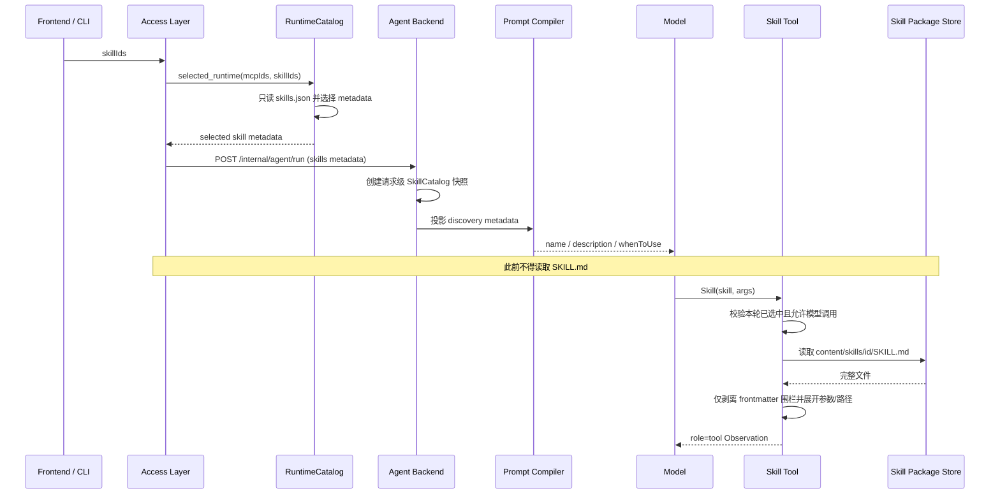

# Skill Catalog 与正文懒加载技术方案

> 状态：K Agent 主链核心边界已按本方案落地  
> 基线：2026-09-02 当前工作区  
> 范围：Access Layer catalog、Backend Prompt discovery、Backend `Skill` 工具  
> 公网发现与安装见 [Skill / MCP 广场技术方案](../features/marketplace-skill-mcp-technical-solution.md)；广场条目不得写入本方案的运行时 catalog，除非安装校验已成功。

## 1. 最终结论

Skill 必须拆成两类数据，生命周期不同：

1. 元数据：`id`、`name`、`description`、`whenToUse`、`argumentNames`、
   `allowedTools` 等，只存放在 `.k_agent/config/catalog/skills.json`。
2. 正文：`content/skills/<id>/SKILL.md` 去掉 frontmatter 后的 Markdown，不能写入
   catalog，也不能由 Access Layer 放进 run payload。

正常运行时的唯一正确链路是：

```text
skills.json
  -> Access Layer 按勾选 id 选择 catalog 行
  -> HTTP payload.skills 只携带元数据
  -> Backend 创建请求级 SkillCatalog
  -> Prompt 只展示发现元数据
  -> 模型实际调用 Skill(skill, args)
  -> Backend 先校验该 id 属于本轮 SkillCatalog
  -> Backend 再读取 content/skills/<id>/SKILL.md 正文
  -> 正文作为 role=tool Observation 进入下一轮推理
```

Access Layer 在正常 run、Team run 和 Resume 组装过程中不允许读取、检查或计算
`SKILL.md`、`filePath`、`baseDir`。Backend 也不允许从文件正文的 YAML 重新生成或覆盖
元数据。

## 2. 所有权与模块边界

### 2.1 Access Layer

Access Layer 负责：

- Skill 导入、编辑和删除；
- 在导入/配置变更时解析一次 frontmatter，并更新 `skills.json`；
- 正常 run 时只读取 `skills.json`；
- 按用户勾选 id 选择整行元数据并发给 Backend；
- 在选择边界拒绝未知或 `enabled=false` 的 Skill。

Access Layer 不负责：

- 在 run 时读取 Skill 正文；
- 把 `instructions`、`filePath`、`baseDir` 写入 Backend 请求；
- 决定 Backend 何时真正加载正文。

`RuntimeCatalog.ensure()` 在 `skills.json` 缺失时从已有 Skill 包执行一次 bootstrap，属于
配置迁移，不属于 run 链路。正常运行不得依赖此回退刷新元数据。

### 2.2 Agent Backend

Backend 负责：

- 只消费本次请求中的 Skill 元数据，不读取 `skills.json`；
- 用请求级 `SkillCatalog` 同时约束 Prompt discovery 和工具执行授权；
- 只有在本地 `Skill` 工具确认 id 已选中且允许模型调用后，才读取对应正文；
- 从 Backend 自己的只读包定位器解析 `content/skills/<id>/SKILL.md`；
- 返回正文以及由可信实际路径产生的 `baseDir/filePath`，供脚本和资源相对路径解析。

Backend 正文加载器只剥离开头的 YAML 围栏，禁止解释 YAML 字段。`argumentNames`、
`allowedTools`、`whenToUse`、`hooks`、`model`、`executionContext` 等始终以请求元数据为准。

### 2.3 跨模块约束

生产代码中禁止：

- `access_layer/**` 导入 `backend/**`；
- `backend/**` 导入 `access_layer/**`；
- Backend 正文加载器调用 Access Layer catalog/parser；
- Access Layer 调用 Backend Skill loader；
- Prompt 模块读取文件或执行 Skill；
- Tool 模块反向调用 Prompt 编译器。

两个进程共享的 `$K_AGENT_HOME/content/skills` 是部署数据协议，不是 Python 模块依赖：
Access Layer 对 Skill 包具有配置写权限，Backend 只在工具调用时读取一个已授权 id 的正文。
如果未来两个服务不共享文件系统，应增加独立的只读 Skill 内容服务或内容对象存储，不能改成
Access Layer 在每次 run 中内联正文。

## 3. 详细调用链



普通会话使用 `access_layer/gateway.py`，Team 首次执行与 Resume 使用
`access_layer/teams/runtime.py`；三者都必须调用同一个 `RuntimeCatalog.selected_runtime()`，
不能各自实现正文加载。

## 4. 数据契约

### 4.1 `skills.json` 与 HTTP `skills` 条目

允许字段：

| 字段 | 运行时用途 |
| --- | --- |
| `id` | 唯一包目录 id，也是 Backend 正文定位键 |
| `name` | 模型可见名称/调用别名 |
| `description` | Prompt discovery 简介 |
| `enabled` | Access Layer 选择开关 |
| `whenToUse` | Prompt discovery 触发提示 |
| `argumentNames` / `argumentHint` | 参数展开和调用提示 |
| `allowedTools` | Skill 激活后的工具白名单 |
| `disableModelInvocation` | 禁止模型主动调用 |
| `userInvocable` | 用户显式调用能力声明 |
| `model` / `executionContext` / `agent` | 已声明的运行属性；未实现字段不能伪装成已生效 |
| `paths` / `hooks` / `version` | catalog 元数据；具体执行语义必须单独实现和测试 |

禁止字段：

- `instructions`；
- `content` / `body`；
- `filePath` / `baseDir`；
- 任何从 `SKILL.md` 正文派生的大文本。

### 4.2 Backend Skill 工具返回

只有成功调用后才返回：

- `content`：加载并展开后的正文；
- `baseDir` / `filePath`：Backend 对实际文件执行 `resolve()` 后的可信路径；
- `allowedTools`、`model`、`status`、`hooks`：仍来自本轮 catalog 快照。

请求夹带旧版 `instructions` 或伪造路径时，Backend 必须忽略；文件中的冲突 frontmatter 也必须
忽略。换句话说：正文只信 Backend 文件，元数据只信本轮请求。

## 5. 安全与一致性

Backend 加载正文前依次执行：

1. 按模型传入的 name/id 在本轮请求级 `SkillCatalog` 中精确匹配；
2. 再次检查 `enabled` 与 `disableModelInvocation`；
3. 使用受限格式的 catalog `id` 定位目录，拒绝 `/`、`..` 和非法字符；
4. 对根目录与候选路径执行 `resolve()`，拒绝普通路径和符号链接逃逸；
5. 只接受常规文件，并限制 `SKILL.md` 最大字节数；
6. 读取 UTF-8 文本，只去掉 frontmatter 围栏，不调用 YAML parser；
7. 空正文返回可恢复工具错误，不启动新的目录扫描或 fallback。

本轮 catalog 元数据是冻结快照；正文则在实际调用时读取。若产品要求整个 run 对正文版本也完全
可复现，应在 catalog 增加内容摘要/版本，并在调用时校验，不应提前传输正文。

## 6. 当前代码落点

| 文件 | 职责 |
| --- | --- |
| `access_layer/catalog.py` | 读取和规范化 catalog；`selected_runtime()` 只选择元数据 |
| `access_layer/gateway.py` | 将所选 metadata 放入 Backend payload |
| `backend/tools/catalog.py` | 建立不可被后续请求字典修改的请求级授权快照 |
| `backend/prompts/skills/__init__.py` | 仅渲染 discovery 元数据，绝不读取正文 |
| `backend/tools/local.py` | `Skill` 工具授权检查与正文加载触发点 |
| `backend/skills/body.py` | Backend 单 id、只读、安全的正文加载器 |

`backend/skills/frontmatter.py` 和通用目录扫描 loader 不应恢复。Backend 需要的只是单个已授权 id
的正文读取能力，不是第二套 catalog。

## 7. 尚需继续收口的独立问题

这些问题不改变上述正文链路，但仍属于整体模块边界审计范围：

1. Backend HTTP `skills` 当前仍是裸 `list[dict]`。应在 Backend 内定义仅含 catalog 字段的
   本地 wire model，并拒绝 `instructions/filePath/baseDir` 等额外字段；Access Layer 维护自己的
   对应模型，通过 JSON contract fixture 对齐，不能共享 Python 类型。
2. `backend/prompts/models.py` 仍类型引用 Tools 的 `SkillCatalog/ToolCatalog` 和 Memory 的
   `MemoryFile`。应由 K Agent Runner 投影成 Prompt 自己拥有的只读 DTO，消除 Prompt 到 Tools、
   Memory 的模块依赖。
3. Codex / Claude Code runner 没有 K Agent 的本地 `Skill` 工具。它们当前只能收到 metadata；
   如需支持同一套 Skill，必须增加各自的按需加载桥接，不能恢复 Access Layer 正文内联。
4. Backend Home 仍保留 catalog 路径和旧 catalog 迁移代码。Backend 可保留只读
   `content/skills` 定位器，但 catalog 创建与迁移必须最终移交 Access Layer。
5. sibling Runner 私有 helper 引用、旧 Prompt 入口、未落地的 frontmatter 字段语义，应按原模块
   边界方案继续收口。

## 8. 验收标准

### 静态边界

- Access Layer 与 Backend 生产代码相互 import 数量为 0；
- `selected_runtime()` 不包含 `SKILL.md` 读取或正文解析；
- Backend 只有 `backend/skills/body.py` 负责 K Agent Skill 正文读取；
- Backend 正文模块不导入 Access Layer，也不包含 frontmatter YAML parser；
- Prompt discovery 中不存在正文和包路径。

### 行为边界

- Skill 包目录不存在时，Access Layer 仍能成功组装已选 catalog metadata；
- 模型未调用、调用未知 id、disabled 或 `disableModelInvocation` Skill 时不读取文件；
- 已授权 Skill 成功调用时才读取对应文件；
- 磁盘 frontmatter 与 catalog 冲突时，参数、工具白名单和触发信息仍采用请求值；
- 请求夹带正文/路径时不影响实际正文和可信路径；
- 缺失、空、超大、非法 id、路径逃逸均返回确定的可恢复工具错误；
- 正文仅作为与 `tool_call_id` 配对的 `role=tool` Observation 进入模型历史。

### 回归命令

```bash
.venv/bin/python -m pytest backend/tests/test_access_catalog.py \
  backend/tests/test_access_boundary.py backend/tests/test_mcp_skills.py -q
.venv/bin/python -m pytest backend/tests -q
git diff --check
```
