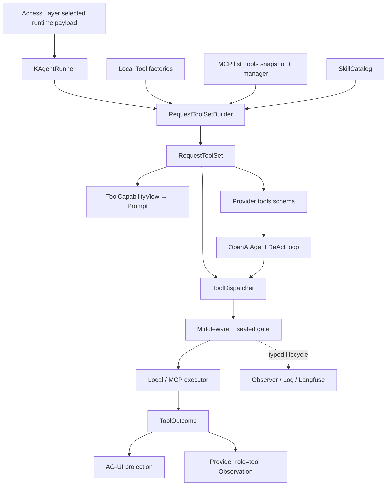

# K Agent Tool Runtime 统一封装与执行边界重构技术方案

> 状态：待评审，尚未实施  
> 日期：2026-09-04  
> 适用范围：Agent Backend 内的本地 Tool、MCP Tool、Skill 元工具、权限/HITL、工具结果与上下文投影。  
> 关联文档：[Agent Hook 与 Middleware 技术方案](agent-hooks-and-middleware-technical-solution.md)、
> [权限模式与 HITL 技术方案](permission-and-hitl-technical-solution.md)、
> [Skill Catalog 与正文懒加载技术方案](skill-catalog-runtime-boundary-technical-solution.md)、
> [AG-UI 协议约定](ag-ui-protocol.md)。

## 0. 结论

现行 Tool 结构需要重构。问题不在于工具数量，而在于同一个 Tool 的定义、请求级绑定、Prompt 投影、
Provider Schema、权限判断、物理执行、结果规范化与运行观测分别由多个模块重复表达，且不存在一个真正驱动
所有下游行为的请求级事实源。

本方案作出五项核心决策：

1. 以 `RequestToolSet` 作为一次 K Agent Run 内唯一的 Tool 事实源；Prompt、Provider Schema、解析、
   权限和执行都从同一份不可变快照派生。
2. 将 Tool 拆成不可变 `ToolSpec` 与请求级 `ToolBinding`，不再用一个可变 `ToolDefinition` 同时承担元数据、
   executor 和运行状态。
3. 从 `OpenAIAgent` 中抽出 `ToolDispatcher`；Agent 只维持 ReAct 顺序、HITL continuation 和 Observation 配对，
   不理解 `Skill`、`AskUserQuestion` 或 MCP 的业务协议。
4. executor 统一返回类型化 `ToolOutcome`；面向模型的正文、面向用户的正文、控制面 effect 和错误状态分开，
   禁止再通过解析工具返回 JSON 驱动权限状态。
5. 保留 sealed safety gate：任意 Middleware 改写后的调用都必须重新经过解析、Schema 校验、Skill allowlist、
   Permission/HITL 和执行门，不能拿到 raw executor。

本方案只定义目标结构与迁移步骤，不在本轮修改运行时代码。

## 1. 当前实现与根因

### 1.1 当前真实链路

```text
KAgentRunner.create_runtime
  ├─ SkillCatalog.from_skills(raw skills)
  ├─ load_local_tools()
  ├─ bind_request_scoped_tools(...)
  ├─ mcp_manager.list_tools()
  ├─ build_tool_catalog(local_tools, mcp_tools) ─→ Prompt
  └─ OpenAIAgent.create_runtime(...)
       ├─ mcp_manager.list_tools()               ─→ 再取一次 MCP 快照
       ├─ _build_tool_specs(...)                 ─→ Provider tools
       └─ run_stream_react()
            └─ _execute_tool()
                 ├─ Local 查找
                 ├─ Skill alias 兼容
                 ├─ MCP 名称解析
                 ├─ Skill allowlist
                 ├─ Permission / HITL
                 ├─ Schema 校验
                 ├─ Local/MCP execute
                 └─ 解析 Skill JSON 激活 allowlist
```

### 1.2 多份事实源

| 表示 | 当前所有者 | 实际用途 | 问题 |
| --- | --- | --- | --- |
| `ToolDefinition` | `backend/tools/local.py` | 本地 schema、executor、context policy | 类型可变，且定义在名为 `local.py` 的业务混合文件中 |
| `McpToolDescriptor` | `backend/mcp_tool/client.py` | MCP metadata | 与本地 Tool 使用不同结构，后续重复转 Schema |
| `ToolCapability` / `ToolCatalog` | `backend/tools/catalog.py` | Prompt 条件投影 | 只保留名称和来源，不驱动 Provider 或执行，不是真正 Catalog |
| `ToolCallRequest` | `backend/agent/hooks/types.py` | Middleware-facing 调用 | 解析和绑定仍留在 Agent 的两个闭包里 |
| `ToolCallPayload` / `ToolResultPayload` | Hook Pipeline | 物理尝试观测 | 与公开 AG-UI `tool_start/tool_result` 又是另一套生命周期 |
| 原始 `str` 结果 | 每个 executor | Provider Observation、UI result、控制面信息 | `ok`/`success`/MCP list/纯文本混用，无法可靠判定成功失败 |

`ToolCatalog` 当前只服务 Prompt，而 Provider Schema 在 `OpenAIAgent._build_tool_specs()` 中再次从
`ToolDefinition + McpToolDescriptor` 生成。MCP Tool 还会在 Runner 和 Agent 中各 `list_tools()` 一次。
因此 Prompt 所见、Provider 所见和执行可达集合存在漂移窗口。

### 1.3 Agent 承担了 Tool Runtime 职责

`OpenAIAgent._execute_tool()` 同时处理 Local/MCP/Skill alias 路由、权限、用户提问、Schema、执行和
Skill 状态激活。它形式上没有导入 Skill loader，语义上却已经理解：

- `Skill` 是特殊元工具；
- 某些模型会把 Skill 名直接当 function name；
- Skill 成功结果中的 `allowedTools` 要限制后续调用；
- `AskUserQuestion` 要走另一种 durable Interrupt；
- MCP 名称使用 `mcp__{server_id}__{tool_name}`。

这些都不是通用 ReAct Agent 的职责，应由 K Agent 请求级 Tool Runtime 提供。

### 1.4 结果控制面与展示面混合

当前 executor 返回字符串。字符串可能是成功 JSON、失败 JSON、MCP content 数组或纯文本。
由此产生三个直接问题：

1. executor 返回 `{"ok": false}` 时没有抛异常，Pipeline 仍可能发出 `ToolCompleted`；
2. Skill allowlist 需要重新 `json.loads()` 模型可见结果才能激活；
3. lazy memory、上下文裁剪、UI 展示和 Observer 只能基于工具名或正文猜测语义。

工具结果必须先是内部类型，最后才在 Provider/AG-UI 边界序列化。

### 1.5 注册与绑定采用替换式装配

当前 Registry 先创建未绑定的 MCP Resource Tool 和 Skill Tool，再按名称替换成请求级闭包；同时保留
`skills` 与 `skill_catalog` 两套入口。`_uniq_by_name()` 对重名静默保留第一个，配置里的未知工具名也
静默忽略。对于安全相关能力集合，这两类错误都应该在装配阶段显式失败或产生结构化诊断。

## 2. 参考项目结论

参考项目：`/Users/kanema/Desktop/agency-ad-platform/agent-server/react_trpc`。

### 2.1 借鉴的部分

| 参考实现 | 可借鉴点 | K Agent 中的落点 |
| --- | --- | --- |
| `trpc_agent.tools.BaseTool` 子类 | Tool 自带名称、描述、Schema 与执行入口 | `ToolSpec + ToolBinding`，但不强制继承基类 |
| `ToolResult(success, output, error, metadata)` | 成功/失败是类型字段，不靠解析正文猜测 | 扩展为 `ToolOutcome`，额外区分 public/model content 与 effects |
| `ToolSetABC` / `ToolFilterAdapter` | 请求级展开、过滤后再交给 Agent | `RequestToolSetBuilder` 一次性解析并冻结全部 Local/MCP Tool |
| `SkillToolSet` / `UseSkillTool` | Skill 作为唯一元工具入口 | 保留 K Agent 固定 `Skill({skill,args})` Provider 协议 |
| `ToolExecutionTracker` | requested、executing、completed、yielded 状态分开 | 类型化内部生命周期事件，区分模型请求与物理执行 |
| `ToolResultStore` | 原始结果与送入上下文的投影分开 | 沿用 K Agent 完整历史与 Provider 活动上下文分离原则 |

### 2.2 明确不采用的部分

参考项目同时存在以下结构，不应复制进 K Agent：

1. 不采用进程级可变单例 `ToolRegistry`。K Agent 的能力选择、MCP 连接和 Skill 授权都是请求级事实。
2. 不采用 import side effect 或自动扫描注册 Tool。注册顺序必须显式、可审计、可测试。
3. 不采用在超大 `AgentManager` 内逐个 try/import/append 工具的装配方式。
4. 不采用全局 `_invoked_skills` 或隐式 ContextVar 作为业务状态事实源；状态必须属于当前 Run Runtime。
5. 不采用 monkey patch 框架执行器来补齐 Tool 生命周期。K Agent 自有 Dispatcher，应直接持有完整契约。
6. 不照搬同步 `BaseTool.execute(**kwargs)`；K Agent 保持 async、取消传播与 live output 背压。

因此，本次“参考”是吸收 ToolSet、自描述 Tool、类型化 Result 和执行追踪四个思想，而不是复刻其目录或框架。

### 2.3 参考源码位置

| 主题 | 参考文件 |
| --- | --- |
| 基础 Tool/Result 结构 | `react_trpc/tools/base.py` |
| 元数据 Registry | `react_trpc/tools/registry.py` |
| 请求级 ToolSet 过滤 | `react_trpc/agent_profiles/tool_filter.py` |
| Skill ToolSet | `react_trpc/skills/_toolset.py` |
| 唯一 Skill 入口及 inline/fork 结果 | `react_trpc/skills/_use_skill_tool.py` |
| 工具调用状态机 | `react_trpc/agent/tool_execution_tracker.py` |
| 流式执行状态 | `react_trpc/agent/streaming_tool_executor.py` |
| 原始结果与上下文投影分离 | `react_trpc/agent/tool_result_store.py` |
| 当前请求的工具装配 | `react_trpc/trpc_service/agent_manager.py` |

参考项目的 `ToolExecutionTracker` 与 `StreamingToolExecutor` 各自又定义了一套状态枚举，这正说明
“借鉴生命周期拆分”不等于复制其所有类型；K Agent 只能保留一套内部 Tool lifecycle contract。

## 3. 目标、非目标与不变量

### 3.1 目标

1. 一次 Run 只构建一次 Local/MCP/Skill Tool 快照。
2. Prompt、Provider Schema 与 Dispatcher 从同一 `RequestToolSet` 投影，无法独立漂移。
3. Local、MCP、Skill、用户输入工具共用一条 sealed execution pipeline。
4. Agent Core 不包含具体 Tool 名称或项目业务分支。
5. 成功、可恢复失败、Interrupt、取消和进程级失败拥有互斥且可测试的类型语义。
6. Tool 的 context policy、权限 subject、结果适配和 runtime effects 有明确所有者。
7. 保留现有 AG-UI 到达顺序、HITL durable checkpoint、Prompt cache 和外部工具协议。
8. 新增工具只需定义 Spec、executor 与必要策略，不修改 Agent 主循环。

### 3.2 非目标

- 不改变 Access Layer 独立于无状态 Backend 的部署边界。
- 不改变 CLI/Frontend 只通过 Access Layer HTTP/AG-UI SSE 工作的边界。
- 不把 Tool Runtime 改成通用工作流引擎。
- 不在本次重构中增加并行 Tool 执行；同轮 Tool 继续按 Provider 到达顺序串行执行。
- 不改变 Skill Catalog 的元数据所有权，也不把 `SKILL.md` 正文提前装入请求或 Provider Schema。
- 不把外部 Marketplace Catalog 与当前请求的已安装 ToolSet 混为一谈。
- 不顺带重写各工具的业务实现、Bash sandbox 或 MCP transport。

### 3.3 必须保持的不变量

1. `Catalog metadata → selected request payload → SkillCatalog → authorized body load` 的单向边界不变。
2. 完整 Skill 正文只在已授权的 `Skill` 调用后读取，并只通过对应 `tool_call_id` 的 Observation 进入模型上下文。
3. `sandbox_permissions=require_escalated` 只是申请，不是授权。
4. Middleware 不能获得 raw executor；改写后必须重过 sealed gate。
5. `ApprovalInterrupt`、用户输入 Interrupt、`CancelledError` 和 `GeneratorExit` 不能变成普通失败 Observation。
6. 普通 Tool 错误必须成为模型可见的可恢复 Observation，不能终止整个 Run。
7. 用户可见 AG-UI 保持原始顺序：`TOOL_CALL_START/ARGS/END` 早于最终 `TOOL_CALL_RESULT`。
8. Hook/Langfuse 是观测面，不参与授权，也不写入完整对话历史。
9. Backend Agent Core 不 import Access Layer、Prompt、Memory、Session 或 Skill 业务模块。

## 4. 统一概念模型

### 4.1 `ToolKey`

`ToolKey` 是内部稳定标识，不等于 Provider function name：

```python
@dataclass(frozen=True, slots=True)
class ToolKey:
    source: Literal["local", "mcp"]
    name: str
    namespace: str | None = None  # MCP 时为 server_id
```

示例：

```text
ToolKey(local, "Read", None)             → provider_name = "Read"
ToolKey(local, "Skill", None)            → provider_name = "Skill"
ToolKey(mcp, "search", "github")         → provider_name = "mcp__github__search"
```

权限、日志、context policy 和执行查找使用 `ToolKey`；只有 Provider/AG-UI 边界使用 `provider_name`。

### 4.2 `ToolSpec`

`ToolSpec` 只保存不可变、可公开投影的定义，不持有请求资源：

```python
@dataclass(frozen=True, slots=True)
class ToolSpec:
    key: ToolKey
    provider_name: str
    description: str
    input_schema: Mapping[str, Any]
    context_policy: ToolContextPolicy
    execution_policy: ToolExecutionPolicy
```

其中：

```python
@dataclass(frozen=True, slots=True)
class ToolContextPolicy:
    mode: Literal["retain", "rerunnable", "receipt"] = "retain"
    max_result_chars: int = 50_000


@dataclass(frozen=True, slots=True)
class ToolExecutionPolicy:
    side_effect: Literal["read", "write", "external", "control"]
    supports_live_output: bool = False
    timeout_seconds: float | None = None
```

Schema 和嵌套策略在构造时 defensive-copy 并 deep-freeze；`frozen=True` 不能替代深层不可变。
Provider 转换时返回新字典，调用方不能拿到内部引用。

### 4.3 `ToolBinding`

`ToolBinding` 将 Spec 与本次请求资源绑定：

```python
ToolExecutor = Callable[["ToolExecutionContext", Mapping[str, Any]], Awaitable["ToolOutcome"]]
PermissionSubjects = Callable[[Mapping[str, Any]], Sequence[str]]


@dataclass(frozen=True, slots=True)
class ToolBinding:
    spec: ToolSpec
    execute: ToolExecutor
    permission_subjects: PermissionSubjects
```

请求级资源通过 `ToolExecutionContext` 或闭包注入，例如：

- 当前 workspace 与 network policy；
- 当前 `McpClientManager`；
- 当前 `SkillCatalog`；
- approval broker adapter；
- live output sink。

禁止把这些对象写回进程级 Spec 或模块级 Tool 列表。

### 4.4 `RequestToolSet`

```python
@dataclass(frozen=True, slots=True)
class RequestToolSet:
    bindings: tuple[ToolBinding, ...]
    by_provider_name: Mapping[str, ToolBinding]

    def provider_specs(self) -> tuple[dict[str, Any], ...]: ...
    def capability_view(self) -> ToolCapabilityView: ...
    def resolve(self, provider_name: str) -> ToolBinding: ...
    def context_policies(self) -> Mapping[str, ToolContextPolicy]: ...
```

构建时必须校验：

1. `provider_name` 唯一；重复时 fail-fast，不再“保留第一个”；
2. `ToolKey` 唯一；
3. Schema 是 object 顶层且可编译；
4. Provider 名称符合所选兼容协议的限制；
5. preset/config 引用未知本地工具时产生明确配置错误；
6. MCP 快照里的 server 必须属于本轮授权 server 集合。

`ToolCapabilityView` 是从 `RequestToolSet` 生成的不含 executor 的只读投影，可以传给 Prompt Composer；
它不是第二份可独立构造的 Catalog。

### 4.5 `ProviderToolCall`、`ToolCall` 与 `ResolvedToolCall`

```python
@dataclass(frozen=True, slots=True)
class ProviderToolCall:
    call_id: str
    iteration: int
    requested_name: str
    arguments_json: str


@dataclass(frozen=True, slots=True)
class ToolCall:
    call_id: str
    iteration: int
    requested_name: str
    arguments: Mapping[str, Any]


@dataclass(frozen=True, slots=True)
class ResolvedToolCall:
    call_id: str
    iteration: int
    requested_name: str
    binding: ToolBinding
    arguments: Mapping[str, Any]
```

`ProviderToolCall` 保留 Provider 原始 JSON 参数；Dispatcher 将其解码成顶层必须为 object 的 `ToolCall`。
两者都属于不可信数据。`ResolvedToolCall` 只能由 `RequestToolSet.resolve()` 与 Schema validator 产生。
Middleware 可以构造新的 `ToolCall` 并 `call_next()`，但不能直接制造带 executor 的 `ResolvedToolCall`。

### 4.6 `ToolOutcome`

```python
class ToolOutcomeStatus(StrEnum):
    SUCCEEDED = "succeeded"
    FAILED = "failed"
    DENIED = "denied"
    CANCELLED = "cancelled"


@dataclass(frozen=True, slots=True)
class ToolError:
    code: str
    message: str
    kind: Literal["input", "permission", "execution", "protocol"]
    retryable: bool = False


@dataclass(frozen=True, slots=True)
class ToolOutcome:
    status: ToolOutcomeStatus
    model_content: str
    public_content: str
    error: ToolError | None = None
    metadata: Mapping[str, Any] = field(default_factory=dict)
    effects: tuple["ToolEffect", ...] = ()
```

边界说明：

- `model_content`：写入 Provider `role=tool` 的正文，可包含 lazy memory 或上下文裁剪标记；
- `public_content`：写入 AG-UI `TOOL_CALL_RESULT` 和完整历史的正文，不附加隐式 Memory；
- `metadata`：日志、耗时、截断和调试字段，不自动进入模型或 UI；
- `effects`：控制面状态变化，由 Runtime 解释，永不通过 JSON 正文反向解析。

首批 effect 只需要：

```python
ActivateToolAllowlist(owner: str, allowed: frozenset[ToolKey])
RecordInvokedSkill(skill_id: str)
UpdateWorkingSet(files: tuple[ObservedFile, ...])
UpdatePlan(todos: tuple[TodoItem, ...])
```

Skill executor 返回 `ActivateToolAllowlist`，Dispatcher 在成功后原子应用；不再从 `public_content` 或
`model_content` 中读取 `allowedTools`。

effect 使用 copy-on-write：先在临时 Runtime state 上校验并应用全部 effect，全部成功后再用一次赋值提交。
任一 effect 失败都转换为 `ToolProtocolError`，原状态保持不变，不能出现 allowlist 已更新但 working set
只更新一半的情况。

### 4.7 Interrupt 不属于 Outcome

以下控制流继续使用 `BaseException` 级终止信号，不进入 `ToolOutcome`：

- `ApprovalInterrupt`；
- `UserInputInterrupt`；
- `asyncio.CancelledError`；
- `GeneratorExit`。

用户拒绝或取消后，新的 Resume Run 根据 checkpoint 生成 `DENIED`/`CANCELLED` Outcome，补齐该
`tool_call_id` 的 Observation。原 Run 不伪造执行结果。

## 5. 目标架构与所有权



### 5.1 `KAgentRunner`

负责：

- 从 Access Layer 请求载荷创建 `SkillCatalog`；
- 连接本轮 MCP server，并且只调用一次 `list_tools()`；
- 调用 `RequestToolSetBuilder` 绑定本轮 workspace、MCP manager、SkillCatalog 和策略；
- 把 `capability_view()` 交给 Prompt Composer；
- 把 `provider_specs()` 和 `ToolDispatcher` 交给 Agent；
- 提供 K Agent 特有的 postprocessor/effect handler，例如 lazy memory 与 working set。

不负责逐个执行 Tool，也不维护另一份工具名称列表。

### 5.2 `OpenAIAgent`

只负责：

- 消费 Provider stream 并保留 reasoning/text/tool call 原始到达顺序；
- 将 Provider function call 原样封装成 `ProviderToolCall`，不在 Agent 内解释参数；
- 在执行前拍摄 durable ReAct boundary；
- 串行消费 `ToolDispatcher.dispatch()` 的 live output 与 terminal outcome；
- 将 `outcome.model_content` 追加为对应 `tool_call_id` 的 Observation；
- 将 typed lifecycle 交给 AG-UI adapter。

禁止在 Agent 中出现具体工具名集合、MCP 名称解析、Skill JSON 解析、权限 subject 提取或工具查表。

### 5.3 `ToolDispatcher`

负责一次调用从不可信 Provider 输入到 terminal outcome 的完整过程：

```text
ProviderToolCall
  → decode JSON object
  → compatibility normalizer
  → user middleware
  → sealed gate
       1. RequestToolSet.resolve
       2. JSON Schema validation
       3. active Tool allowlist
       4. Permission decision / HITL
       5. emit ToolExecutionStarted
       6. executor business validation + execution
       7. normalize ToolOutcome
       8. apply ToolEffect atomically
       9. model-only postprocessors
      10. emit ToolExecutionCompleted / Failed
  → ToolOutcome
```

任意 Middleware 对 name/arguments 的修改都通过新的 `ToolCall` 再次进入 sealed gate。

### 5.4 Tool 实现

Tool 实现只负责本领域：

- 文件工具处理文件语义和 workspace boundary；
- Bash 工具处理命令执行、沙箱和 live output；
- MCP adapter 处理 `call_tool()` 与 MCP `isError`；
- Skill adapter 处理 catalog 授权后的正文加载和参数替换；
- User Question 工具校验问题业务结构并抛出 `UserInputInterrupt`。

权限规则、Observer、AG-UI 和 Provider 消息拼装都不进入具体 Tool 文件。

## 6. 请求级构建流程

### 6.1 唯一构建入口

```python
tool_set = await build_request_tool_set(
    settings=settings,
    preset=settings.local_tool_preset,
    configured_names=settings.local_tool_names,
    mcp_tools=mcp_snapshot,
    mcp_manager=mcp_manager,
    skill_catalog=skill_catalog,
    workspace=workspace,
    network_access=network_access,
)
```

构建顺序：

1. 从显式 `LOCAL_TOOL_FACTORIES` 取得内置 Tool Spec/factory；
2. 校验 preset 和 configured names；
3. 绑定 workspace/network/sandbox 形成 Local Binding；
4. 将一次 `mcp_manager.list_tools()` 的结果转换为 MCP Binding；
5. 仅当 preset 暴露 `Skill` 时，绑定同一个 `SkillCatalog`；
6. 绑定 MCP resource/prompt adapter，但不预先读取资源或 Skill 正文；
7. 检查 ToolKey、provider_name、Schema 和授权 server；
8. 冻结并返回 `RequestToolSet`。

Runner 后续不得重新查 MCP tools，也不得绕开 `RequestToolSet` 拼 Provider schema。

### 6.2 Prompt 投影

Prompt Composer 继续只接收不含 executor 的只读视图：

```python
PromptInputs(
    tool_capabilities=tool_set.capability_view(),
    skill_catalog=skill_catalog,
    ...,
)
```

`available_skills` 仍从 `SkillCatalog` 生成，并以 `tool_set.has_provider("Skill")` 作为是否投影的条件。
Prompt 不读取 `SKILL.md`，也不读取 Tool Binding。

### 6.3 Provider 投影

Provider schema 只能由：

```python
provider_tools = tool_set.provider_specs()
```

生成。删除 `OpenAIAgent._build_tool_specs()`。Local/MCP 的不同仅体现在构建 Binding 时，投影阶段不再
维护两段 list comprehension。

## 7. sealed 执行协议

### 7.1 固定顺序

目标顺序调整为：

```text
decode JSON object
  → resolve binding
  → validate JSON Schema
  → derive permission subjects
  → active Skill allowlist
  → permission decision / HITL
  → physical execution started
  → executor
  → outcome/effects/postprocess
  → terminal event
```

与现状相比，Schema 校验统一移动到 Permission/HITL 之前。理由：

1. 权限 subject 不应从类型错误或缺字段的参数中推导；
2. malformed call 不应先弹审批卡，再在执行阶段失败；
3. Middleware 改写后的调用仍会完整重过 Schema 与权限，不降低 sealed 安全性；
4. executor 仍必须进行路径、业务范围、目标存在性等语义校验，Schema 不能替代业务防御。

采用 `jsonschema` 的 Draft 2020-12 validator 同时校验 Local 和 MCP input schema；在迁移期间先保留现有
validator adapter 做结果对照，确认 Provider 兼容后再移除最小子集实现。

### 7.2 Permission Subject

权限对象提取从 `OpenAIAgent._permission_subjects()` 移到每个 Binding 的显式策略：

```python
ToolBinding(
    spec=READ_SPEC,
    execute=read_file,
    permission_subjects=lambda args: (args["file_path"],),
)
```

通用 Permission Guard 只接收：

```text
ToolKey + validated arguments + derived subjects + permission mode
```

它不知道 `Read`、`Bash` 或 MCP 参数字段。Bash 的命令分段、network escalation resource 校验属于
Bash permission subject/policy；MCP 默认 subject 为 `{server_id}:{tool_name}`。

### 7.3 Skill allowlist

allowlist 内部保存 `frozenset[ToolKey]`，不保存易碰撞的裸名字。Skill metadata 中的名称在绑定阶段解析为
当前 `RequestToolSet` 中的 ToolKey；无法解析时 Skill 调用失败，不允许静默忽略。

为保持现有权限语义，`full_access` 同时绕过 Permission Guard 和当前 Skill allowlist；默认模式仍先执行
Skill allowlist 再执行 Permission/HITL。是否把 Skill `allowedTools` 提升为连 full access 都不能绕过的强制
安全边界，需要单独评审，不能利用本次结构重构静默改变。

Skill allowlist 的生命周期明确为当前 Run，而不是跨 Run 的会话状态。Runtime 只保存一个显式
`ActiveToolScope`：

```text
首次调用 Skill A → ActiveToolScope(owner=A, allowed_keys=...)
随后调用 Skill B  → 原子替换为 ActiveToolScope(owner=B, allowed_keys=...)
Run 正常结束/取消 → scope 随 Runtime 销毁
Run Interrupt      → scope 写入 checkpoint，并在 Resume Run 恢复
```

这样既保持当前“Skill 指令约束本轮后续工具”的语义，也不会污染下一次用户请求。若未来需要在同一 Run 内
显式退出 Skill，必须新增可审计的 `ExitSkill`/scope token 协议；不能根据模型文本或某个普通工具结果猜测
Skill 已经完成。

### 7.4 `AskUserQuestion`

`AskUserQuestion` 保持模型可见 Tool，但不再由 Agent 按名称特殊处理：

1. Binding 的业务 validator 规范化 questions；
2. Binding 通过 Runtime interrupt port 抛出 `UserInputInterrupt`；
3. Runner 将通用 Interrupt 转给现有 approval broker；
4. Access Layer durable-before-visible 保存 checkpoint；
5. Resume Run 把规范化答案转换为该 call 的 `ToolOutcome`；
6. 不调用 `_unreachable_execute()`，也不伪造 permission approval。

### 7.5 普通失败、Interrupt 与取消

| 情况 | 内部表达 | 模型 Observation | 当前 Run |
| --- | --- | --- | --- |
| JSON 不可解析/Schema 不合法 | `ToolOutcome(FAILED, input)` | `ok:false` | 继续下一轮 Reason |
| 未知 Tool | `ToolOutcome(FAILED, input)` | 含精确可用工具提示 | 继续 |
| 权限 deny | `ToolOutcome(DENIED, permission)` | `ok:false` | 继续 |
| executor/MCP `isError` | `ToolOutcome(FAILED, execution/protocol)` | `ok:false` | 继续 |
| Permission ask | `ApprovalInterrupt` | 原 Run 不追加假结果 | 终止并等待 Resume |
| 用户提问 | `UserInputInterrupt` | 原 Run 不追加假结果 | 终止并等待 Resume |
| 用户拒绝后的 Resume | `ToolOutcome(DENIED)` | 补齐对应 call | 新 Run 继续 |
| `CancelledError` / `GeneratorExit` | 原样传播 | 无成功结果 | 正确取消 |
| Agent/Provider 级失败 | Agent error | 不伪装成 Tool 失败 | `RUN_ERROR` |

## 8. 结果、流式输出与上下文

### 8.1 内部执行流

替换当前 `_tool_excute_serially(..., result_out: list[str])` 的 out-parameter 形式：

```python
ToolExecutionEvent = ToolOutputDelta | ToolExecutionFinished

async for event in dispatcher.dispatch(call):
    if isinstance(event, ToolOutputDelta):
        yield public_tool_output(event)
    else:
        outcome = event.outcome
```

协议保证每次 dispatch 恰好一个 terminal `ToolExecutionFinished`；Interrupt 和取消除外。收到多个 terminal、
无 terminal 或 executor 返回错误类型都转换为 `ToolProtocolError`。

### 8.2 Provider 与公开结果分离

处理顺序：

```text
executor raw outcome
  ├─ public_content ───────────────→ AG-UI / history
  ├─ model postprocessor
  │    ├─ lazy nested memory
  │    └─ context result limiter
  └─ model_content ────────────────→ role=tool Observation
```

完整历史保存用户真正看到的工具结果；lazy memory 只进入 Provider Observation。上下文裁剪产生的 replacement
仍引用稳定 `messageId/toolCallId`，不回写或覆盖历史原文。

### 8.3 Context policy

`context_policy` 从松散字典改为 `ToolContextPolicy`，并成为所有 Tool Spec 的必填字段：

- Local Tool 显式声明；
- MCP Tool 默认 `retain`，除非未来 MCP 标准或受信配置提供可验证的幂等/重跑语义；
- 未知 Tool 不创建 policy；
- `RequestToolSet.context_policies()` 使用 `provider_name` 生成与 Provider call 完全一致的映射。

禁止在上下文模块维护第二份“按工具名猜 policy”的默认业务表。

## 9. 生命周期事件与 AG-UI

### 9.1 区分请求与物理执行

当前公开 `tool_start` 代表“模型请求了 Tool”，Pipeline `ToolStarted` 则代表“权限通过后开始物理执行”。
重构后内部名称必须明确区分：

```text
ToolCallRequested       Provider tool call 已完整产生
ToolCallRejected        名称、Schema、allowlist 或 permission deny 未通过，未执行
ToolExecutionStarted    sealed gate 通过，真实副作用即将发生
ToolOutputProduced      执行中的 stdout/progress
ToolExecutionSucceeded  executor 成功
ToolExecutionFailed     可恢复失败
ToolCallInterrupted     等待 approval/user input，仅内部控制与审计
```

### 9.2 AG-UI 映射保持兼容

```text
ToolCallRequested
  → TOOL_CALL_START → TOOL_CALL_ARGS → TOOL_CALL_END

ToolOutputProduced
  → 当前私有实时 output 事件（不持久化）

ToolCallRejected / ToolExecutionSucceeded / ToolExecutionFailed / Resume denial
  → TOOL_CALL_RESULT
```

Observer/Langfuse 使用 `ToolExecutionStarted/Succeeded/Failed`，因此 denied、malformed 和未知 Tool 不会被误记为
“真实执行成功”。公开工具卡仍能展示模型尝试和可恢复失败。

## 10. 包与文件规划

目标目录：

```text
backend/tools/
├── __init__.py
├── contracts.py          # ToolKey/Spec/Binding/Call/Outcome/Effect/Policy
├── toolset.py            # RequestToolSet + builder + 唯一投影
├── dispatcher.py         # middleware + sealed gate + typed execution stream
├── validation.py         # JSON Schema compiler 与 ToolInputError
├── permissions.py        # Binding permission subject/policy adapters
├── effects.py            # ToolScope/working-set effect 的原子应用
├── adapters/
│   ├── local.py          # 旧 ToolDefinition 的临时单向 adapter
│   ├── mcp.py            # McpToolDescriptor/call_tool → Binding/Outcome
│   ├── skill.py          # SkillCatalog + body loader → Binding/Effect
│   └── user_input.py     # AskUserQuestion interrupt binding
├── builtins/
│   ├── filesystem.py     # Read/Write/Edit/Glob/Grep/LS/NotebookEdit
│   ├── shell.py          # Bash/InstallSandbox
│   ├── web.py            # WebFetch/WebSearch
│   ├── memory.py         # personal memory tools
│   ├── task.py           # TodoWrite
│   └── misc.py           # get_current_time/legacy echo
├── streaming.py
└── workspace.py
```

迁移完成后：

- 删除 `ToolDefinition`；
- 删除只服务 Prompt 的可独立构造 `ToolCatalog/build_tool_catalog`；
- 删除 `bind_request_scoped_tools()`、`replace_skill_tool()` 和 `_uniq_by_name()`；
- 删除 `OpenAIAgent._build_tool_specs()`、`_parse_mcp_tool()`、`_permission_subjects()`、
  `_activate_skill_allowlist()` 与 `_execute_tool()`；
- `cc_like.py` / `cc_extra.py` 按领域拆分，不再以“像 Claude Code”作为代码所有权边界；
- `backend/agent/hooks/types.py` 只保留 Agent/Model/Observer 生命周期类型，Tool 核心契约从
  `backend.tools.contracts` 引用，避免定义两套 Tool Result。

## 11. 迁移计划

### 阶段 0：冻结现状契约

不改生产行为，先增加 characterization tests：

1. 快照默认 coding preset 的 Provider Tool 名称、描述摘要和 Schema；
2. 记录 Local/MCP/Skill 成功与失败的当前 AG-UI 事件序列；
3. 记录 approval ask/approve/deny、AskUserQuestion、Resume pendingIndex 的 checkpoint；
4. 记录 middleware override 后重新鉴权；
5. 记录 lazy memory 只进入 model Observation，不进入公开 Tool result；
6. 记录 MCP `isError=true` 为可恢复 Observation；
7. 记录取消不产生成功 terminal。

验收：新增测试在当前实现上通过，形成迁移基线。

### 阶段 1：引入 Contracts 与旧定义 Adapter

1. 新增 `contracts.py`、typed policy、typed outcome；
2. 用 `LegacyLocalToolAdapter` 将现有 `ToolDefinition` 单向转成 `ToolBinding`；
3. legacy executor 的字符串结果先包成 `SUCCEEDED`，已有 `ok:false/success:false` 由兼容 adapter 识别为
   `FAILED`；
4. MCP 建立独立 result adapter，统一 `isError`；
5. 暂不移动工具实现文件。

约束：生产路径只能是 `旧定义 → 新 Binding`，禁止新结构再回调旧 Registry 形成双向依赖。

验收：Provider Schema 和外部结果字节级或语义级兼容；Observer 能正确区分失败。

### 阶段 2：建立唯一 `RequestToolSet`

1. Runner 只调用一次 `mcp_manager.list_tools()`；
2. Local/MCP/Skill bindings 一次性构建并冻结；
3. Prompt capability、Provider specs、context policies 都改从 ToolSet 派生；
4. 删除 Agent 内的第二次 MCP list 与 `_build_tool_specs()`；
5. 对重复 Tool 名和未知配置 fail-fast。

验收：测试证明 Prompt、Provider 和 Dispatcher 的 provider-name 集合完全一致；并发请求之间无法互相污染。

### 阶段 3：抽出 `ToolDispatcher`

1. 将解析、Schema、allowlist、Permission/HITL、执行、结果规范化移出 `OpenAIAgent`；
2. Pipeline 的 `wrap_tool` 改围绕 `ToolCall → ToolOutcome` 工作；
3. sealed gate 持有唯一 resolve 与 executor 入口；
4. Agent 只消费 typed execution events；
5. 保持当前串行顺序和 checkpoint 时机。

验收：`OpenAIAgent` 不再出现任何具体 Tool 名；权限/HITL 全量回归通过。

### 阶段 4：迁移特殊 Tool 与 Runtime Effects

1. Skill adapter 返回 typed effects，移除结果 JSON 反向解析；
2. AskUserQuestion 改为 user-input interrupt binding；
3. lazy memory/working set 改为 typed postprocessor/effect handler；
4. Skill scope 显式进入 checkpoint；
5. 移除 raw `skills` 与 `SkillCatalog` 双轨消费。

验收：disabled/unselected Skill 在 Prompt、Provider、alias 和执行四处都不可见/不可达；Resume 不重放 Reason。

### 阶段 5：逐域迁移内置工具

按风险从低到高迁移：

1. `get_current_time`、legacy echo；
2. Memory/Todo；
3. Read/Glob/Grep/LS；
4. WebFetch/WebSearch/MCP resources；
5. Write/Edit/NotebookEdit；
6. Bash/InstallSandbox；
7. Skill 与 MCP prompt。

每一组迁移后删除对应 legacy adapter 路径，不长期保留两套 executor。

### 阶段 6：清理与文档收口

1. 删除旧类型、替换函数、别名辅助函数和死导出；
2. 更新 [工具说明](../guides/tools.md) 的实现位置与结果契约；
3. 更新 Hook、HITL、Skill 文档中的 Tool pipeline 图；
4. 增加“如何新增一个 Tool”的开发指南；
5. `rg` 审计确保 `OpenAIAgent` 不含具体 Tool 名，Prompt 不持有 Binding/executor。

## 12. 兼容策略

### 12.1 必须保持的外部兼容

- Access Layer → Backend 请求 Schema；
- Backend → Access Layer AG-UI 事件类型与顺序；
- 默认 coding/legacy preset 的模型可见 Tool 名；
- MCP provider name：`mcp__{server_id}__{tool_name}`；
- `Skill({"skill": ..., "args": ...})` 固定调用协议与固定 description；
- Permission rule 文件的 Tool 名与 subject 语义；
- HITL checkpoint version 2 与 request hash 校验；
- CLI/Frontend 工具卡、审批卡与历史回放行为。

内部 `ToolOutcome` 不直接暴露给 Access Layer。迁移期间由 adapter 输出与当前相同的 JSON/文本；等运行时结构稳定后，
若要统一公开结果 Schema，应另开接口变更方案，不能混入本次内部重构。

### 12.2 Skill alias 兼容

部分 Provider 会把 Skill 名直接输出为 function name。兼容逻辑保留，但移动到 K Agent 的
`SkillAliasNormalizer`：

1. 只读取同一个 `SkillCatalog`；
2. 同时检查 `enabled` 与 `disableModelInvocation`；
3. 只改写为规范 `ToolCall(requested_name="Skill", arguments={skill,args})`；
4. 记录兼容命中指标；
5. 未命中时返回 Unknown Tool，不猜测 Skill；
6. 待 Provider 兼容问题消失后可独立删除，不污染 Dispatcher 核心。

### 12.3 回滚

每个迁移阶段保持单向 adapter 和独立提交：

- 阶段 1–2 可回退到旧 `ToolDefinition` 消费路径；
- 阶段 3 切换时不保留运行时双执行或 shadow execute，避免同一个写工具产生两次副作用；
- 可做 shadow compare 的只有静态 Provider Schema、ToolSet 名称与结果序列化，不执行第二遍 Tool；
- 任一阶段失败时回滚整个阶段，不在生产中按工具随机混跑两套安全门。

## 13. 测试矩阵

### 13.1 ToolSet 与投影

- Local/MCP/Skill ToolKey 和 provider_name 唯一；
- preset 顺序稳定；
- 未知配置、重复名称、非法 Schema fail-fast；
- MCP `list_tools()` 每 Run 只调用一次；
- 未授权 server 的 Tool 不进入 ToolSet；
- `capability_view`、`provider_specs`、`resolve` 名称集合一致；
- 两个并发 Run 的 Skill/MCP/workspace 绑定互不污染。

### 13.2 sealed gate

- Middleware 修改参数后重新 Schema 校验和权限判断；
- Middleware 修改名字后必须重新从 ToolSet resolve；
- Middleware 无法直接调用 executor；
- malformed 参数不会触发 approval；
- deny/ask/full_access/approved-for-run 保持既定语义；
- 默认模式下 Skill allowlist 在 Permission 前生效；full access 保持现有显式绕过语义；
- executor 只会在 `ToolExecutionStarted` 之后调用一次。

### 13.3 结果与错误

- Local success/failure 规范化；
- MCP success、`isError=true`、异常、超时与 retryable 标记；
- Unknown Tool 和坏 JSON 成为可恢复 Outcome；
- `ok:false` 不再记为 Observer success；
- ToolEffect 只在 success 后原子应用；
- effect 失败不会留下半更新状态；
- lazy memory 只改变 `model_content`；
- public content 与完整历史不被 context truncation 覆盖。

### 13.4 HITL 与生命周期

- approval ask 时无物理 `ToolExecutionStarted`；
- approval/AskUserQuestion Interrupt 不被 `_recoverable_tool_error` 捕获；
- Resume 使用 callId + requestHash，只授权当前 pending call；
- deny/cancel Resume 补齐一条 Tool result；
- 同批后续 Tool 仍可再次触发 Interrupt；
- 取消时 executor、live-output consumer 和 MCP call 一起取消；
- AG-UI 实时与 history replay 投影一致，事件到达顺序不变。

### 13.5 边界审计

- `backend/agent/` 不 import K Agent Skill/Memory/Prompt/Access Layer；
- Prompt 模块不 import ToolBinding/Dispatcher/executor；
- Tool executor 不 import AG-UI、Session Store 或 Frontend 协议；
- Access Layer 不加载本地 Tool 实现或 Skill 正文；
- 进程级对象中不存在请求级 Skill allowlist、workspace、approval 或 MCP manager。

## 14. 验收标准

重构完成必须同时满足：

1. 每次 Run 的 Tool metadata 只由一个 `RequestToolSet` 提供；
2. Runner 和 Agent 合计只进行一次 MCP `list_tools()`；
3. `OpenAIAgent` 不含 `Skill`、`AskUserQuestion`、本地工具名或 MCP 名称解析分支；
4. Local/MCP/Skill 都通过同一个 Dispatcher 和 sealed gate；
5. 所有 executor 返回 `ToolOutcome`，运行时不解析结果正文来改变安全状态；
6. Prompt/Provider/Runtime Tool 名称集合有直接一致性测试；
7. malformed、deny、MCP `isError` 与 executor 异常均是可恢复 Tool failure；
8. Interrupt、取消和 Agent error 不会被错误包装成 Tool failure；
9. AG-UI 顺序、durable HITL、完整历史、lazy memory 与上下文压缩回归通过；
10. 旧 `ToolDefinition`、独立 `ToolCatalog`、替换式绑定和 Agent 内 `_execute_tool()` 被删除；
11. 新增 Tool 不需要修改 Agent 主循环；
12. 必要的架构、安全、并发和生命周期逻辑带准确中文注释。

## 15. 实施前置条件

正式开始写运行时代码前，需要先完成阶段 0 的 characterization tests，并将当前工作区正在进行的
上下文/历史重构整理到可稳定回归的状态。Tool 重构会触碰 `react_agent.py`、Runner、Hook、HITL 和 context
result policy；若与未收口的上下文改动交叉实施，将很难判断失败来自 Tool boundary 还是 conversation storage。

建议实施顺序为：

```text
当前上下文/历史改动通过回归
  → Tool 阶段 0 契约冻结
  → 阶段 1/2 类型与唯一 ToolSet
  → 阶段 3 Dispatcher 切换
  → 阶段 4 特殊 Tool/effects
  → 阶段 5/6 逐域迁移与清理
```

该顺序不要求等所有产品功能停止开发，但每个阶段必须保持一条生产执行路径和可回滚提交，不能让旧/新
Tool pipeline 长期并存。
