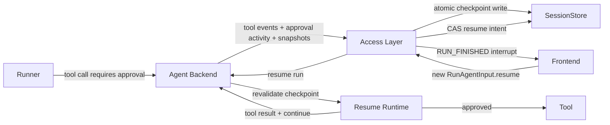
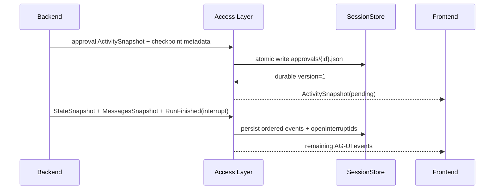

# 基于 AG-UI Interrupt 的可持久化 HITL 技术方案

> 状态：待实现、待评审  
> 协议基线：`ag-ui-protocol 0.1.19` 及其 Interrupt 生命周期  
> 适用范围：Work 对话、定时任务、Agent Team；K Agent、Codex、Claude Code  
> 关联文档：[权限模式与 HITL 技术方案](permission-and-hitl-technical-solution.md)

## 1. 结论

可恢复 HITL 应直接采用 AG-UI 的 terminal interrupt 模型，不再把原 Run 长时间阻塞在
进程内 `Future` 上：

1. Agent 在工具执行前产生 Interrupt。
2. Access Layer 立即把 Interrupt 和恢复检查点持久化到 Session 目录。
3. 原 Run 发送状态/消息快照，并以
   `RUN_FINISHED.outcome.type="interrupt"` 正常结束。
4. 用户以后批准、拒绝或取消时，使用相同 `threadId`、新的 `runId` 和
   `RunAgentInput.resume[]` 启动恢复 Run。
5. Resume Run 重新校验检查点；批准时执行原来展示过的准确工具调用，拒绝时把结构化
   拒绝结果交回 Agent。

这意味着系统不再需要“在线等待十分钟后才保存”的业务语义。审批请求一产生就持久化，
原 Run 随即释放 HTTP 流、会话执行锁、MCP 租约、CLI 子进程和并发槽。审批本身可以
长期保持未决，但绝不会因等待时间自动批准或执行。

## 2. 当前实现与问题

当前实现使用自定义的在线审批通道：

- `ApprovalBroker.request()` 创建进程内 `asyncio.Future`；
- Runner 停在 `await Future`；
- Backend 通过 `ACTIVITY_SNAPSHOT(activityType="approval")` 发审批卡；
- 前端调用独立的 `/api/approvals/{id}` 接口唤醒原 Future；
- HTTP 流关闭或 Backend 重启后，Future 和原执行现场一起失效。

它存在四类问题：

1. **不可恢复**：页面刷新、网络断开或服务重启后不能继续原 Run。
2. **资源常驻**：长期占用执行锁、并发槽、MCP/CLI 和观测 span。
3. **多 Worker 不安全**：审批 POST 可能命中没有对应 Future 的 Backend worker。
4. **不符合当前 AG-UI Interrupt 契约**：暂停没有表达为 `RunFinished.outcome`，恢复也
   没有使用 `RunAgentInput.resume[]`。

`ACTIVITY_SNAPSHOT` 仍然适合作为审批卡的实时 UI 投影，但不能承担 Interrupt 的协议
关联和恢复职责。

## 3. 设计目标与非目标

### 3.1 目标

1. 遵守 AG-UI Interrupt 的终止、持久化和恢复规则。
2. 审批卡在不刷新页面时实时显示，且卡片可见时已经具备持久化恢复条件。
3. 页面刷新、服务重启和普通网络中断后仍能处理审批。
4. Resume 使用新的 Run，并通过 `interruptId` 与原 Run 关联。
5. 同一恢复请求可安全重放，但工具副作用不能重复执行。
6. 执行前重新校验参数、权限、工具 schema 和环境变化。
7. Work、定时任务和 Team 使用相同协议与持久化模型。
8. 保持服务边界：Access Layer 拥有 Session 状态；Agent Backend 不直接访问
   `$K_AGENT_HOME/state/sessions`。

### 3.2 非目标

- 不序列化 Python 协程、async generator、socket 或 CLI 子进程内存。
- 不将批准提升为永久权限或 `full_access`。
- 不承诺任意外部副作用 exactly-once；结果不确定时进入 `unknown_outcome`。
- 不从旧历史中的展示卡片推断一个可执行检查点。
- 第一阶段不支持多个 Access Layer worker 并发修改同一文件式 Session；多 worker
  需要把 Interrupt/ResumeIntent 迁移到 SQLite 或共享事务存储。

## 4. AG-UI 协议映射

### 4.1 原 Run 的标准结束事件

工具审批属于 `reason="tool_call"`，并必须绑定已产生的 `toolCallId`：

```json
{
  "type": "RUN_FINISHED",
  "threadId": "session-id",
  "runId": "origin-run-id",
  "outcome": {
    "type": "interrupt",
    "interrupts": [
      {
        "id": "interrupt-id",
        "reason": "tool_call",
        "message": "允许执行该工具调用吗？",
        "toolCallId": "tool-call-id",
        "responseSchema": {
          "type": "object",
          "properties": {
            "approved": { "type": "boolean" },
            "scope": { "enum": ["once", "run"] }
          },
          "required": ["approved"]
        },
        "metadata": {
          "agentKind": "k_agent",
          "category": "local_tool",
          "requestHash": "sha256:...",
          "checkpointVersion": 1
        }
      }
    ]
  }
}
```

`expiresAt` 只在产品明确要求审批过期时填写。长期未决审批应省略它；历史清理时间和
“环境变化后重新确认”属于应用策略，不能伪装成 AG-UI expiry。

### 4.2 中断前的快照

在 `RUN_FINISHED` 之前，Agent 必须发送恢复所需的：

1. `STATE_SNAPSHOT`：包含公开的 Interrupt/Checkpoint 引用和 Agent 状态。
2. `MESSAGES_SNAPSHOT`：包含截至工具审批边界的完整消息快照。

建议状态：

```json
{
  "openInterrupts": [
    {
      "id": "interrupt-id",
      "checkpointRef": "approvals/interrupt-id.json",
      "requestHash": "sha256:..."
    }
  ]
}
```

工具调用序列应满足：

```text
TOOL_CALL_START
TOOL_CALL_ARGS
TOOL_CALL_END
ACTIVITY_SNAPSHOT(approval, pending)   # 可选的富 UI 投影
STATE_SNAPSHOT
MESSAGES_SNAPSHOT
RUN_FINISHED(outcome=interrupt)
```

被中断的 assistant tool call 暂时没有 `TOOL_CALL_RESULT` 是合法的 Interrupt 边界。
SessionStore 不能像普通失败 Run 一样直接丢掉它；同一线程存在开放 Interrupt 时，也不能
把这段未配对历史发送给普通新消息 Run。

### 4.3 Resume Run

批准使用同一 `threadId` 和新的 `runId`：

```json
{
  "threadId": "session-id",
  "runId": "resume-run-id",
  "state": {},
  "messages": [],
  "tools": [],
  "context": [],
  "forwardedProps": {},
  "resume": [
    {
      "interruptId": "interrupt-id",
      "status": "resolved",
      "payload": {
        "approved": true,
        "scope": "once"
      }
    }
  ]
}
```

拒绝也使用 `status="resolved"`，并携带 `payload.approved=false`。只有用户放弃、没有可用
回答时使用 `status="cancelled"` 且不携带 payload。

### 4.4 必须执行的协议规则

1. Resume 必须使用产生 Interrupt 的同一个 `threadId`。
2. `resume[].interruptId` 必须引用原 `RUN_FINISHED.outcome.interrupts[]`。
3. 一次 Resume 必须覆盖该 interrupted run 的全部开放 Interrupt，不支持部分恢复。
4. 线程有开放 Interrupt 时，普通新输入必须返回 `RUN_ERROR`；不能绕过审批开新 Turn。
5. 相同 `(threadId, interruptId, status, payload)` 必须幂等。
6. payload 必须通过 `responseSchema` 校验。
7. 设置了 `expiresAt` 的 Interrupt 过期后必须返回 `RUN_ERROR`。
8. `parentRunId` 保持分支/时间旅行语义，不能代替 `resume[].interruptId`。

### 4.5 Capabilities

对外能力声明增加：

```json
{
  "humanInTheLoop": {
    "supported": true,
    "approvals": true,
    "interrupts": true,
    "approveWithEdits": false
  }
}
```

只有真正支持 `editedArgs` 校验和执行时才能将 `approveWithEdits` 设为 `true`。

## 5. 总体架构



职责边界：

- **Agent Backend**：生成 Interrupt 和运行时检查点；执行 Resume Run；不写 Session 文件。
- **Access Layer**：持久化 Interrupt、阻止未解决线程接收普通输入、原子认领 Resume、
  转发新 Run。
- **SessionStore**：保存审批记录、开放 Interrupt 索引、ResumeIntent 和审计事件。
- **Frontend**：实时渲染 Activity；从 `RunFinished.outcome` 识别中断；通过标准 resume
  输入处理决定。

## 6. 持久化布局

### 6.1 目录结构

审批记录放在用户指定的 Session 目录下，但不建议把每次状态更新都写回不断增长的主
Session JSON。使用独立小文件可降低审批卡实时显示前的写入延迟：

```text
$K_AGENT_HOME/state/sessions/{sessionId}/
├── {sessionId}.json
├── approvals/
│   └── {interruptId}.json
├── resume-intents/
│   └── {resumeIntentId}.json
└── workspace/
```

所有路径必须由 Access Layer 的 StorageBackend 解析；Backend 只能收到不含宿主绝对
路径的 checkpoint payload。

### 6.2 ApprovalRecord

```json
{
  "schemaVersion": 1,
  "id": "interrupt-id",
  "threadId": "session-id",
  "originRunId": "origin-run-id",
  "resumeRunId": null,
  "version": 1,
  "state": "pending",
  "interrupt": {
    "id": "interrupt-id",
    "reason": "tool_call",
    "message": "允许执行该工具调用吗？",
    "toolCallId": "tool-call-id",
    "responseSchema": {},
    "metadata": {}
  },
  "request": {
    "target": "Bash",
    "source": "local",
    "arguments": {},
    "argumentsSha256": "sha256:..."
  },
  "checkpoint": {
    "version": 1,
    "kind": "react_tool_boundary"
  },
  "capabilities": {
    "modelId": "...",
    "mcpServerIds": [],
    "skillIds": [],
    "permissionMode": "default"
  },
  "environment": {
    "workspaceRevision": "...",
    "permissionPolicyRevision": "..."
  },
  "decision": null,
  "requestedAt": "2026-08-19T10:00:00Z",
  "decidedAt": null,
  "completedAt": null,
  "lastError": null
}
```

主 Session JSON 可以保存派生索引：

```json
{
  "openInterruptIds": ["interrupt-id"]
}
```

审批文件是可执行状态的权威来源；AG-UI `events` 是按到达顺序的审计和 UI 重放来源。
两者不能由前端互相推断。

### 6.3 Checkpoint 类型

| kind | Runner | 内容 |
| --- | --- | --- |
| `react_tool_boundary` | K Agent | iteration、assistant tool call、已完成消息边界、逻辑 Run 授权 |
| `codex_provider_session` | Codex | provider thread ID、原生 request method/params、hash |
| `claude_provider_session` | Claude Code | Claude session ID、tool/input hash、权限请求摘要 |
| `restart_from_context` | 通用兜底 | 不能精确恢复时的安全重启上下文 |

检查点不得保存 API Key、OAuth token、Authorization Header、完整环境变量或未脱敏日志。
必须依赖敏感数据时保存受控引用，并在 Resume 时重新从当前凭据源解析。

## 7. 持久化与实时显示顺序

### 7.1 Durable-before-actionable

审批卡不能只是先显示、随后碰运气落盘。推荐时序：



`approvals/{id}.json` 是小型原子写，不能走需要等待整条流结束的后台批处理。若写入失败：

- 不显示可操作的 pending 卡片；
- 结束为 `RUN_ERROR`；
- 工具保持未执行；
- 日志记录稳定错误码 `HITL_CHECKPOINT_PERSIST_FAILED`。

### 7.2 Activity 的定位

`ACTIVITY_SNAPSHOT(activityType="approval")` 用于富卡片展示和原位状态更新：

```text
pending → resuming → approved | denied | cancelled | resume_failed
                            └→ unknown_outcome
```

它是合法的 AG-UI ActivityMessage，但恢复判断必须读取 `RunFinished.outcome` 和持久化
ApprovalRecord。前端不能因为历史里存在一张 pending Activity 就假设仍可恢复。

### 7.3 实时卡片历史问题

仓库曾存在“审批卡只在刷新后出现”的问题，当前代码虽已具备以下链路：

- Backend 把审批转换为标准 `ACTIVITY_SNAPSHOT`；
- Access Layer 在审批帧后发送 flush comment；
- 前端 SSE parser 按网络批次 dispatch，并让出一次浏览器绘制机会；
- `App.applyAgUiEvent()` 能投影 approval Activity；

但单元测试只证明事件链路，不能证明真实浏览器已经完成 React commit。实现本方案前，
必须先完成第 15 节的真实 HTTP + 浏览器验收；在验收通过前，
`docs/streaming-approval-card-todo.md` 保持“未解决”。

采用 terminal interrupt 后，审批 Activity 后很快会到达 `RUN_FINISHED` 并关闭本次流，
不再依赖一条无限空闲的 SSE 连接，这会减少中间层长期缓冲风险，但不能代替浏览器验收。

## 8. 状态机

```text
pending
  ├─ resolved(approved=false) ──────────→ denied
  ├─ cancelled ─────────────────────────→ cancelled
  ├─ resolved(approved=true) + CAS ─────→ resume_queued
  ├─ context changed/too old ───────────→ reconfirm_required
  └─ real expiresAt reached ────────────→ expired

reconfirm_required
  ├─ explicit reconfirm + CAS ──────────→ resume_queued
  └─ deny/cancel ───────────────────────→ denied/cancelled

resume_queued → resuming
  ├─ completed ─────────────────────────→ approved
  ├─ known failure ─────────────────────→ resume_failed
  ├─ tool not started + transient error → pending
  └─ tool start recorded, result missing → unknown_outcome
```

`unknown_outcome` 不提供自动重试。用户只能检查外部状态后标记结果，或创建一个新的任务。

## 9. Resume 接口与原子认领

### 9.1 公开输入

普通 Work 对话继续使用现有：

```http
POST /api/agent
```

但请求体必须保留并转发 `RunAgentInput.resume`。不新增一套与 AG-UI 平行的“离线审批
执行 API”。前端审批按钮负责构造标准 Resume Run。

为了刷新卡片和管理历史，可提供只读查询：

```http
GET /api/sessions/{sessionId}/approvals/{interruptId}
```

返回持久化 `state/version/actionable`，不暴露敏感 checkpoint。

### 9.2 ResumeIntent

Access Layer 在调用 Backend 前先写：

```json
{
  "schemaVersion": 1,
  "id": "resume-intent-id",
  "threadId": "session-id",
  "interruptIds": ["interrupt-id"],
  "resumeRunId": "resume-run-id",
  "inputHash": "sha256:canonical-resume-array",
  "idempotencyKey": "sha256:thread:interrupts:payload",
  "state": "queued",
  "createdAt": "...",
  "startedAt": null,
  "finishedAt": null
}
```

写入和状态变更必须使用 `expectedVersion`/CAS：

1. 校验同一 interrupted run 的全部开放 Interrupt 均被覆盖。
2. 校验 payload schema、thread 归属和 expiry。
3. 原子执行 `pending → resume_queued` 并写 ResumeIntent。
4. 之后才调用 Agent Backend。
5. 重复的完全相同 Resume 返回原 `resumeRunId`；不同 payload 返回 `409 Conflict`。

### 9.3 崩溃恢复

- `queued` 且没有工具开始事件：可以重新认领。
- `resuming` 且工具未开始：退回 `pending` 或重新认领同一幂等 intent。
- 已记录 `tool_execution_started` 但没有 Result：标记 `unknown_outcome`。
- 已有终态 Result：幂等补齐 ApprovalRecord，不重新执行。

文件式 CAS 只支持单 Access Layer worker。启用 Durable HITL 时如果 Access Layer 配置
为多 worker，启动必须失败并提示改用共享事务存储；不能静默退化。Agent Backend 因为
不再持有跨请求 Future，可以继续独立扩展 worker 数量。

## 10. K Agent 恢复

K Agent 第一阶段实现精确的 `react_tool_boundary`：

1. 模型完成工具调用后，先正常发送 `TOOL_CALL_START/ARGS/END`。
2. Tool Pipeline preflight 判定为 `ask` 时生成 Interrupt，不进入工具 execute。
3. checkpoint 保存 iteration、准确 assistant tool call、request hash、已完成消息边界、
   能力快照和逻辑 Run 内授权。
4. Resume Runtime 从 Session messages、MessagesSnapshot 和 checkpoint 重建
   `api_messages`。
5. 重新加载当前工具/MCP/Skill，并重新运行比原策略更严格的安全检查。
6. `approved=true` 时确认工具名和参数 hash 完全一致，先写
   `tool_execution_started`，再执行一次工具。
7. 工具结果使用原 `toolCallId` 发 `TOOL_CALL_RESULT`，加入 provider context 后继续
   `run_stream_react()` 下一轮。
8. `approved=false` 时生成结构化工具拒绝结果，让模型选择替代方案。

不能把批准转换成自然语言“用户同意执行 Bash”再让模型重新生成调用；否则参数可能变化，
无法证明执行的是用户审阅过的同一操作。

## 11. Codex 与 Claude Code 恢复

### 11.1 Codex

1. 保存 provider thread ID、原生 request method/params 和 canonical hash。
2. Resume Run 使用 app-server `thread/resume`。
3. Provider 若重新暴露相同 request，则消费一次标准 resume 决议。
4. Provider 无法恢复原 request 时，进入 `restart_from_context`；新 Turn 必须重新生成并
   校验工具调用，不能直接执行旧参数。

### 11.2 Claude Code

原 MCP permission socket 和 CLI 进程不能跨 Run 恢复：

1. 保存 Claude session ID、tool name、input hash 和 permission request 摘要。
2. 新 Run 使用 `--resume` 恢复 provider session。
3. 注入只对准确 `(toolName,inputHash)` 有效的一次性授权。
4. Claude 重新请求完全相同工具和参数时消费授权。
5. 名称或参数变化时重新进入 HITL。

在完成真实 provider 协议测试前，Codex/Claude UI 应显示“重新开始并继续”，不能声称
能够原地恢复旧进程。

## 12. TOCTOU 与安全不变量

1. `require_escalated` 仍然只是请求，不是授权。
2. Interrupt 必须在工具执行前产生。
3. canonical JSON 参数 hash 必须与用户看到的调用一致。
4. 文件操作记录目标路径、存在性、mtime/size 或内容 hash；Git workspace 记录 commit
   和 dirty fingerprint。
5. Resume 时重新执行路径边界、SSRF、域名白名单、Skill allowlist 和 MCP schema 检查。
6. 新策略比旧策略严格时按新策略执行；不能因旧审批降级安全规则。
7. `scope=run` 只适用于同一逻辑 continuation，不扩散到用户新发起的 Run。
8. 所有状态迁移、执行开始和结果均写审计事件，不记录密钥。
9. 对过旧或环境已变化的审批进入 `reconfirm_required`，展示变化摘要后再次确认。
10. 未知副作用结果绝不自动重放。

## 13. Work、定时任务与 Team

### 13.1 Work

- 收到 Interrupt 后原 Run 立即结束，前端 loading 结束但卡片保持可操作。
- `openSession()` 从 `RUN_FINISHED.outcome` 和 ApprovalRecord 重建开放审批。
- 有开放 Interrupt 时输入框可以禁用普通发送，或将发送动作明确转换为取消 Interrupt 后
  开启新 Turn；不能静默绕过。
- Resume Run 在相同 Session 时间线中使用新 `runId`，并关联原 `interruptId`。

### 13.2 定时任务

- scheduled run 以 `interrupted`/`awaiting_approval` 业务状态落库，但 AG-UI 事件仍使用
  标准 `RunFinished.outcome.interrupt`。
- 原执行立即释放 `SCHEDULED_TASK_MAX_ACTIVE_RUNS` 槽位。
- 用户在任务详情页批准时，由 Access Layer 构造标准 Resume Run。
- 后续周期是独立 Run，不能继承上一周期的一次性审批。

### 13.3 Agent Team

- Worker/Agent 进入 `waiting`，原 task execution lease 转成持久化 Interrupt 等待状态，
  不能继续使用普通 120 秒 task lease。
- Resume Run 继续原 Task attempt，并使用新的 run ID。
- Team SQLite 保存 `interruptId` 索引和聚合状态；Session approval 文件保存原始 Agent
  检查点，两者由 Access Layer 命令协调。
- Supervisor 能看到 denied、resume_failed 和 unknown_outcome 的结构化结果。

## 14. 配置

采用 terminal interrupt 后不再需要 `HITL_LIVE_LEASE_SECONDS`。

建议增加：

| 配置 | 默认值 | 说明 |
| --- | ---: | --- |
| `DURABLE_HITL_ENABLED` | `false` | 分阶段启用标准 Interrupt |
| `HITL_RECONFIRM_AFTER_SECONDS` | `86400` | 超过该年龄需要再次确认，但不自动执行 |
| `HITL_RETENTION_DAYS` | `30` | 已解决记录的审计保留期 |
| `HITL_MAX_OPEN_INTERRUPTS_PER_SESSION` | `20` | 防止无限堆积 |
| `HITL_RESUME_MAX_ATTEMPTS` | `1` | 仅限工具开始前的调度错误 |

如果产品确实需要审批失效时间，应单独增加明确配置并映射到 AG-UI `expiresAt`；不能把
历史清理时间当成执行有效期。

## 15. 实时卡片验收

现有单元测试不能关闭 `streaming-approval-card-todo`。必须增加真实浏览器测试：

1. 启动真实 Access Layer、Agent Backend 和前端。
2. 使用确定性测试 Runner 产生一个需要审批的工具调用。
3. 监听浏览器网络流，确认依次收到：
   `TOOL_CALL_END → ACTIVITY_SNAPSHOT → RUN_FINISHED(interrupt)`。
4. 不刷新页面，等待审批按钮实际出现在 DOM。
5. 在按钮出现前后确认测试工具副作用都没有发生。
6. 截图并记录卡片所在 assistant/run 时间线位置。
7. 刷新页面，确认卡片仍位于相同位置且仍可操作。
8. 点击批准，确认发出了新的 `RunAgentInput.resume`，并只产生一次工具结果。
9. 分别验证拒绝、取消、窄屏、浅色/深色和后台标签页。

验收通过后才允许：

- 把 `docs/streaming-approval-card-todo.md` 改为已解决；
- 声称审批卡支持实时显示；
- 开始依赖该能力承载定时任务和 Team 的长期审批。

## 16. 代码改造位置

| 文件 | 改造内容 |
| --- | --- |
| `backend/agui.py` | 输出 State/Messages Snapshot 和 `RunFinished.outcome.interrupt` |
| `backend/approvals.py` | 从 Future broker 收敛为 Interrupt 构造/校验辅助层 |
| `backend/agent/react_agent.py` | 导出 `react_tool_boundary`，支持 Resume Runtime |
| `backend/runners/k_agent.py` | checkpoint 与标准 resume 适配 |
| `backend/runners/codex_app_server.py` | provider thread resume 与请求 hash 匹配 |
| `backend/runners/claude_code.py` | provider session resume 与一次性授权 |
| `backend/api/schemas.py` | Interrupt/Checkpoint/Resume 的应用层校验模型 |
| `access_layer/sessions/store.py` | approvals/resume-intents、开放 Interrupt 索引和 CAS |
| `access_layer/gateway.py` | 保留 `RunAgentInput.resume`、阻止未解决线程普通输入、持久化屏障 |
| `access_layer/main.py` | 审批只读查询和 Session 恢复接口 |
| `access_layer/scheduled_tasks/` | interrupted run 与标准 resume 调度 |
| `access_layer/teams/` | Interrupt 等待状态与 task lease 解耦 |
| `frontend/src/types.ts` | `RunFinished.outcome`、Interrupt、`RunAgentInput.resume` |
| `frontend/src/api/agui.ts` | 构造并发送标准 Resume Run |
| `frontend/src/App.tsx` | 开放 Interrupt 状态、普通输入门禁和实时 Activity |
| `frontend/src/components/ConversationTranscript.tsx` | 历史审批查询、恢复和复核 UI |
| `frontend/src/components/TeamWorkbench.tsx` | Team Interrupt 聚合状态 |

## 17. 分阶段实施

### 阶段 A：协议与实时显示

1. 前后端类型支持 `RunFinished.outcome`、Interrupt 和 `RunAgentInput.resume`。
2. 使用标准 terminal interrupt 结束测试 Run。
3. 完成第 15 节真实浏览器验收。

完成标准：不刷新即可看到卡片，原 Run 正常终止且工具未执行。

### 阶段 B：持久化与线程门禁

1. 实现 approval 文件、ResumeIntent、原子写和开放 Interrupt 索引。
2. 刷新/服务重启后准确恢复卡片。
3. 开放 Interrupt 存在时拒绝缺少完整 resume 的普通输入。

完成标准：重启后审批仍可处理，重复决定不会创建多个 Resume Run。

### 阶段 C：K Agent 精确恢复

1. 实现 `react_tool_boundary` checkpoint。
2. 恢复准确工具调用并继续 ReAct。
3. 覆盖工具开始前后崩溃和 `unknown_outcome`。

完成标准：关闭浏览器并重启服务后批准，工具只执行一次，Agent 能继续输出最终回答。

### 阶段 D：Codex、Claude、定时任务与 Team

1. 验证两个 provider 的 session resume 行为。
2. 实现一次性请求 hash 授权。
3. 接入 scheduled run 与 Team Task 状态机。

## 18. 测试矩阵

### 18.1 协议

- Interrupt 前存在 StateSnapshot 和 MessagesSnapshot。
- `RunFinished.outcome.interrupts` 非空且 tool interrupt 含 `toolCallId`。
- Resume 使用同一 thread、新 run ID 和正确 interrupt ID。
- 缺少、部分、过期或错误 payload 产生 `RUN_ERROR`。
- 有开放 Interrupt 的普通输入被拒绝。
- Activity 只负责展示，删除 Activity 不影响服务端 Interrupt 权威状态。

### 18.2 持久化与幂等

- 卡片变为可操作前 approval 文件已经原子写入。
- 旧 Session 没有 approvals 目录时正常加载为空。
- 相同 resume 可重放并返回同一 resume run。
- 不同 payload 的并发 resume 只有一个成功。
- 工具开始后崩溃进入 `unknown_outcome`，不自动重试。
- Session 删除会清理 approvals 和 resume-intents。
- 分支不会复制源 Session 的开放 Interrupt。

### 18.3 Runner

- K Agent 工具名、参数和 hash 与审批卡一致。
- 拒绝作为 tool result 返回模型，不执行工具。
- `scope=run` 不传播到新的逻辑任务。
- Codex/Claude 参数变化会重新审批。
- MCP 工具已删除或 schema 改变时要求复核。

### 18.4 自动化与 Team

- 定时任务 Interrupted 后释放并发槽。
- 后续周期不继承旧审批。
- Team waiting Agent 不被普通 lease 回收为可重复派发。
- Resume 后继续原 Task attempt，但使用新 run ID。

## 19. 迁移与回滚

1. 旧 Session 中只有 approval Activity 而没有标准 Interrupt/checkpoint 时，显示
   `invalid` 并提示重新发起，不能生成可执行记录。
2. 迁移期 Backend 可以同时读取旧 resolve API，但新 Run 只产生标准 Interrupt；完成
   前端迁移后删除旧 Future 路径。
3. `DURABLE_HITL_ENABLED=false` 时可临时保留当前在线审批实现，但不能宣传跨重启恢复。
4. 新字段和目录不能改变原始 AG-UI event 到达顺序。
5. 旧版本如果会删除未知字段，降级写入前必须阻止启动或先备份 Session。

## 20. 评审建议

建议按以下结论进入实现：

1. 采用 AG-UI terminal interrupt，不保留十分钟在线 Future 快速路径。
2. approval/checkpoint 使用 Session 下的独立原子文件，主 JSON 只保存开放 ID 索引。
3. 省略默认 `expiresAt`；超过 24 小时或环境变化时由应用要求二次确认。
4. 第一阶段先完成协议、真实浏览器实时显示和 K Agent 精确恢复。
5. Codex/Claude 在 provider resume 验证完成前使用明确的
   `restart_from_context` 降级语义。
6. 文件式存储阶段限定单 Access Layer worker；需要多 worker 时先迁移到 SQLite。

## 21. 2026-08-19 实施记录

本方案已落入代码，当前实现边界如下。

### 21.1 已完成

- Backend 权限请求不再等待固定时长 Future；统一产生
  `ACTIVITY_SNAPSHOT → STATE_SNAPSHOT → MESSAGES_SNAPSHOT → RUN_FINISHED(interrupt)`。
- Access Layer 在审批 Activity 对浏览器可见前，先原子写入
  `sessions/{sessionId}/approvals/{interruptId}.json`，并在主 Session JSON 保存
  `openInterruptIds`；公开 SSE、Session API 和 Team 事件 API 均不会暴露 checkpoint。
- `RunAgentInput.resume[]` 使用同一 thread、新 run；普通用户消息不能跨过开放
  Interrupt。ResumeIntent 负责单 worker 文件存储阶段的一次性认领。
- K Agent 保存 `react_tool_boundary`，包含 provider 消息、iteration、并列工具调用和
  当前下标；批准只授权匹配 `callId + requestHash` 的一次执行，拒绝/取消作为 tool
  result 返回模型。
- Codex/Claude 采用 `restart_from_context` 降级，并对 provider 重新发出的完全相同
  请求消费一次 hash 绑定授权；参数改变时重新进入审批。
- 前端主对话、定时任务和 Team 工作台均改为提交标准 Resume Run，不再依赖旧的
  Backend pending Future。terminal interrupt 后工具卡进入 `waiting`，输入槽由线程
  门禁保护。
- scheduled run 遇到 Interrupt 会释放执行槽并标记 `interrupted`；恢复完成后更新原
  trigger 记录。Team worker/supervisor 会释放 lease、保持原 attempt，并用新 run ID
  继续，不会把中断误提交为空 Artifact。

### 21.2 已验证

- `.venv/bin/python -m pytest backend/tests -q`：240 passed，13 subtests passed。
- `npm --prefix frontend run check`、`test:stream`、`test:approval`、
  `test:transcript` 和 `build:client` 均通过。
- 覆盖 durable-before-visible、服务重载、开放 Interrupt 门禁、完整 Resume 覆盖、
  checkpoint 不出服务端、Team terminal interrupt 和 provider 一次性 hash 授权。

### 21.3 尚未关闭的验收项

当前环境没有可连接的 in-app/扩展浏览器，因此第 15 节的真实 DOM、截图、窄屏、
深浅主题和后台标签页验收尚未执行。自动化证明协议和状态投影链路成立，但在完成
真实浏览器验收前，`docs/streaming-approval-card-todo.md` 仍保持“未解决”，不能仅凭
本次自动化结果宣称实时卡片问题已最终关闭。

文件式 SessionStore 的 ResumeIntent CAS 仍限定单 Access Layer worker；多 worker
部署必须先迁移到 SQLite/数据库事务，这一约束没有改变。
