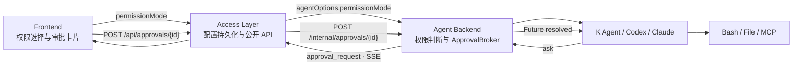
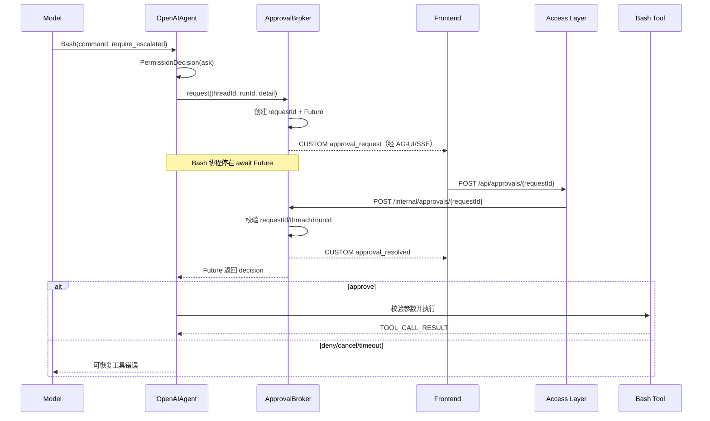

# 权限模式与 HITL 技术方案

> 状态：已实现  
> 适用范围：Work 对话、Agent Team、定时任务，以及 K Agent、Codex、Claude Code 三类运行时。

## 1. 背景与目标

Agent 既要能在工作空间内稳定自动执行，又需要在确有必要时访问工作空间外文件、
网络或具有明显副作用的能力。如果只有固定沙箱，合法任务会因边界受阻；如果默认
关闭沙箱，则普通提示词、第三方 Skill 或误判命令都可能扩大到宿主机。

本方案提供两个用户可见的运行权限模式：

| 模式 | 行为 | 适用场景 |
| --- | --- | --- |
| `default` | 保持现有沙箱和权限规则；越权调用暂停并进入 HITL | 默认选择、日常对话、来源不完全可信的任务 |
| `full_access` | 关闭运行时沙箱和人工审批，允许宿主机级访问 | 用户明确理解风险、任务必须无人值守访问宿主机时 |

设计目标：

1. 旧数据和未传字段保持 `default`，不因升级扩大权限。
2. 权限是 run 或所属对象的显式配置，不通过进程全局变量临时切换。
3. 默认权限下，工具执行必须发生在审批之后，不能“先执行、后展示”。
4. 审批必须绑定 `requestId + threadId + runId`，禁止跨会话误批。
5. Work、Team、定时任务复用同一个 `ApprovalBroker` 与公开审批接口。
6. 完全权限必须在界面持续展示风险，尤其说明定时任务会在每次无人值守触发时复用授权。

非目标：

- 完全权限不会提升为 `root`，也不会绕过操作系统账号、容器或宿主平台限制。
- 完全权限不会凭空创建 API Key、OAuth token 或第三方服务 scope。
- 本方案不把审批做成跨进程、跨重启的永久队列；审批只属于仍然存活的 run。

## 2. 总体架构



职责边界：

- **Frontend**：让用户选择权限、展示风险、渲染审批请求并提交决定。
- **Access Layer**：校验公开请求、持久化会话/Team/定时任务权限，并代理审批 API。
- **Agent Backend**：保存当前 run 的权限上下文，执行规则判断，管理未决审批和 Runner。
- **Runner/Tool**：只消费已经校验的权限结果，不直接读取前端或 Access Layer 状态。

## 3. 权限数据模型与持久化

统一枚举：

```json
"permissionMode": "default" | "full_access"
```

### 3.1 Work 对话

- 字段位于 `forwardedProps.agentOptions.permissionMode`。
- Access Layer 在 run 开始时写入 Session 的 `capabilities.permissionMode`。
- 打开旧 Session 时缺少该字段，规范化为 `default`。
- 新会话始终从 `default` 开始，不继承前一个会话的完全权限。

### 3.2 Agent Team

- 创建请求使用 `TeamCreateInput.permissionMode`。
- 数据库存储于 `teams.permission_mode`，旧表迁移时增加
  `TEXT NOT NULL DEFAULT 'default'`。
- Supervisor 和所有 Worker dispatch 都从 Team 快照读取相同模式。
- Team 创建后的运行使用该持久化快照，避免并行 Worker 处于不同权限语义。

### 3.3 定时任务

- 创建/编辑请求使用 `ScheduledTaskInput.permissionMode`。
- 数据库存储于 `scheduled_tasks.permission_mode`，旧任务迁移为 `default`。
- 每次计划触发与“立即运行”都把该字段传入新的 Session run。
- `full_access` 是对该自动化后续每次触发的持续授权，不是一次性批准。

## 4. K Agent 默认权限与单次越权

### 4.1 模型请求契约

本地文件工具和 Bash 暴露可选字段：

```json
{
  "sandbox_permissions": "require_escalated"
}
```

它只表示“请求越权”，不是已经取得授权。标准调用必须先经过
`OpenAIAgent._enforce_permission()`；不得将本地工具执行函数直接暴露为公开 API。

Bash 示例：

```json
{
  "command": "需要访问默认沙箱外资源的命令",
  "description": "向用户解释越权原因",
  "sandbox_permissions": "require_escalated"
}
```

`require_escalated` 采用正向触发规则。只有当前任务必须执行下列行为之一时，模型才可
申请 HITL：

1. 写入、修改或删除 Session workspace 之外的路径；
2. 访问默认沙箱阻止的宿主设备、本地 Socket、GUI、进程、凭据存储或系统服务；
3. 访问一个不在当前 `BASH_SANDBOX_ALLOWED_DOMAINS` 中的具体网络域名。

申请中的 `description` 必须指出具体资源及其必要性，例如“写入
`/etc/example/config` 以完成用户要求的系统级配置”，不能只写“需要 host access”。
这是允许发起 Bash 审批的完整条件集合。调用还必须提供
`escalation_scope=outside_workspace_write|host_resource|network_destination` 与具体的
`escalation_resource`，Backend 会在进入 ApprovalBroker 前强制校验。网络资源必须是
不带协议、路径和端口的准确 hostname；Backend 使用本轮实际域名白名单匹配，白名单
内的目标不会进入审批。普通网络超时、DNS 失败、HTTP 错误、连接重置、
`IncompleteRead`、远端限流以及脚本异常也不会进入审批。

### 4.2 审批前置

`OpenAIAgent` 在参数校验、`before_tool` 回调和工具执行之前完成权限判断：

1. 执行权限规则 `check_permissions()`。
2. `permission_mode == full_access` 时规范化为 `allow`。
3. 默认模式且请求 `require_escalated` 时强制规范化为 `ask`。
4. `deny` 直接返回可恢复工具错误。
5. `ask` 调用注入的 `approval_handler`，当前工具协程暂停。
6. 只有收到 `approve` 才继续参数校验与实际执行。

这个顺序是不变量：任何重构都不能把参数中的 `require_escalated` 直接当成授权凭证。

### 4.3 Bash 是否跳过 srt

Backend 用 `ContextVar` 把 `permissionMode` 绑定到当前异步 run，关闭流时恢复 token，
避免并发会话相互污染。`cc_bash()` 计算：

```python
full_access = (
    current_tool_permission_mode() == "full_access"
    or payload.get("sandbox_permissions") == "require_escalated"
)
```

随后 `plan_bash_invocation()` 返回：

| 条件 | `argv` | 执行方式 |
| --- | --- | --- |
| 完全权限或已批准的单次越权 | `None` | `create_subprocess_shell()`，跳过 srt |
| 默认权限且 srt 可用 | `[srt, --settings, ..., shell, -c, command]` | `create_subprocess_exec()` |
| `BASH_SANDBOX_MODE=off` | `None` | 全局配置关闭沙箱 |
| `auto` 且 srt 不可用 | `None` | 降级执行，并在结果中携带原因 |
| `required` 且 srt 不可用 | 不返回 | 拒绝执行 |

即使跳过 srt，Bash 仍保留：

- 当前 Session/Team workspace 作为 `cwd`；
- `build_child_env()` 环境变量白名单和敏感变量清理；
- 命令超时、输出截断、stdout/stderr 结构化返回；
- run 取消时的子进程生命周期处理。

## 5. HITL 完整时序



### 5.1 ApprovalBroker 内部状态

```text
不存在
  → pending(Future)
      → approved
      → denied
      → cancelled
      → timed_out
```

Broker 维护：

- `(thread_id, run_id) → event queue`
- `request_id → PendingApproval(request_id, thread_id, run_id, future)`

Runner producer 与审批事件共用一个合流队列。工具可以阻塞在 Future 上，而 SSE 仍能
先把审批卡发送给浏览器。默认审批超时为 600 秒。

### 5.2 公开接口

```http
POST /api/approvals/{requestId}
Content-Type: application/json

{
  "threadId": "...",
  "runId": "...",
  "action": "approve" | "deny" | "cancel",
  "remember": false
}
```

Access Layer 代理至 `POST /internal/approvals/{requestId}`。Backend 只有在
`requestId + threadId + runId` 全部匹配且 Future 仍未完成时才返回成功；过期、重复、
跨 run 或跨会话请求统一返回 404。

### 5.3 三种用户决定

| 决定 | 当前调用 | 后续调用 |
| --- | --- | --- |
| 拒绝 | 不执行，错误返回模型 | 仍需重新审批 |
| 允许一次 | 当前越权调用执行 | 下一次越权重新审批 |
| 本轮始终允许 | 当前调用执行 | 当前 Agent run 内同一权限目标不再询问 |

“本轮始终允许”只写入当前 `OpenAIAgent._approved_targets`，不落库、不跨 run、
不影响其他 Session。对 Bash 而言，后续调用只有再次携带 `require_escalated` 才会
跳过 srt；普通 Bash 仍按默认沙箱执行。

## 6. Codex 与 Claude Code 映射

| Runner | 默认权限 | 完全权限 |
| --- | --- | --- |
| K Agent | srt + 本地权限规则 + ApprovalBroker | 文件工具可越过 workspace；Bash 跳过 srt；不询问 |
| Codex | `workspace-write` + `approvalPolicy=on-request` | `danger-full-access` + `approvalPolicy=never` |
| Claude Code | sandbox enabled + approval bridge | `bypassPermissions` + sandbox disabled |

三者产生的请求最终都进入同一个公开审批 API，但 provider 原生请求会保留各自的
命令、文件变更、表单答案或 MCP elicitation 结构。

## 7. 前端与定时任务审批

Frontend 把 `approval_request` 投影为时间线审批卡，展示 Agent、类别、原因、命令或
参数；提交期间禁用按钮，收到 `approval_resolved` 后显示最终状态。

定时任务不跳转普通会话：执行记录在自动化详情页读取对应专属 Session，在原页面
渲染审批卡，并每 2 秒刷新仍打开的执行结果。默认权限下必须在 Broker 的 600 秒
期限内处理；页面关闭、Backend 重启或流被取消不会永久保存一个可恢复的 Future。

完全权限定时任务必须持续显示：

> 每次计划或手动触发都不会启用沙箱或等待审批，可读取、修改或删除本机文件并访问网络。

## 8. 失败与恢复语义

| 场景 | 处理 |
| --- | --- |
| 用户拒绝 | 工具不执行，结构化错误返回模型，模型可以换方案 |
| 600 秒无决定 | Future 超时，本次工具调用失败 |
| SSE/HTTP run 关闭 | `cancel_run()` 取消该 run 所有未决 Future |
| 重复提交审批 | Future 已完成，返回 404 |
| threadId/runId 不匹配 | 返回 404，不泄露其他 run 是否存在 |
| Backend 重启 | 内存审批失效；自动任务本次运行按 worker/run 失败处理，不重放副作用 |
| srt required 但不可用 | 拒绝执行，不自动转为完全权限 |
| srt auto 但不可用 | 返回明确 `sandboxed=false` 和原因，不能伪装成沙箱成功 |

## 9. 安全不变量

1. `default` 是 API、数据库迁移和前端初始化的共同默认值。
2. 完全权限必须由用户在运行入口显式选择，模型不能自行修改 `permissionMode`。
3. `require_escalated` 是请求，不是授权；只能在已注册的 active run 中进入 Broker。
4. 工具必须在审批完成后执行，不能预执行或并行启动。
5. 审批归属必须校验三元组，不能只凭 `requestId`。
6. run 结束必须清理 ContextVar、队列和未决 Future。
7. 环境变量脱敏独立于 srt，即使完全权限也不自动继承 Backend 全量环境。
8. 完全权限的风险文案不能只放在帮助文档，选择时和持久化详情中都要可见。

## 10. 验证要求

后端回归至少覆盖：

- 默认权限的 `require_escalated` 在工具执行前进入 HITL；
- allow/deny/remember、超时、run 取消和三元组不匹配；
- 完全权限跳过规则、K Agent srt、Codex/Claude sandbox 映射；
- Session、Team、定时任务权限持久化与旧表默认迁移；
- 定时任务和 Team dispatch 确实转发 `permissionMode`；
- 并发 run 的 ContextVar 不串值。

前端回归至少覆盖：

- 三个入口默认选中“默认权限”；
- 完全权限风险文案在浅色/深色主题和窄屏下可读；
- 定时任务授权文案明确“每次无人值守触发”；
- 审批卡可提交且状态不重复；
- 权限卡片不覆盖后续 MCP/Skill 表单。

## 11. 主要实现位置

| 位置 | 职责 |
| --- | --- |
| `access_layer/gateway.py` | 校验并转发 run 权限 |
| `access_layer/sessions/store.py` | Session capability 持久化 |
| `access_layer/teams/` | Team 权限迁移与 Worker/Supervisor dispatch |
| `access_layer/scheduled_tasks/` | 自动化权限迁移与每次触发转发 |
| `backend/approvals.py` | Future、事件合流、归属校验与清理 |
| `backend/agent/react_agent.py` | K Agent 权限决策与工具执行前门禁 |
| `backend/tools/workspace.py` | run-scoped 权限 ContextVar |
| `backend/tools/cc_like.py` | 文件越界与 Bash 执行入口 |
| `backend/sandbox/plan.py` | srt/裸 shell 执行计划 |
| `backend/runners/codex_app_server.py` | Codex sandbox/approval 映射 |
| `backend/runners/claude_code.py` | Claude sandbox/permission 映射 |
| `frontend/src/components/PermissionModeField.tsx` | Team/定时任务权限选择与风险提示 |
| `frontend/src/components/ConversationTranscript.tsx` | 定时任务原页审批 |
