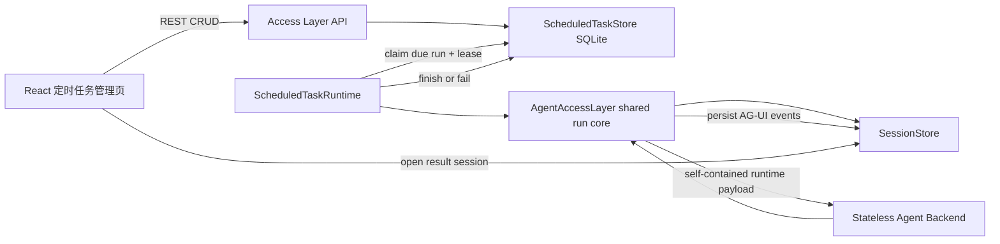

# 定时任务技术方案

> 状态：待产品确认，确认前不修改业务代码  
> 适用范围：`k_agent` 本地 Work 模式，不包含 Agent Team 任务调度

## 1. 目标与首版边界

在 Work 左侧栏“新建会话”下方增加“定时任务”入口。用户可以创建、查看、暂停、恢复、编辑和删除计划；到达执行时间后，即使页面没有打开，只要 Access Layer 服务仍在运行，任务也会自动发起一次 Agent 会话。每次执行的结果可以从任务详情直接打开。

首版支持：

- 执行频率：仅一次、每天、每周；时间精度到分钟。
- 任务内容：名称、提示词、频率、日期/星期、执行时间、时区、Agent、模型、推理强度、MCP、Skill。
- 生命周期：启用、暂停、编辑、删除；展示下次执行时间和最近执行结果。
- 每次触发创建一个独立会话，不复用上一轮上下文。任务与历次会话通过 `scheduledTaskId`、`scheduledRunId` 关联。
- 本地单用户模型，不新增登录、租户和远程推送。

首版不包含：秒级定时、任意 Cron 表达式、Agent Team 定时启动、文件附件快照、系统级常驻服务安装、邮件/桌面通知、运行中的强制取消。

## 2. 交互方案

### 2.1 左侧入口

文件位置：`frontend/src/App.tsx` 中 `.new-session` 按钮之后、`.session-search` 之前。

新增一枚与“新建会话”等高、同圆角和同主题变量的按钮：

```text
┌──────────────────────────┐
│ ＋  新建会话        ⌘ N  │
└──────────────────────────┘
┌──────────────────────────┐
│ ◷  定时任务          3   │
└──────────────────────────┘
┌──────────────────────────┐
│ ⌕  搜索会话              │
└──────────────────────────┘
```

右侧数字只统计启用中的计划。点击后在主内容区打开“定时任务”管理页；不使用小浮层，因为创建表单包含运行配置，窄浮层容易拥挤且不利于错误提示和键盘操作。移动端仍由现有侧栏遮罩负责收起。

### 2.2 管理页

- 顶部：标题、启用任务数、“创建定时任务”按钮。
- 列表项：任务名、频率的人类可读描述、下次执行、最近状态、暂停/恢复开关、更多菜单。
- 最近状态：`等待执行 / 执行中 / 成功 / 失败 / 已错过`；失败项直接显示简短原因，详情中保留完整错误。
- 点击任务进入详情：配置摘要、最近执行记录；点击某次记录打开对应 Work 会话。
- 创建/编辑使用右侧抽屉；保存前显示按所选时区计算的“下次执行时间”。删除使用二次确认。

### 2.3 创建表单

必填字段为任务名称、提示词、频率、执行时间、Agent、模型。默认时区取浏览器 `Intl.DateTimeFormat().resolvedOptions().timeZone`，例如 `Asia/Shanghai`，服务端必须保存 IANA 时区名而不是固定 UTC 偏移。

MCP、Skill、Agent、模型和推理强度沿用当前会话选择器及其校验规则。保存的是 ID 快照；执行时重新向 `RuntimeCatalog` 解析。若某项已被删除或禁用，本次执行失败并给出明确错误，不静默换用其他能力或模型。

## 3. 架构与边界



- **Access Layer 是唯一调度与持久化所有者。** 浏览器定时器在关闭页面、休眠和刷新后不可靠；Agent Backend 按现有架构保持无状态，不读取计划表。
- **执行路径复用聊天网关。** 将 `AgentAccessLayer.run()` 内部的事件生成逻辑抽成共享异步事件流；HTTP `/api/agent` 继续包装成 SSE，`ScheduledTaskRuntime` 则在进程内消费同一事件流。不能复制一套模型、MCP、Skill、会话持久化逻辑。
- **独立调度数据库。** 使用 `data/scheduled_tasks/scheduled_tasks.db`（最终路径由现有 home/path helper 解析），不把调度状态混入 JSON 会话文件或 Team 数据库。
- **前端只管理与观察。** 页面关闭不影响已保存计划或正在运行的调度任务。

## 4. 数据模型

### 4.1 `scheduled_tasks`

| 字段 | 类型 | 说明 |
|---|---|---|
| `id` | TEXT PK | UUID |
| `name` | TEXT | 任务名，1–120 字符 |
| `prompt` | TEXT | 本次用户消息，1–20000 字符 |
| `status` | TEXT | `active / paused` |
| `schedule_kind` | TEXT | `once / daily / weekly` |
| `local_date` | TEXT NULL | 仅一次，`YYYY-MM-DD` |
| `weekdays_json` | TEXT | 每周执行日，ISO 1–7 |
| `local_time` | TEXT | `HH:mm` |
| `timezone` | TEXT | IANA 时区 |
| `next_run_at` | TEXT NULL | 预计算 UTC ISO 时间；一次性任务完成后为空 |
| `agent_kind` | TEXT | `k_agent / codex / claude_code` 等目录 ID |
| `model_id` | TEXT | 模型 ID |
| `reasoning_effort` | TEXT | 与当前运行协议一致 |
| `mcp_server_ids_json` | TEXT | MCP ID 快照 |
| `skill_ids_json` | TEXT | Skill ID 快照 |
| `agent_options_json` | TEXT | 仅允许白名单运行选项 |
| `created_at` / `updated_at` | TEXT | UTC ISO 时间 |

### 4.2 `scheduled_runs`

| 字段 | 类型 | 说明 |
|---|---|---|
| `id` | TEXT PK | 一次触发记录 ID |
| `task_id` | TEXT FK | 所属计划，删除计划时保留或级联由产品决定；首版采用级联删除 |
| `scheduled_for` | TEXT | 理论触发 UTC 时间 |
| `status` | TEXT | `queued / running / succeeded / failed / missed` |
| `lease_until` | TEXT NULL | 崩溃恢复租约 |
| `attempt` | INTEGER | claim 次数，不代表自动重试模型调用 |
| `session_id` / `agent_run_id` | TEXT NULL | 可追踪到会话与 AG-UI run |
| `started_at` / `finished_at` | TEXT NULL | 执行时间 |
| `error_code` / `error_message` | TEXT NULL | 结构化失败信息 |

约束与索引：

- `UNIQUE(task_id, scheduled_for)`：同一个理论触发点最多生成一次执行记录，是防重复的最终边界。
- `INDEX(status, scheduled_for)`：快速认领到期任务。
- SQLite 开启 WAL、foreign keys 和 busy timeout；写事务使用 `BEGIN IMMEDIATE`。

## 5. 调度语义

### 5.1 时间计算

- 数据库存 UTC，展示与规则计算使用任务自己的 IANA 时区和 Python `zoneinfo`。
- 夏令时向前跳导致本地时间不存在：本次标记 `missed`，继续计算下一次。
- 夏令时回拨导致本地时间出现两次：只取第一次，依靠唯一键保证不重复。
- 创建或编辑时，`next_run_at` 必须严格晚于服务端当前时间；“仅一次”的过去时间返回 422。

不引入 APScheduler。首版只有三种规则，用标准库实现可审计的 `compute_next_run()`；避免额外任务仓库与本项目 SQLite 真相源发生冲突。

### 5.2 休眠、停机与补跑

Runtime 不做固定按秒轮询。它查询最近的 `next_run_at` 后动态休眠；创建、编辑、
暂停、恢复和删除操作通过 `asyncio.Event` 立即唤醒调度循环并重算截止时间。为处理
电脑休眠、系统时钟跳变或遗漏的进程内信号，动态休眠最长每 60 秒做一次时钟校准，
该间隔可通过 `SCHEDULED_TASK_CLOCK_RECHECK_SECONDS=60` 配置。恢复后：

- 延迟不超过 15 分钟：执行最近一次到期触发。
- 延迟超过 15 分钟：该触发记为 `missed`，不执行。
- 多个周期均已错过：只为最近一个触发点建立记录，旧周期不逐个回填，随后计算未来的 `next_run_at`。

该策略防止电脑开机后瞬间补跑几十次。15 分钟做成 Access Layer 配置项 `SCHEDULED_TASK_MISFIRE_GRACE_SECONDS=900`。

### 5.3 认领、并发与失败

1. 在一个写事务内读取到期计划、插入 `scheduled_runs`、推进任务的 `next_run_at`，再把 run claim 为 `running` 并写租约。
2. Runtime 使用独立全局 semaphore，默认最多 2 个定时运行；真实模型请求仍必须经过现有 `RequestConcurrencyLimiter`，因此不会绕过单会话和全局限制。
3. 每次执行预先生成 `session_id` 与 `agent_run_id`，调用共享 AgentAccessLayer 运行核心；会话标题为任务名加本地触发时间。
4. 收到 `RUN_FINISHED` 后标记成功；`RUN_ERROR`、目录解析失败、模型不可用、审批超时或网络异常均标记失败并保存原因。
5. 不自动重试已经开始的 Agent 调用，避免工具产生重复副作用。进程在运行中崩溃后，过期 lease 对应记录标记失败 `worker_lost`，也不重放。
6. 暂停只阻止未来触发，不中断已运行实例；编辑只影响下一次触发。

### 5.4 审批规则

定时任务没有在线用户保证，不能无限等待人工审批。调度运行沿用现有权限策略，但请求人工审批时使用现有审批超时；未在期限内批准则本次失败，错误显示“等待审批超时”。首版不提供“定时任务永久自动批准”，避免后台任务扩大工具权限。

## 6. API 契约

统一前缀 `/api/scheduled-tasks`：

| 方法 | 路径 | 用途 |
|---|---|---|
| `GET` | `/api/scheduled-tasks` | 列表，含最近状态与下次执行 |
| `POST` | `/api/scheduled-tasks` | 创建，返回规范化任务和下次执行 |
| `GET` | `/api/scheduled-tasks/{id}` | 详情 |
| `PUT` | `/api/scheduled-tasks/{id}` | 全量编辑，服务端重算下次执行 |
| `POST` | `/api/scheduled-tasks/{id}/pause` | 幂等暂停 |
| `POST` | `/api/scheduled-tasks/{id}/resume` | 幂等恢复并重算下次执行 |
| `DELETE` | `/api/scheduled-tasks/{id}` | 删除非运行中任务及执行记录 |
| `GET` | `/api/scheduled-tasks/{id}/runs` | 分页读取执行历史 |
| `POST` | `/api/scheduled-tasks/{id}/run-now` | 手动验证一次，不改变原计划 |

`run-now` 也建立 `scheduled_runs`，但 `scheduled_for` 使用当前时间并额外记录 `trigger_type=manual`。若任务已有运行实例，返回 409；删除运行中的任务也返回 409。Pydantic 请求模型拒绝未知字段，字符串裁剪后校验，时区与目录 ID 均由服务端验证。

列表与 CRUD 先采用短轮询：管理页打开时每 3 秒刷新，页面隐藏后停止。Agent 的完整流仍落入会话，不再为管理页建立第二套 SSE 协议。

## 7. 代码落点

### 新增

- `access_layer/scheduled_tasks/models.py`：Pydantic 输入/输出模型、枚举。
- `access_layer/scheduled_tasks/schedule.py`：纯函数时间计算与 DST 规则。
- `access_layer/scheduled_tasks/store.py`：SQLite schema、事务、lease、查询。
- `access_layer/scheduled_tasks/runtime.py`：lifespan 调度循环和后台执行。
- `access_layer/scheduled_tasks/router.py`：公开 REST API。
- `frontend/src/scheduled-tasks/types.ts`：前端领域类型。
- `frontend/src/scheduled-tasks/api.ts`：HTTP 客户端。
- `frontend/src/components/ScheduledTasksView.tsx`：列表、详情、创建/编辑抽屉。
- `backend/tests/test_scheduled_task_schedule.py`：时区/DST/规则单测。
- `backend/tests/test_scheduled_task_store.py`：唯一触发、事务、恢复单测。
- `backend/tests/test_scheduled_task_runtime.py`：执行、并发、失败与重启测试。

### 修改

- `access_layer/main.py`：lifespan 装配和关闭 Runtime、注册路由、健康状态。
- `access_layer/gateway.py`：无需修改；Runtime 在进程内消费其 `StreamingResponse.body_iterator`，完整复用现有网关运行路径。
- `access_layer/scheduled_tasks/runtime.py`：读取调度专用环境变量，包括 misfire grace、并发、lease、启用开关与时钟校准周期。
- `frontend/src/App.tsx`：增加入口、视图路由状态、执行结果跳转。
- `frontend/src/styles.css`：入口、列表、抽屉和各主题状态样式。
- `frontend/src/types.ts`：会话摘要可选的定时任务关联字段（如 UI 确需展示来源）。

所有非显而易见的调度边界、事务不变量、时区、权限、并发和生命周期代码都写准确注释；不为普通赋值写叙述性注释。

## 8. 生命周期与可观测性

- `access_layer/main.py` lifespan 顺序：初始化 Store → 回收过期 lease → 启动 Runtime；关闭时先停止认领，再等待/取消本进程任务，最后关闭存储。
- `/api/health` 增加 `scheduledTasks`：`enabled`、`schedulerRunning`、`activeRuns`、`nextDueAt`、`lastLoopAt`、`lastLoopError`。
- 结构化日志至少包含：`scheduled.task.created`、`scheduled.run.claimed`、`scheduled.run.started`、`scheduled.run.finished`、`scheduled.run.failed`、`scheduled.run.missed`；字段带 `scheduledTaskId`、`scheduledRunId`、`threadId`、`runId`，不记录 prompt、模型输出或密钥。
- 调度器单次循环异常只能记录并继续下一轮，不能让后台任务静默死亡。

## 9. 安全与数据一致性

- RuntimeCatalog 在每次执行时解析配置；数据库只保存 ID，不复制 API key、MCP token 或环境变量。
- `agent_options_json` 由服务端按白名单生成，客户端不能注入 `resumeSessionId`、工作目录或任意后端参数。
- 定时任务使用新的会话 ID，天然获得独立 `sessions/{id}/workspace/`；不允许客户端提交文件系统路径。
- SQLite 唯一键 + claim 事务 + lease 三层保证不重复认领；对已开始的有副作用运行采用“至多一次重放”策略。
- 删除计划会删除调度记录，但不删除已生成的会话及 workspace，避免意外抹除成果；会话中的关联 ID仅作为来源信息。

## 10. 验收与验证

### 自动化

- Python：规则跨日、跨年、每周多选、非法时区、DST 缺失/重复时间、误触发宽限。
- Store：并发 claim 只成功一次、重启回收、暂停/恢复、编辑重算、删除运行中冲突、唯一键防重。
- Runtime：成功产生完整会话与 `RUN_FINISHED`；模型/MCP/审批/网络错误均落为可见失败；崩溃恢复不重放已开始执行。
- API：422 字段错误、404、409、幂等暂停/恢复、分页执行记录。
- 前端：类型检查、构建，以及创建/编辑校验和状态映射测试。

### 实机浏览器验收

1. 入口准确位于“新建会话”下方，窄侧栏、移动端及全部主题无溢出。
2. 创建一个 2 分钟后的仅一次任务，关闭管理页；到点后出现执行记录和新会话。
3. 打开该会话，确认思考、工具和回答的 AG-UI 时间线顺序与普通会话一致。
4. 验证暂停不触发、恢复重算、手动立即运行、失败原因、删除确认。
5. 执行期间重启 Access Layer，确认记录失败且不重复执行工具。
6. 运行 `npm run check && npm run build:client`，并使用 `.venv/bin/python -m pytest` 执行新增及相关回归测试。

## 11. 需要确认的产品决策

开始编码前请确认以下默认选择：

1. 首版频率只做“仅一次 / 每天 / 每周”，暂不开放 Cron。
2. 每次触发新建独立会话，不在同一会话连续追加。
3. 电脑休眠或服务停止后仅在 15 分钟宽限内补最近一次，过期记为“已错过”。
4. 删除计划会删除其执行记录，但保留已经生成的会话和文件成果。
5. 首版后台运行遇到人工审批时等待现有审批超时，不提供永久自动批准。

以上五项确认后再进入实现阶段。
